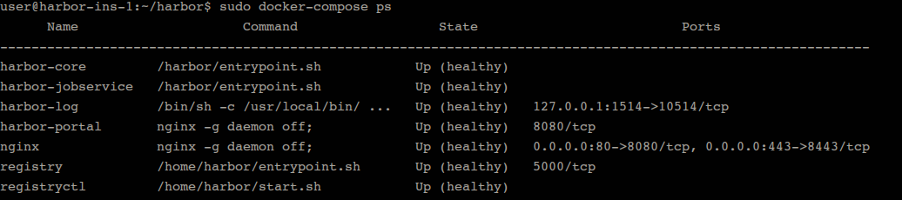
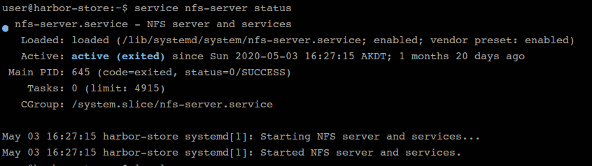
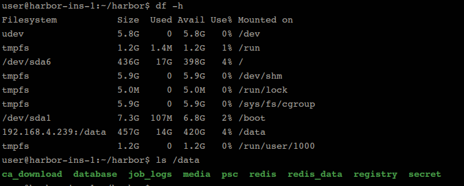

# Harbor 高可用

- https://blog.csdn.net/m0_37886429/article/details/89084549

## 登录信息

1. admin超级用户: (不依赖于LDAP服务)
    - 用户名：　admin
    - 密码：　　**Harbor12345**

2. 支持LDAP用户登录

## 部署结构

使用 ”多harbor实例共享后端存储“ 方案保证了harbor高可用性

### Harbor Instance

- 192.168.4.230 (/home/user/harbor)
- 192.168.4.231 (/home/user/harbor)

两个instance 的harbor目录内容相同

### Harbor postgresql ＆ redis

- 192.168.4.238  (psql -Upostgres # 进入postgresql)

### Harbor storage （NFS服务）

- 192.168.4.239

`mount -t nfs 192.168.4.239:/data /data # 在harbor节点上挂载nfs目录`

## 方案

https://www.cnblogs.com/breezey/p/9444231.html
https://blog.csdn.net/m0_37886429/article/details/89084549

方案：
    一：双主复制（实际生产不靠谱）
    二：多harbor实例共享后端存储（推荐）

方案二（nfs做统一镜像存储服务，独立redis和postsql服务）：
    共享后端存储算是一种比较标准的方案，就是多个Harbor实例共享同一个后端存储，任何一个实例持久化到存储的镜像，
    都可被其他实例中读取。通过前置LB进来的请求，可以分流到不同的实例中去处理，这样就实现了负载均衡，也避免了单
    点故障：

    这个方案在实际生产环境中部署需要考虑三个问题：
        １．共享存储的选取，Harbor的后端存储目前支持AWS S3、Openstack Swift, Ceph等，在我们的实验环境里，
        　　就直接使用nfs
        ２．Session在不同的实例上共享，这个现在其实已经不是问题了，在最新的harbor中，默认session会存放在redis
        　　中，我们只需要将redis独立出来即可。可以通过redis sentinel或者redis cluster等方式来保证redis的可
        　　用性。在我们的实验环境里，仍然使用单台redis
        ３．Harbor多实例数据库问题，这个也只需要将harbor中的数据库拆出来独立部署即可。让多实例共用一个外部数据库，
        　　数据库的高可用也可以通过数据库的高可用方案保证。

    具体操作(root用户):
        0. 在服务器上安装nfs和postgresql

        注意: redis暂时分开(独立出来也没问题)

        1. 在一个服务器上运行harbor
            1.1 运行起来harbor

            1.2 进入数据库容器, 备份数据
                1.2.1 进入
                    psql -U postgres  -h172.20.58.47 -p 5432
                    pwd: root123

                1.2.2 备份
                    pg_dumpall -U postgres -h postgresql -p 5432 -f dump.sql

            1.3 拷贝到服务器上
                docker cp harbor-db:/dump.sql ~/dump.sql

        2. 将数据备份到外部数据库
            psql -U postgres  -h172.20.58.47 -p 5432  -f /home/user/Documents/harbor/dump.sql postgres

        3. 在harbor服务器上挂载nfs存储服务
            3.1 在nfs服务器上创建共享目录,并赋予777权限

            3.2 在harbor服务器上挂载
                sudo mount -t nfs 172.20.58.47:/home/user/Desktop/nfs_sharefolder /data

        4. 在harbor部署服务器上修改harbor文件
            4.1 先修改harbor.yml中postgresql配置,然后执行 ./prepare同步更新到common/config中去

            4.2 修改common读写权限
                chmod -R 777 common

            4.3 启动
                ./install

        5. copy harbor目录到其他harbor服务器
            docker-compose up -d启动

        6. 部署nginx服务器
            配置好
        
        7. 在其他服务器上login harbor
            7.1 域名配置指向nginx

## 配置

1.安装完nfs后添加挂载配置
    172.20.58.46
    172.20.58.47
        $ sudo mount -t nfs 172.20.58.195:/home/user/Desktop/nfs_sharefolder /data

2.备份数据库到单独的数据库服务器

3.修改数据库配置部分
    在common/config下配置
    去掉docker-compose 中db部分，和其他服务依赖db部分

4.独立redis，并设置可用ip访问

5.修改redis配置部分
    在common/config下配置
    去掉docker-config下配置，和其他服务依赖db部分

6. 分别启动harbor即可
