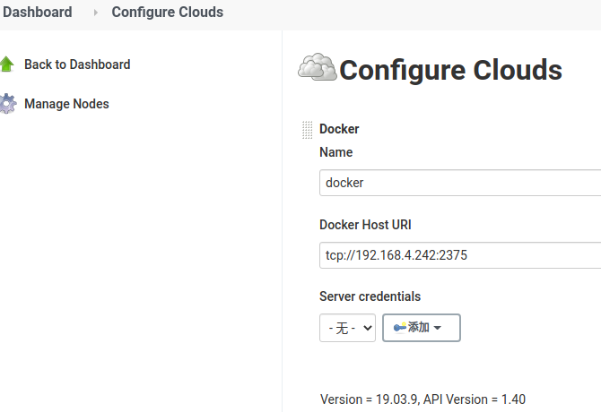
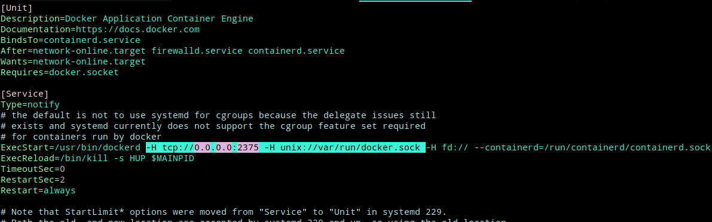

# docker-slave


要在Jenkins Slave中运行docker 命令
- https://blog.csdn.net/qq_31977125/article/details/104000507
## 1. 安装docker插件

[Docker plugin](https://plugins.jenkins.io/docker-plugin/)
This plugin integrates Jenkins with Docker


配置插件
“Manage Jenkins”–>“Configure system”->“cloud” 添加一个docker, 配置 之后测试docker 连通性




## 2. Docker宿主机配置

1. 安装docker, 添加docker yum源

2. . 配置docker开启远程访问

vim /lib/systemd/system/docker.service  (ubuntu)

```
在OPTIONS=中加入 -H tcp://0.0.0.0:2375 -H unix://var/run/docker.sock
如：
OPTIONS='--selinux-enabled --log-driver=journald --signature-verification=false -H tcp://0.0.0.0:2375 -H unix://var/run/docker.sock'

```




```
systemctl daemon-reload&&systemctl restart docker
```