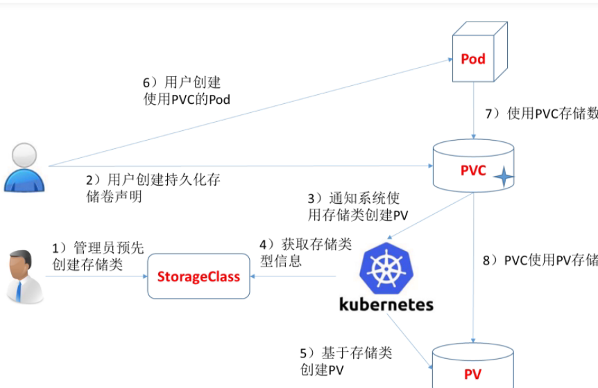

# StorageClass

[TOC]

## StorageClass解决的问题

- <https://kubernetes.io/docs/concepts/storage/storage-classes/>

PV是运维人员来创建的，开发操作PVC，可是大规模集群中可能会有很多PV，如果这些PV都需要运维手动来处理这也是一件很繁琐的事情，所以就有了动态供给概念，即`Dynamic Provisioning`。而我们上面的创建的PV都是静态供给方式，也就是`Static Provisioning`。

- <https://kubernetes.io/docs/concepts/storage/dynamic-provisioning/>

动态供给的关键就是StorageClass，它的作用就是创建PV模板。它需要定义PV属性比如存储类型、大小等；另外创建这种PV需要用到存储插件。最终效果是，用户提交PVC，里面指定存储类型，如果符合我们定义的StorageClass，则会为其自动创建PV并进行绑定。

**基于StorageClass的动态存储供应整体过程如下图所示：**



## 实现原理

- 存储控制器 Volume Controller，是用来专门处理持久化存储的控制器，其一个子控制循环 PersistentVolumeController 负责实现 PV 和 PVC 的绑定。

- PersistentVolumeController 会 watch kube-apiserver 的 PVC 对象。如果发现有 PVC对象创建，则会查看所有可用的 PV， 如果有则绑定，若没有，则会使用 StorageClass 的配置和 PVC 的描述创建 PV 进行绑定。

所谓将一个 PV 与 PVC 进行“绑定”，其实就是将这个PV对象的名字，填在了 PVC 对象的 spec.volumeName 字段上


## 定义存储类

每一个存储类都包含provisioner、parameters和reclaimPolicy这三个参数域，当一个属于某个类的PersistentVolume需要被动态提供时，将会使用上述的参数域。

存储类对象的名称非常重要，用户通过名称类请求特定的存储类。管理员创建存储类对象时，会设置类的名称和其它的参数，`存储类的对象一旦被创建，将不能被更新`。管理员能够为PVC指定一个默认的存储类。

``` yaml
kind: StorageClass
apiVersion: storage.k8s.io/v1
metadata:
  name: standard
provisioner: kubernetes.io/aws-ebs # 指定存储类的供应者
parameters:
  type: gp2
reclaimPolicy: Retain # 指定回收策略
mountOptions:
  - debug
```

### 供应者 -provisioner

- <https://kubernetes.io/docs/concepts/storage/storage-classes/#provisioner>

储类有一个供应者的参数域，此参数域决定PV使用什么存储卷插件。参数必需进行设置：


Kubernetes的存储类并不局限于表中的“interneal”供应者，“interneal”供应者的名称带有`“kubernetes.io”`前缀；也可以允许和指定外部的供应者，外部供应者通过独立的程序进行实现。 `kubernetes-sigs/sig-storage-lib-external-provisioner` 仓库中存在编写外部提供者的类库

## 使用存储类

动态存储卷供应基于StorageClass的API对象的来实现，集群管理员能够按需定义StorageClass对象，每一个StorageClass对象能够指定一个存储卷插件（即供应者）。集群管理员能够在一个集群中定义各种存储卷供应，用户不需要了解存储的细节和复杂性，就能够选择符合自己要求的存储。

### 启用动态供应

为了启用动态供应，集群管理员需要预先为用户创建一个或者多个存储类对象。存储类对象定义了使用哪个供应者，以及供应者相关的参数。下面是存储类的一个示例，它创建一个名称为slow的存储类，使用gce供应者：

``` yaml
apiVersion: storage.k8s.io/v1
kind: StorageClass
metadata:
  name: slow
provisioner: kubernetes.io/gce-pd
parameters:
  type: pd-standard
```

下面创建了一个名为“fast”的存储类，其提供类似固态磁盘的存储卷磁盘：

``` yaml
apiVersion: storage.k8s.io/v1
kind: StorageClass
metadata:
  name: fast
provisioner: kubernetes.io/gce-pd
parameters:
  type: pd-ssd
```

### 使用动态供应

下面是请求fast存储类的持久化存储卷声明的YAML配置文件示例：

``` yaml
apiVersion: v1
kind: PersistentVolumeClaim
metadata:
  name: claim1
spec:
  accessModes:
    - ReadWriteOnce
# 指定所使用的存储类，此存储类将会自动创建符合要求的PV
 storageClassName: fast
 resources:
    requests:
      storage: 30Gi
```

### 默认行为

如果Kubernetes的集群中没有指定存储类，集群管理员可以通过执行下面的设置，启用默认的存储类：

- 标记一个默认的StorageClass对象；
- 确定API server中DefaultStorage接入控制器已被启用

如下图：minikube环境中启用了 默认的StorageClass


管理员能够通过添加storageclass.kubernetes.io/is-default-class注释，标记一个特定的StorageClass作为默认的存储类。在集群中，如果存在一个默认的StorageClass，系统将能够在不指定storageClassName 的情况下创建一个PersistentVolume，DefaultStorageClass接入控制器会自动将storageClassName指向默认的存储类。

**注意：** 在一个集群中，最多只能有一个默认的存储类，如果没有默认的存储类，那么如果在PersistentVolumeClaim中没有显示指定storageClassName，则将无法创建PersistentVolume。

## NFS存储类示例

kubernetes本身支持的动态PV创建不包括nfs，所以需要使用额外插件实现

- <https://github.com/kubernetes-sigs/nfs-subdir-external-provisioner>
- <https://github.com/kubernetes-sigs/nfs-ganesha-server-and-external-provisioner>

下面我们以[nfs-provisioner](<https://github.com/kubernetes-sigs/nfs-ganesha-server-and-external-provisioner/tree/master/deploy/kubernetes>)为例

### 1. 部署nfs-provisioner

为nfs-provisioner实例选择存储状态和数据的存储卷，并将存储卷挂接到容器的/export 命令。

``` yaml
...
 volumeMounts:
    - name: export-volume
      mountPath: /export
volumes:
  - name: export-volume
    hostPath:
      path: /tmp/nfs-provisioner
...
```

为StorageClass选择一个供应者名称，并在deploy/kubernetes/deployment.yaml进行设置。

``` yaml
args:
  - "-provisioner=example.com/nfs"
```

在设置好deploy/kubernetes/deployment.yaml文件后，通过命令在Kubernetes集群中部署nfs-provisioner

`$ kubectl create -f {path}/deployment.yaml`

### 2. 创建StorageClass

下面是example-nfs的StorageClass配置文件，此配置文件定义了一个名称为nfs-storageclass的存储类，此存储类的提供者为nfs-provisioner。

``` yaml
kind: StorageClass
apiVersion: storage.k8s.io/v1
metadata:
  name: example-nfs
provisioner: example.com/nfs
mountOptions:
  - vers=4.1
```

通过命令使用上面的配置文件创建：`$ kubectl create -f deploy/kubernetes/class.yaml`

在存储类被正确创建后，就可以创建PVC来请求StorageClass，而StorageClass将会为PVC自动创建一个可用PV

### 3. 创建PVC

``` yaml
apiVersion: v1
kind: PersistentVolumeClaim
metadata:
  name: nfs-pvc
spec:
  accessModes:
  - ReadWriteMany
  storageClassName： nfs-storageclass
  resources:
    requests:
      storage: 1Mi
```

通过kubectl create命令创建上述的持久化存储卷声明：`$ kubectl create -f {path}/claim.yaml`

### 4. 创建使用PVC的部署

在这里定义名为busybox-deployment的部署YAML配置文件，使用的镜像为busybox。基于busybox镜像的容器需要对/mnt目录下的数据进行持久化，在YAML文件指定使用名称为nfs的PersistenVolumeClaim对容器的数据进行持久化。

``` yaml
# This mounts the nfs volume claim into /mnt and continuously
# overwrites /mnt/index.html with the time and hostname of the pod. 
apiVersion: v1
kind: Deployment
metadata:  
  name: busybox-deployment
spec:  
  replicas: 2  
  selector:
    name: busybox-deployment
  template:
    metadata:
      labels:
        name: busybox-deployment
    spec:
      containers:
      - image: busybox
        command:
        - sh
        - -c
        - 'while true; do date > /mnt/index.html; hostname >> /mnt/index.html; sleep $(($RANDOM % 5 + 5)); done'
        imagePullPolicy: IfNotPresent
        name: busybox
        volumeMounts:
        # name must match the volume name below
        - name: nfs
          mountPath: "/mnt"
     volumes:
     - name: nfs
       persistentVolumeClaim:
         claimName: nfs-pvc
```

通过kubectl create创建busy-deployment部署：`$ kubectl create -f {path}/nfs-busybox-deployment.yaml`

