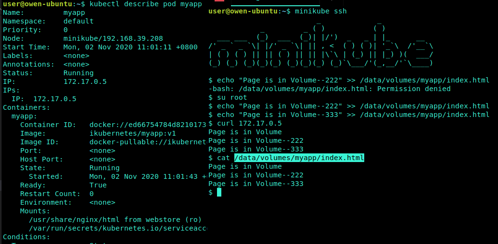
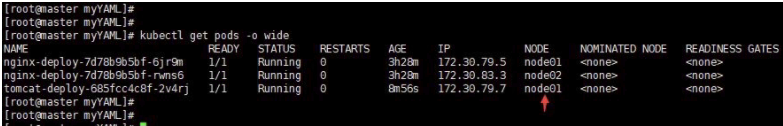

# Volumes

[TOC]

## 为什么引入Volume

当container crash的时候，kubelet将会重启它，里面之前运行的数据将会丢失，容器将以一个clean state的状态来启动。

运行在pod中的containers通常会共享数据，volumes的概念就是为了解决这些问题。

## Volumes的类型

- <https://kubernetes.io/docs/concepts/storage/volumes/>

在 Docker 容器时代，我们就对 Volume 很熟悉了，一般来说是通过创建 Volume 数据卷，然后挂载到指定容器的指定路径下，以实现容器数据的持久化存储或者是多容器间的数据共享，当然这里说的都是单机版的容器解决方案。

kubernetes中的volume有 `完整的声明周期`，在pod中可以脱离Container而存在。container重启的时候，volume中的pod会被保存；pod消失的时候，volume也会消失。

本质上，Kubernetes Volume 是一个目录，这一点与 Docker Volume 类似。当 Volume 被 mount 到 Pod，Pod 中的所有容器都可以访问这个 Volume。

kubernetes支持多种volumes的类型，pod可以使用同时使用多个volume。类型如下：

- cephfs
- secret
- gitRepo
- emptyDir
- hostPath
- local
- ... (省略)
- glusterfs
- nfs
- persistentVolumeClaim
- emptyDir

Volume 提供了对各种 backend 的`抽象`，容器在使用 Volume 读写数据的时候不需要关心数据到底是存放在本地节点的文件系统中呢还是云硬盘上。对它来说，`所有类型的 Volume 都只是一个目录`。

## 本地存储

既然都已经实现容器云平台了，我们为什么还要关以下本地存储卷呢？

粗略归纳了下，有以下几个原因：

- 特殊使用场景需求，如需要个临时存储空间，运行 cAdvisor 需要能访问到 node 节点 /sys/fs/cgroup 的数据，做本机单节点的 k8s 环境功能测试等等。
- 容器集群只是做小规模部署，满足开发测试、集成测试需求。
- 作为分布式存储服务的一种补充手段，比如我在一台 node 主机上插了块 SSD，准备给某个容器吃小灶。
- 目前主流的两个容器集群存储解决方案是 ceph 和 glusterfs，二者都是典型的网络分布式存储，所有的数据读、写都是对磁盘 IO 和网络 IO 的考验，所以部署存储集群时至少要使用万兆的光纤网卡和光纤交换机。如果你都没有这些硬货的话，强上分布式存储方案的结果就是收获一个以”慢动作”见长的容器集群啦。
- 分布式存储集群服务的规划、部署和长期的监控、扩容与运行维护是专业性很强的工作，需要有专职的技术人员做长期的技术建设投入。

不是说分布式存储服务不好，很多公司在云平台建设的实践中，往往是需要结合使用几种通用的与专用的存储解决方案，才能最终满足大部分的使用需求

### emptyDir

emptyDir 是最基础的 Volume 类型。正如其名字所示，一个 emptyDir Volume 是 Host 上的一个空目录。最开始里面是什么都没有的，pod启动后容器产生的数据会存放到那个空卷中。

emptyDir Volume 对于容器来说是持久的，对于 Pod 则不是。当 Pod 从节点删除时，Volume 的内容也会被删除。但如果只是容器被销毁而 Pod 还在，则 Volume 不受影响。

也就是说：`emptyDir Volume 的生命周期与 Pod 一致。`

Pod 中的所有容器都可以共享 Volume，它们可以指定各自的 mount 路径。

``` yaml
apiVersion: v1
kind: Pod
metadata:
  name: test-pod
spec:
  containers:
  - image: busybox
    name: test-emptydir
    command: [ "sleep", "3600" ]
    volumeMounts:
    - mountPath: /data
      name: data-volume
  volumes:
  - name: data-volume
    emptyDir: {}
```

此时Emptydir已经创建成功，在宿主机上的访问路径为`/var/lib/kubelet/pods/<pod uid>/volumes/kubernetes.io~empty-dir/redis-data`

emptyDir 是 Host 上创建的临时目录，其优点是能够方便地为 Pod 中的容器提供共享存储，不需要额外的配置。但它不具备持久性，如果 Pod 不存在了，emptyDir 也就没有了。根据这个特性，emptyDir 特别适合 Pod 中的容器需要临时共享存储空间的场景

默认情况下，根据您的环境，emptyDir卷存储在任何介质中，可能是磁盘或SSD或网络存储。 但是，您可以将emptyDir.medium字段设置为“Memory”，以告诉Kubernetes为您安装tmpfs（RAM支持的文件系统）。 虽然tmpfs非常快，但请注意，与磁盘不同，tmpfs在机器重新启动时被清除，您写入的任何文件都会计入您的容器的内存限制

### hostPath

hostPath类型则是映射node文件系统中的文件或者目录到pod里。

其实这个功能就相当于docker中的-v  目录映射，只不过在k8s中的时候，pod会漂移，当pod漂移到其他node节点的时候，pod不会跨节点的去读取目录。所以说hostpath只能算一种半持久化的存储方式，大部分应用都不会使用 hostPath Volume，因为这实际上`增加了 Pod 与节点的耦合，限制了 Pod 的使用`。

不过那些需要访问 Kubernetes 或 Docker 内部数据（配置文件和二进制库）的应用则需要使用 hostPath。

比如，一些使用hostPath的例子：

- 运行需要访问Docker内部的容器; 使用/var/lib/docker的hostPath

- 在容器中运行cAdvisor; 使用/dev/cgroups的hostPath

**示例：**

```yaml
apiVersion: v1
kind: Pod
metadata:
  name: myapp
spec:
  containers:
  - name: myapp
    image: ikubernetes/myapp:v1
    #定义挂载内容
    volumeMounts:
     #使用的存储卷名称，这跟下面volume字段相同表示使用webstor这个存储卷
    - name: webstore
      #挂载至容器中哪个目录
      mountPath: /usr/share/nginx/html
      readOnly: true
  volumes:
  - name: webstore #存储卷名称
    hostPath : # 物理节点上的真实路径
      path: /data/volumes/myapp
      #定义类型，这表示如果宿主机没有此目录则会自动创建
      type: DirectoryOrCreate
```



**注意：**

1. 不提供pod的亲和性，即host path映射的目录在node1，而pod可能被调度到node2，导致原来的在node1的数据不存在，pod一直无法启动起来；
2. 能够提供pv/pvc/storage class的方式使用；
3. 数据能持久化 - 如果 Pod 被销毁了，hostPath 对应的目录也还会被保留，从这点看，hostPath 的持久性比 emptyDir 强。不过一旦 Host 崩溃，hostPath 也就没法访问了。

### local (亲和性)

> A local volume represents a mounted local storage device such as a disk, partition or directory.
> PersistentVolume nodeAffinity is required when using local volumes. It enables the Kubernetes scheduler to correctly schedule Pods using local volumes to the correct node.

local类型作为静态资源被PersistentVolume使用，不支持Dynamic provisioning。与hostPath相比，因为能够通过PersistentVolume的节点亲和策略 来进行调度，因此比hostPath类型更加适用。local类型也存在一些问题，如果Node的状态异常，那么local存储将无法访问，从而导致Pod运行状态异常。使用这种类型存储的应用必须能够承受可用性的降低、可能的数据丢失等。

对于使用了PV的Pod，Kubernetes会调度到具有对应PV的Node上，因此PV的节点亲和性 nodeAffinity 属性是必须的。

``` yaml
apiVersion: v1
kind: PersistentVolume
metadata:
  name: example-pv
spec:
  capacity:
    storage: 100Gi
  volumeMode: Filesystem
  accessModes:
  - ReadWriteOnce
  persistentVolumeReclaimPolicy: Delete
  storageClassName: local-storage
  local:
    path: /mnt/disks/ssd1
  nodeAffinity:  # 这里就设置了节点亲和
    required:
      nodeSelectorTerms:
      - matchExpressions:
        - key: kubernetes.io/hostname
          operator: In
          values:
          - node01
```

如果你在node02上也有/data/vol1这个目录，上面这个PV也一定不会在node02上，因为下面的nodeAffinity设置了主机名就等于node01。

**注意：**

1. nodeAffinity字段是必须配置的，k8s依赖于这个标签为你定义的Pods在正确的nodes节点上找到需要使用的local volumes，避免发生host path找不到映射数据的情况，这也是host path和local volume的最大区别，所以host path最适合单机k8s的测试，而local volume适合小规模集群的使用，因为local volume最终还是没有摆脱node的束缚，当这个node磁盘或其他部分损坏，将会影响在其上面的应用迁移；

2. 能够提供pv/pvc/storage class的方式使用；
3. 数据能够持久化；
4. host path和local volume还有一个共同的缺点：都需要在对应节点上创建映射的目录或文件，否则pod无法启动，报目录找不到错误。

## 持久化(动态)存储

所谓容器挂载卷就是将宿主机的目录挂载到容器中的某个目录。而持久化则意味着这个目录里面的内容不会因为容器被删除而清除，也不会和当前宿主机有什么直接关系，而是一个外部的。这样当POD重建以后或者在其他主机节点上启动后依然可以访问这些内容。

上面说过的 `hostPath和emptyDir` 都算是临时或者半持久化存储，因为前者和当前宿主机有必然联系，而后者就是一个随POD删除而被删除的临时目录。

在k8s实际生产环境中，一般会选用`私有云持久化存储方案`还有`公有云持久化存储方案`，私有云存储方案包括nfs，ceph，glusterfs等方案。公有云存储会用到AWS等方案

### NFS

nfs卷允许现有的NFS（网络文件系统）共享挂载到您的pod中。 不同于在删除Pod时被清除的emptyDir，nfs卷的内容将被保留，并且卷仅被卸载。 这意味着NFS卷可以预先填充数据，并且该数据可以在pod之间“切换”。 NFS可以同时由多个写入器安装

### Ceph

Kubernetes Volume 也可以使用主流的分布式存，比如 Ceph、GlusterFS 等，下面是 Ceph 的例子


Ceph 文件系统的 /some/path/in/side/cephfs 目录被 mount 到容器路径 /test-ceph。

相对于 emptyDir 和 hostPath，`这些 Volume 类型的最大特点就是不依赖 Kubernetes`。Volume 的底层基础设施由独立的存储系统管理，与 Kubernetes 集群是分离的。数据被持久化后，即使整个 Kubernetes 崩溃也不会受损。

当然，运维这样的存储系统通常不是项简单的工作，特别是对可靠性、高可用和扩展性有较高要求时。

Volume 提供了非常好的数据持久化方案，不过在可管理性上还有不足。

### 更多类型

- <https://github.com/kubernetes/examples/blob/master/volumes>

## 宿主机是如何挂载远程目录的

挂载过程会有不同，这取决于远程存储的类型，它是块设备存储还是文件设备存储。但是不管怎么样POD有这样一个目录`/var/lib/kubelet/pods/<Pod 的 ID>/volumes/kubernetes.io~<Volume 类型 >/<Volume 名字 >` 这个目录是POD被调度到该节点之后，由kubelet为POD创建的。因为它一定会被创建，因为系统中的默认secret就会被挂载到这里。之后就要根据存储设备类型的不同做不同处理。

### 文件存储设备

以nfs这种文件设备存储来说。依然启动之前的容器继续使用之前的PVC。



由于这个POD运行在node01节点，我们登陆node01节点，查看这个目录

`/var/lib/kubelet/pods/<Pod 的 ID>/volumes/kubernetes.io~<Volume 类型 >/<Volume 名字 >` 

当创建POD的时候.它由于它被调度到node01节点，所以会创建这个目录，而且根据YAML中的定义就也会在这个目录中创建你在volumesMount中定义的目录，如下图：


通过命令查看在本地宿主机的挂载情况


由于创建了必要的目录，那么kubelet就直接使用mount命令把nfs目录挂载到这个目录上`volumes/kubernetes.io~<type>/<Volume 名字>`，注意这时候仅仅是把这个远程存储挂载到宿主机目录上，要想让容器使用还需要做调用相关接口来把这个宿主机上的目录挂载到容器上。所以当准备好之后启动容器的时候就是利用CRI里的mounts参数把这个宿主机的目录挂载到容器中指定的目录上，就相当于执行docker run -v。

不过需要注意的是由于nfs文件存储不是一个块设备，所以宿主机系统需要扮演的就是nfs客户端角色，kubelet就是调用这个客户端工具来完成挂载的。

### 块存储设备

块存储设备你可以理解为一个磁盘。这个的处理要稍微复杂一点，就好像你为Linux服务器添加一块磁盘一样，你得先安装然后分区格式化之后挂载到某个目录使用。

`/var/lib/kubelet/pods/<Pod 的 ID>/volumes/kubernetes.io~<Volume 类型 >/<Volume 名字 >`这个目录依然会创建。当POD被调度到该节点上会做如下操作

1. 首先要安装一个块设备存储到宿主机（不是物理安装，而是通过API来安装），如何安装取决于不同块存储设备的API，很多云厂商有这种块存储设备比如Google的GCE。

2. 格式化磁盘

3. 把格式化好的磁盘设备挂载到宿主机上的目录

4. 启动容器挂载宿主机上的目录到容器中

相对于文件设备存储来说块设备要稍微复杂一点，不过上面这些过程都是自动的有kubelet来完成。
