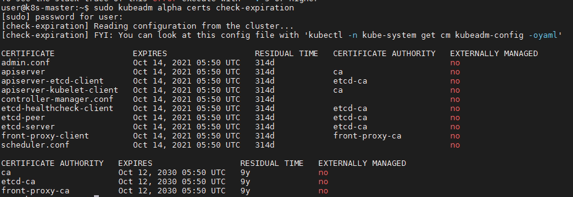

# k8s证书延期

[TOC]

此文档适用于kubernetes 1.16.0

## 更新master证书

1. 在master节点上检查证书是否过期 `kubeadm alpha certs check-expiration`

    

2. 备份证书  `cp -rp /etc/kubernetes/ /etc/back-kubernetes-up/`

3. 生成集群当前配置文件 `kubeadm config view > ./cluster.yaml`

4. 手动更新证书 `kubeadm alpha certs renew all --config=./cluster.yaml`

5. 更新配置文件`/etc/kubernetes/*.conf`, 主要是为了更新`/etc/kubernetes/kubelet.conf`

    `kubeadm init phase kubeconfig all --config=./cluster.yaml`

6. 检查证书过期时间是否更新 `kubeadm alpha certs check-expiration`

## 更新kubelet证书

### 修改master节点配置

1. 在master节点上编辑`kube-controller-manager`配置文件

    ```shell
    vim /etc/kubernetes/manifests/kube-controller-manager.yaml
    # 添加以下参数
    - --experimental-cluster-signing-duration=87600h0m0s
    - --feature-gates=RotateKubeletServerCertificate=true
    ```

2. 在master节点上配置rbac进行server证书自动签发授权

    在master节点，保存以下设置并执行kubectl apply

    ```yaml
    apiVersion: rbac.authorization.k8s.io/v1
    kind: ClusterRole
    metadata:
      annotations:
        rbac.authorization.Kubernetes.io/autoupdate: "true"
      labels:
        kubernetes.io/bootstrapping: rbac-defaults
      name: system:certificates.k8s.io:certificatesigningrequests:selfnodeserver
    rules:
    - apiGroups:
      - certificates.k8s.io
      resources:
      - certificatesigningrequests/selfnodeserver
      verbs:
      - create
    ---
    apiVersion: rbac.authorization.k8s.io/v1
    kind: ClusterRoleBinding
    metadata:
      name: kubeadm:node-autoapprove-certificate-server
    roleRef:
      apiGroup: rbac.authorization.k8s.io
      kind: ClusterRole
      name: system:certificates.k8s.io:certificatesigningrequests:selfnodeserver
    subjects:
    - apiGroup: rbac.authorization.k8s.io
      kind: Group
      name: system:nodes
    ```

    k8s 1.16.0自带下面这个ClusterRoleBinding。如果没有，则需要手动添加

    ```yaml
    apiVersion: rbac.authorization.k8s.io/v1
    kind: ClusterRoleBinding
    metadata:
      name: kubeadm:node-autoapprove-certificate-rotation
    roleRef:
      apiGroup: rbac.authorization.k8s.io
      kind: ClusterRole
      name: system:certificates.k8s.io:certificatesigningrequests:selfnodeclient
    subjects:
    - apiGroup: rbac.authorization.k8s.io
      kind: Group
      name: system:nodes
    ```

### 更新每一个k8s节点的kubelet证书

1. 检查kubelet证书是否过期

    ```shell
    openssl x509 -in /var/lib/kubelet/pki/kubelet-client-current.pem -noout -text | grep Not
    openssl x509 -in /var/lib/kubelet/pki/kubelet.crt -noout -text | grep Not
    ```

2. 备份kubelet配置文件和证书

    ``` shell
    cp /var/lib/kubelet/config.yaml /var/lib/kubelet/config.yaml.bak
    cp -rp /var/lib/kubelet/pki/ /var/lib/kubelet/back-pki-up/
    ```

3. 编辑kubelet配置文件

    ```yaml
    vim /var/lib/kubelet/config.yaml
    # 添加以下参数
    featureGates:
      RotateKubeletClientCertificate: true
      RotateKubeletServerCertificate: true
    serverTLSBootstrap: true
    ```

4. 重启kubelet

    ```shell
    systemctl restart kubelet
    ```

5. 在master节点颁发kubelet server证书

    ```shell
    kubectl get csr
    kubectl certificate approve <pending-csr>
    ```

6. 检查证书过期时间是否更新

    ```shell
    openssl x509 -in /var/lib/kubelet/pki/kubelet-client-current.pem -noout -text | grep Not
    openssl x509 -in /var/lib/kubelet/pki/kubelet-server-current.pem -noout -text | grep Not
    ```

### 重新生成master的kubelet.conf

1. 备份master的`kubelet.conf`

    ```shell
    cp /etc/kubernetes/kubelet.conf /etc/kubernetes/kubelet.conf.bak
    ```

2. 重新生成master的`kubelet.conf`

    ```shell
    kubeadm init phase kubeconfig kubelet
    ```

3. 重启kubelet

    ```shell
    systemctl restart kubelet
    ```

## 小记

1. 在master节点重启kubelet，会生成新的`kubelet-client-xxxx.pem`，10年有效期。如果删除这条证书，重启kubelet后会再次生成。执行`kubectl get csr`会看到一条自动Approved的csr。

2. 在其它Node节点重启kubelet，没有生成新的`kubelet-client-xxxx.pem`。

3. 把k8s每个节点的硬件时间和系统时间修改到`kubelet-client-xxxx.pem`过期前几天，重启kubelet后会生成新的`kubelet-client-xxxx.pem`。

    ```shell
    hwclock --set --date="07/24/2020 09:32:45"
    hwclock --hctosys
    ```

4. 把k8s每个节点的硬件时间和系统时间修改到`kubelet-client-xxxx.pem`过期之后，重启kubelet也没有生成新的`kubelet-client-xxxx.pem`。

## 修改k8s源码更新master证书

1. 修改证书有效期

    ```shell
    cd ~/kubernetes-1.16.0

    vim ./staging/src/k8s.io/client-go/util/cert/cert.go

    vim ./cmd/kubeadm/app/constants/constants.go
    ```

    `cert.go`修改内容

    ```go
    // NewSelfSignedCACert creates a CA certificate
    func NewSelfSignedCACert(cfg Config, key crypto.Signer) (*x509.Certificate, error) {
      ......
        NotBefore:             now.UTC(),
        //NotAfter:              now.Add(duration365d * 10).UTC(),
        NotAfter:              now.Add(duration365d * 100).UTC(),
      ......
    }
    ```

    `constants.go`修改内容

    ```go
    const (
      ......
      // CertificateValidity defines the validity for all the signed certificates generated by kubeadm
      //CertificateValidity = time.Hour * 24 * 365
      CertificateValidity = time.Hour * 24 * 365 * 100
      ......
    )
    ```

2. 编译

    ```shell
    # 检查kube-cross版本
    cat ~/kubernetes-1.16.0/build/build-image/cross/VERSION

    docker pull gcrcontainer/kube-cross:v1.12.9-1
    docker run --rm -v ~/kubernetes-1.16.0:/go/src/k8s.io/kubernetes -it gcrcontainer/kube-cross:v1.12.9-1 bash

    # 编译kubeadm
    cd /go/src/k8s.io/kubernetes
    make all WHAT=cmd/kubeadm GOFLAGS=-v
    ```

3. 替换`kubeadm`

    ```shell
    mv /usr/bin/kubeadm /usr/bin/kubeadm_backup
    cp ~/kubernetes-1.16.0/_output/local/bin/linux/amd64/kubeadm /usr/bin/kubeadm
    ```