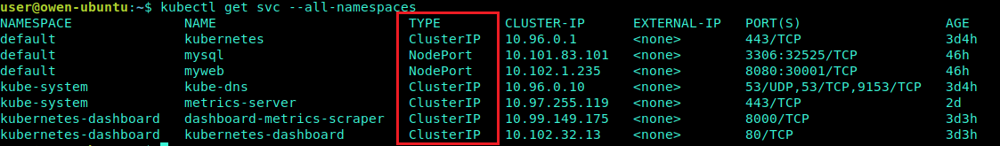

# Service

[TOC]

## Service解决的问题

Kubernetes以Pod作为应用部署的最小单位。kubernetes会根据Pod的声明对其进行调度，包括创建、销毁、迁移、水平伸缩等，因此Pod 的IP地址不是固定的，不方便直接采用Pod IP对服务进行访问。

为解决该问题，Kubernetes提供了Service资源，Service对提供同一个服务的多个Pod进行聚合。一个Service提供一个虚拟的Cluster IP，后端对应一个或者多个提供服务的Pod。在集群中访问该Service时，采用Cluster IP即可，Kube-proxy负责将发送到Cluster IP的请求转发到后端的Pod上。

## 创建 Service

创建Services的方法：

1. kubectl expoese命令，会给我们的pod创建一个service，供外部访问

2. 通过定义一个yml文件定义一个service类型的资源.

  ``` yaml
  apiVersion: v1
  kind: Service
  metadata:
    labels:
      name: mysql
      role: service
    name: mysql-service
  spec:
    ports:
      - port: 3306
        targetPort: 3306
        nodePort: 30964
    type: NodePort
    selector:
      mysql-service: "true"
  ```

  上述内容定义了一个名为“mysql-service”的Servcie，它的服务端口为8080，拥有 “mysql-service=true”这个Label的所有Pod实例都属于它；当访问node上的30964端口时，其请求会转发到service对应的cluster IP的3306端口，并进一步转发到pod的3306端口

查看service更多信息 `kubectl get svc tomcat-service -o yaml`

## Service 类型

Kubernetes的ServiceTypes能让你指定你想要哪一种服务。

- 默认的是`ClusterIP`，它会开放一个服务可以在`集群内部进行连接`。
- `NodePort` 和`LoadBalancer`是两种会 `将服务开放给外部网络的类型`。

service主要以下类型：

1. ClusterIP: 仅仅使用一个集群内部的IP地址 - 这是默认值。选择这个值意味着你只想这个服务在集群内部才可以被访问到。

2. NodePort: 在集群内部IP的基础上，在集群的每一个节点的端口上开放这个服务。你可以在任意 `<NodeIP>:NodePort`地址上访问到这个服务。

3. LoadBalancer: 在使用一个集群内部IP地址和在NodePort上开放一个服务之外，向云提供商申请一个负载均衡器，会让流量转发到这个在每个节点上以`<NodeIP>:NodePort`的形式开放的服务上。

4. ExternalName：通过返回 CNAME 和它的值，可以将服务映射到 externalName 字段的内容（例如， foo.bar.example.com）。 没有任何类型代理被创建。

  
