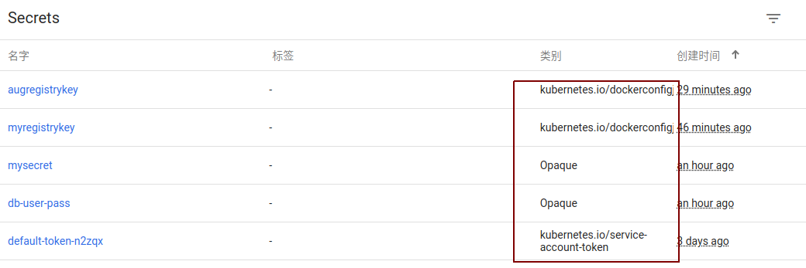

# Secret

[TOC]

Secret对象与ConfigMap对象类似，但它主要用于存储以下敏感信息，例如密码，OAuth token和SSH key等等。将这些信息存储在secret中，和直接存储在Pod的定义中，或Docker镜像定义中相比，更加安全和灵活。

## Secret 类型

Secret有三种类型：

- Opaque：使用base64编码存储信息，可以通过base64 --decode解码获得原始数据，因此安全性弱。

- kubernetes.io/dockerconfigjson：用于存储docker registry的认证信息。

- kubernetes.io/service-account-token：用于被 serviceaccount 引用。serviceaccout 创建时 Kubernetes 会默认创建对应的 secret。Pod 如果使用了 serviceaccount，对应的 secret 会自动挂载到 Pod 的 `/run/secrets/kubernetes.io/serviceaccount` 目录中。



### 创建 Secret (Opaque类型)

Opaque类型的Secret，其value为base64编码后的值

#### 1. 从文件中创建Secret

分别创建两个名为username.txt和password.txt的文件：

``` shell
echo -n "admin" > ./username.txt
echo -n "123456" > ./password.txt
```

使用kubectl create secret命令创建secret：

`kubectl create secret generic db-user-pass --from-file=./username.txt --from-file=./password.txt`


#### 2. 使用 yaml描述文件创建Secret

首先使用base64对数据进行编码：

``` shell
echo -n 'admin' | base64
YWRtaW4=

$ echo -n '123456' | base64
MTIzNDU2
```

创建一个类型为Secret的yaml描述文件：

``` yaml
apiVersion: v1
kind: Secret
metadata:
  name: mysecret
type: Opaque
data:
  username: YWRtaW4=
  password: MTIzNDU2
```

`kubectl create -f ./secret.yaml`

### 使用 Secret

创建好Secret之后，可以通过两种方式使用：

- 以Volume方式
- 以环境变量方式

#### 1. 将Secret挂载到Volume中

``` yaml
apiVersion: v1
kind: Pod
metadata:
  name: mypod
spec:
  containers:
  - name: mypod
    image: redis
    volumeMounts:
    - name: foo
      mountPath: "/etc/foo"
      readOnly: true
  volumes:
  - name: foo
    secret:
      secretName: mysecret
```

进入pod 查看挂载：

``` shell
user@owen-ubuntu:~$ kubectl exec -it mypod -- /bin/sh
# pwd
/data
# ls /etc/foo
password  username
# cat /etc/foo/password
123456# cat /etc/foo/username
admin#
```

也可以只挂载Secret中特定的key：

``` yaml
apiVersion: v1
kind: Pod
metadata:
  name: mypod
spec:
  containers:
  - name: mypod
    image: redis
    volumeMounts:
    - name: foo
      mountPath: "/etc/foo"
      readOnly: true
  volumes:
  - name: foo
    secret:
      secretName: mysecret
      items:
      - key: username
        path: my-group/my-username
```

在这种情况下：

- username 存储在`/etc/foo/my-group/my-username`中
- password未被挂载

被挂载的secret内容自动更新

- 也就是如果修改一个Secret的内容，那么挂载了该Secret的容器中也将会取到更新后的值，但是这个时间间隔是由kubelet的同步时间决定的。最长的时间将是一个同步周期加上缓存生命周期(period+ttl)

#### 2. 将Secret设置为环境变量

``` yaml
apiVersion: v1
kind: Pod
metadata:
  name: secret-env-pod
spec:
  containers:
  - name: mycontainer
    image: redis
    env:
      - name: SECRET_USERNAME
        valueFrom:
          secretKeyRef:
            name: mysecret
            key: username
      - name: SECRET_PASSWORD
        valueFrom:
          secretKeyRef:
            name: mysecret
            key: password
  restartPolicy: Never
```

### kubernetes.io/dockerconfigjson

kubernetes.io/dockerconfigjson用于存储docker registry的认证信息，可以直接使用kubectl create secret命令创建：

``` shell
kubectl create secret docker-registry myregistrykey \
   --docker-server=DOCKER_REGISTRY_SERVER \
   --docker-username=DOCKER_USER --docker-password=DOCKER_PASSWORD \
   --docker-email=DOCKER_EMAIL
```

查看secret的内容：


通过 base64 对 secret 中的内容解码：

``` shell
user@owen-ubuntu:~$ echo "eyJhdXRocyI6eyJET0NLRVJfUkVHSVNUUllfU0VSVkVSIjp7InVzZXJuYW1lIjoiRE9DS0VSX1VTRVIiLCJwYXNzd29yZCI6IkRPQ0tFUl9QQVNTV09SRCIsImVtYWlsIjoiRE9DS0VSX0VNQUlMIiwiYXV0aCI6IlJFOURTMFZTWDFWVFJWSTZSRTlEUzBWU1gxQkJVMU5YVDFKRSJ9fX0="|base64 --decode

{"auths":{"DOCKER_REGISTRY_SERVER":{"username":"DOCKER_USER","password":"DOCKER_PASSWORD","email":"DOCKER_EMAIL","auth":"RE9DS0VSX1VTRVI6RE9DS0VSX1BBU1NXT1JE"}}}
```

也可以直接读取 ~/.dockercfg 的内容来创建

```shell
kubectl create secret docker-registry myregistrykey \
  --from-file="~/.dockercfg"
```

#### 使用 imagePullSecrets

``` shell
kubectl create secret docker-registry myregistrykey \
   --docker-server=harbor.xxxx.com.cn \
   --docker-username=owen.li --docker-password=********** \
   --docker-email=owenli@xxxx.com.cn
```

在创建 Pod 的时候，通过 imagePullSecrets 来引用刚创建的 myregistrykey:

``` yaml

apiVersion: apps/v1
kind: Deployment
metadata:
  name: vuejs
spec:
  replicas: 1
  selector:
    matchLabels:
     app: vuejs
  template:
    metadata:
      labels:
        app: vuejs
    spec:
      containers:
      - name: vuejs
        image: harbor.xxxx.com.cn/vuejs-docker:1.0.61_master_9438c18
        ports:
        - containerPort: 80
      imagePullSecrets:
       - name: myregistrykey

---
apiVersion: v1
kind: Service
metadata:
  name: vuejs-svc
spec:
  type: NodePort
  selector:
    app: vuejs
  ports:
    - protocol: TCP
      port: 8088
      targetPort: 80
      nodePort: 30081
```

### kubernetes.io/service-account-token

用于被 serviceaccount 引用

serviceaccout 创建时 Kubernetes 会默认创建对应的 secret。Pod 如果使用了 serviceaccount，对应的 secret 会自动挂载到 Pod 的 `/run/secrets/kubernetes.io/serviceaccount` 目录中。


## secret 使用注意事项

- 需要被挂载到Pod中的secret需要提前创建，否则会导致Pod创建失败

- secret是有命名空间属性的，只有在相同namespace的Pod才能引用它

- 单个Secret容量限制的1Mb，这么做是为了防止创建超大的Secret导致apiserver或kubelet的内存耗尽。但是创建过多的小容量secret同样也会耗尽内存，这个问题在将来可能会有方案解决

- kubelet只支持由API server创建出来的Pod中引用secret，使用特殊方式创建出来的Pod是不支持引用secret的，比如通过kubelet的--manifest-url参数创建的pod，或者--config参数创建的，或者REST API创建的。

- 通过secretKeyRef引用一个不存在你secret key会导致pod创建失败

## secret 示例

### Pod中的ssh keys

- 创建一个包含ssh keys的secret

    `kubectl create secret generic ssh-key-secret --from-file=ssh-privatekey=/path/to/.ssh/id_rsa --from-file=ssh-publickey=/path/to/.ssh/id_rsa.pub`

创建一个Pod，其中的容器可以用volume的形式使用ssh keys

``` yaml
kind: Pod
apiVersion: v1
metadata:
  name: secret-test-pod
  labels:
    name: secret-test
spec:
  volumes:
  - name: secret-volume
    secret:
      secretName: ssh-key-secret
  containers:
  - name: ssh-test-container
    image: mySshImage
    volumeMounts:
    - name: secret-volume
      readOnly: true
      mountPath: "/etc/secret-volume"
```

### Pod中区分生产和测试证书

创建2种不同的证书，分别用在生产和测试环境

``` shell
$ kubectl create secret generic prod-db-secret --from-literal=username=produser --from-literal=password=Y4nys7f11
secret "prod-db-secret" created
$ kubectl create secret generic test-db-secret --from-literal=username=testuser --from-literal=password=iluvtests
secret "test-db-secret" created
```

再创建2个不同的Pod

``` yaml
apiVersion: v1
kind: List
items:
- kind: Pod
  apiVersion: v1
  metadata:
    name: prod-db-client-pod
    labels:
      name: prod-db-client
  spec:
    volumes:
    - name: secret-volume
      secret:
        secretName: prod-db-secret
    containers:
    - name: db-client-container
      image: myClientImage
      volumeMounts:
      - name: secret-volume
        readOnly: true
        mountPath: "/etc/secret-volume"
- kind: Pod
  apiVersion: v1
  metadata:
    name: test-db-client-pod
    labels:
      name: test-db-client
  spec:
    volumes:
    - name: secret-volume
      secret:
        secretName: test-db-secret
    containers:
    - name: db-client-container
      image: myClientImage
      volumeMounts:
      - name: secret-volume
        readOnly: true
        mountPath: "/etc/secret-volume"
```

两个容器中都会有下列的文件

- /etc/secret-volume/username
- /etc/secret-volume/password

### 以“.”开头的key可以产生隐藏文件

``` yaml
kind: Secret
apiVersion: v1
metadata:
  name: dotfile-secret
data:
  .secret-file: dmFsdWUtMg0KDQo=
---
kind: Pod
apiVersion: v1
metadata:
  name: secret-dotfiles-pod
spec:
  volumes:
  - name: secret-volume
    secret:
      secretName: dotfile-secret
  containers:
  - name: dotfile-test-container
    image: k8s.gcr.io/busybox
    command:
    - ls
    - "-l"
    - "/etc/secret-volume"
    volumeMounts:
    - name: secret-volume
      readOnly: true
      mountPath: "/etc/secret-volume"
```

会在挂载目录下产生一个隐藏文件，/etc/secret-volume/.secret-file
