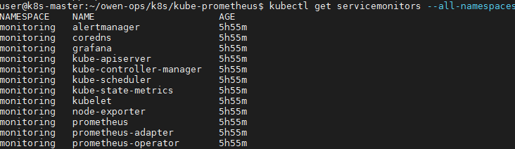

# Kube-Prometheus-Stack

[TOC]

很多地方提到Prometheus Operator是kubernetes集群监控的终极解决方案，但是目前Prometheus Operator已经不包含完整功能，完整的解决方案已经变为kube-prometheus。

`但是kube-prometheus是基于Prometheus Operator`，所以有必要首先了解下什么是 Prometheus Operator。

## Prometheus Operator

Prometheus 是一套开源的系统监控、报警、时间序列数据库的组合，而 `Prometheus Operator` 是 CoreOS 开源的一套用于管理在 Kubernetes 集群上的 Prometheus 控制器，它是`为了简化在 Kubernetes 上部署、管理和运行 Prometheus 和 Alertmanager 集群。`

- <https://github.com/prometheus-operator/prometheus-operator>

### 功能

- 创建/毁坏: 在Kubernetes namespace中更容易启动一个Prometheus实例，一个特定的应用程序或团队更容易使用Operator。

- 简单配置: 配置Prometheus的基础东西，比如在Kubernetes的本地资源versions, persistence, retention policies, 和replicas。

- Target Services通过标签: 基于常见的Kubernetes label查询，自动生成监控target 配置；不需要学习普罗米修斯特定的配置语言。

### 架构

架构图如下：


上图是Prometheus-Operator官方提供的架构图，其中Operator是最核心的部分，作为一个控制器，他会去创建Prometheus、ServiceMonitor、AlertManager以及PrometheusRule4个CRD资源对象，然后会一直监控并维持这4个资源对象的状态。

其中创建的prometheus这种资源对象就是作为Prometheus Server存在，而`ServiceMonitor就是exporter的各种抽象`，exporter前面我们已经学习了，是用来提供专门提供metrics数据接口的工具，Prometheus就是通过ServiceMonitor提供的metrics数据接口去 pull 数据的，当然alertmanager这种资源对象就是对应的AlertManager的抽象，而PrometheusRule是用来被Prometheus实例使用的报警规则文件。

这样要在集群中监控什么数据，就变成了直接去操作 Kubernetes 集群的资源对象了，是不是方便很多了。上图中的 Service 和 ServiceMonitor 都是 Kubernetes 的资源，`一个 ServiceMonitor 可以通过 labelSelector 的方式去匹配一类 Service，Prometheus 也可以通过 labelSelector 去匹配多个ServiceMonitor`。

Prometheus Operator通过定义`servicemonitor`和`prometheusrule`就能动态调整prometheus和alertmanager配置，更加符合Kubernetes的操作习惯，使Kubernetes监控更优雅

### 安装

Operator 根据以下自定义资源 (CustomResourceDefinitions) 进行操作：

- Prometheus：定义期望的Prometheus实例，同时保证任何时候有期望的Prometheus实例在运行。

- ServiceMonitor：通过声明式的方式指定哪些服务需要被监控，它自动生成Prometheus 的scrape配置。

- PodMonitor：通过声明式的方式指定哪些pod需要被监控，它自动生成Prometheus 的scrape配置。

- PrometheusRule：配置Prometheus rule文件，包括recording rules和alerting，它能够自动被Prometheus加载。

- Alertmanager：定义期望的Alertmanager实例，同时保证任何时候有期望的Alertmanager实例在运行，对于指定多台Alertmanager，prometheus operator会自动将它们配置成集群。

    ``` shell
    # git clone https://github.com/coreos/kube-prometheus/manifests
    # Create the namespace and CRDs, and then wait for them to be availble before creating the remaining resources
    kubectl create -f manifests/setup
    until kubectl get servicemonitors --all-namespaces ; do date; sleep 1; echo ""; done

    ```

部署完成后，会创建一个名为monitoring的 namespace，所以资源对象对将部署在改命名空间下面，此外 Operator 会自动创建CRD 资源对象：

- 查看自定义资源crd

    

## Kube-Prometheus

Prometheus是非常流行的监控服务，但是对于k8s的监控需要做很多接口，这导致了prometheus监控K8s比较复杂，官方就出了`kube-prometheus`这么一个项目，是Prometheus Operator的定制版，如果我们想获取完整的k8s服务监控指标，推荐采用kube-prometheus的方式

- <https://github.com/prometheus-operator/kube-prometheus>

**Kube-Prometheus 包含以下组件：**

- The Prometheus Operator
- Highly available Prometheus
- Highly available Alertmanager
- Prometheus node-exporter
- Prometheus Adapter for Kubernetes Metrics APIs
- kube-state-metrics
- Grafana

### 部署 Kube-Prometheus

所以说， 上面的步骤仅仅是创建了 `prometheus-operator自定义资源 (CRDs)` 创建完毕，为了得到完整的prometheus stack, 仍然需要执行 以下命令

`kubectl create -f manifests/`

- 部署完后，根据命名空间查询 状态 `kubectl get all -n monitoring` ，如图所示

    

    可以在 monitoring 命名空间下面查看所有的 Pod，其中 alertmanager 和 prometheus 是用 StatefulSet 控制器管理的，其中还有一个比较核心的 prometheus-operator 的 Pod，用来控制其他资源对象和监听对象变化的

- 查看 servicemonitor 资源

    

上面我们直接通过 Prometheus-Operator 的源码来进行安装，当然也可以用 Helm 来进行一键安装

### 基于Kube-Prometheus配置进行修改

- 对源码进行修改，对prometheus, grafana, alertmanager 增加了`NodePort`

- 可以看到大部分的配置都是正常的，只有两三个没有管理到对应的监控目标，比如 kube-controller-manager 和 kube-scheduler 这两个系统组件，这就和 ServiceMonitor 的定义有关系了

    

  查看yaml文件prometheus-serviceMonitorKubeScheduler，selector匹配的是service的标签，但是kube-system namespace中并没有k8s-app=kube-scheduler的service

  - 在源码基础上添加
  1. 新建 prometheus-kubeSchedulerService.yaml
  2. 新建 prometheus-kubeControllerManagerService.yaml

    `kubectl apply -f prometheus-kubeSchedulerService.yaml`
    `kubectl apply -f prometheus-kubeControllerManagerService.yaml`

### 访问 Prometheus/Grafana/AlertManager

#### Prometheus

`$ kubectl --namespace monitoring port-forward svc/prometheus-k8s 9090 --address 0.0.0.0`

Then access via <http://localhost:9090>


#### Grafana

`$ kubectl --namespace monitoring port-forward svc/grafana 3000 --address 0.0.0.0`
Then access via <http://localhost:3000> and use the default grafana user:password of admin:admin.

grafana默认已经添加了Prometheus数据源，可以直接用


#### Alert Manager

`$ kubectl --namespace monitoring port-forward svc/alertmanager-main 9093 --address 0.0.0.0`
Then access via <http://localhost:9093>


如果想要在外网访问这两个服务的话可以通过创建对应的 Ingress 对象或者使用 NodePort 类型的 Service

## 自定义监控项

除了 Kubernetes 集群中的一些资源对象、节点以及组件需要监控，有的时候我们可能还需要根据实际的业务需求去添加自定义的监控项，添加一个自定义监控的步骤也是非常简单的。

1. 第一步建立一个 ServiceMonitor 对象，用于 Prometheus 添加监控项

2. 第二步为 ServiceMonitor 对象关联 metrics 数据接口的一个 Service 对象

3. 第三步确保 Service 对象可以正确获取到 metrics 数据

## Prometheus/AlertManager 配置

浏览Prometheus Dashboard上的Configuration页面，会有个疑问，这些配置内容是从哪里来的呢？

prometheus-operator和直接部署prometheus区别是operator把prometheus, alertmanager server 的配置, 还有scape config, record/alert rule 包装成了k8s中的CRD

修改CRD之后，operator监控到CRD的修改，生成一份prometheus的配置文件，gzip压缩后存成k8s Secret。

`kubectl get secret -n monitoring prometheus-k8s -o json | jq -r '.data."prometheus.yaml.gz"' | base64 -d | gzip -d`

json文件内容是：

{
    "apiVersion": "v1",
    "data": {
        "prometheus.yaml.gz": "xxxxxxx"
    },
    ...
}

我们需要取出data."prometheus.yaml.gz"的值，再做base64解密和gzip还原, 如下所示：

``` yaml
global:
  evaluation_interval: 30s
  scrape_interval: 30s
  external_labels:
    prometheus: monitoring/k8s
    prometheus_replica: $(POD_NAME)
rule_files:
- /etc/prometheus/rules/prometheus-k8s-rulefiles-0/*.yaml
scrape_configs:
- job_name: monitoring/alertmanager/0
  honor_labels: false
  kubernetes_sd_configs:
  - role: endpoints
    namespaces:
      names:
      - monitoring
  scrape_interval: 30s
  relabel_configs:
  - action: keep
    source_labels:
    - __meta_kubernetes_service_label_alertmanager

    ....
```

同理可得alertmanager的配置内容：

`kubectl get secret -n monitoring alertmanager-main -o json | jq -r '.data."alertmanager.yaml"' | base64 -d`

```yaml
"global":
  "resolve_timeout": "5m"
"receivers":
- "name": "null"
"route":
  "group_by":
  - "job"
  "group_interval": "5m"
  "group_wait": "30s"
  "receiver": "null"
  "repeat_interval": "12h"
  "routes":
  - "match":
      "alertname": "Watchdog"
    "receiver": "null"
```

prometheus和alertmanager的pod中都有监控configmap/secrets的container，如果挂载的配置文件发生了修改(k8s同步configmap需要1分钟左右)，会让server进程reload配置文件。

## 示例地址

按照上面步骤，使用下面文件可部署 kube-prometheus

- <https:/devopsing.site/devops/-/tree/master/k8s/k8s-monitor/kube-prometheus/>
