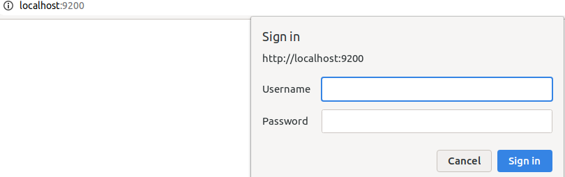
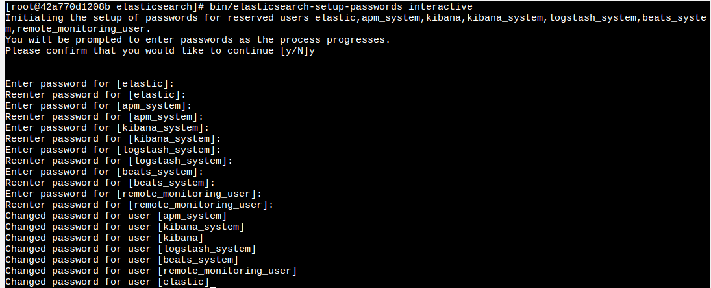
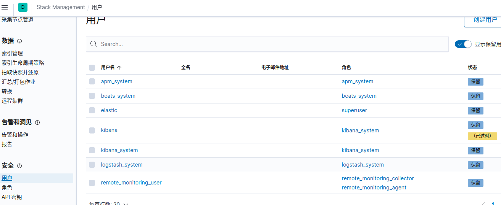

# Elasticsearch X-Pack

[TOC]

X-Pack是Elastic Stack扩展功能，提供安全性，警报，监视，报告，机器学习和许多其他功能。 **ES7.0+之后，默认情况下，当安装Elasticsearch时，会安装X-Pack，无需单独再安装**。

自6.8以及7.1+版本之后，基础级安全永久免费

- <https://www.elastic.co/guide/en/elasticsearch/reference/current/setup-xpack.html#setup-xpack>

## X-Pack安全配置的核心步骤

- <https://www.elastic.co/guide/en/elasticsearch/reference/current/configuring-security.html>

### 1. 启用Elasticsearch安全功能

默认情况下，拥有安全免费许可证时，Elasticsearch安全功能被禁用。 要启用安全功能，需要设置`xpack.security.enabled`。
在每个节点的elasticsearch.yml配置文件中，新增：

```yml
xpack.security.enabled: true
```

重启ES后，访问http://localhost:9200,就会弹出密码验证窗口



### 2. 生成TLS证书

`bin/elasticsearch-certutil cert -out config/elastic-certificates.p12 -pass ""`

### 3.配置加密通信

启用安全功能后，必须使用TLS来确保节点之间的通信已加密。
在elasticsearch.yml中心新增配置如下：

```yml
xpack.security.transport.ssl.enabled: true
xpack.security.transport.ssl.verification_mode: certificate
xpack.security.transport.ssl.keystore.path: elastic-certificates.p12
xpack.security.transport.ssl.truststore.path: elastic-certificates.p12
```

### 4. 设置密码

注意：必须启用xpack之后，才能设置密码。否则会报错

- <https://www.elastic.co/guide/en/elasticsearch/reference/current/built-in-users.html>

```bash
# 设置Elasticsearch集群(built-in users)密码
[root@42a770d1208b elasticsearch]# bin/elasticsearch-setup-passwords -h
Sets the passwords for reserved users

Commands
--------
auto - Uses randomly generated passwords
interactive - Uses passwords entered by a user

Non-option arguments:
command              

Option             Description        
------             -----------        
-E <KeyValuePair>  Configure a setting
-h, --help         Show help          
-s, --silent       Show minimal output
-v, --verbose      Show verbose output

# bin/elasticsearch-setup-passwords auto #自动生成好几个默认用户和密码

# bin/elasticsearch-setup-passwords interactive #手动生成密码
```

   

## 修改Logstash配置

``` yml
#logstash.yml 增加的参数
xpack.monitoring.elasticsearch.username: logstash_system
xpack.monitoring.elasticsearch.password: logstash_system
xpack.monitoring.elasticsearch.url: ["http://10.215.4.166:9200", "http://10.215.4.167:9200"]
xpack.management.logstash.poll_interval: 5s
xpack.monitoring.elasticsearch.sniffing: true
```

``` yml
#pipeline.yml, 添加user和 password:
    elasticsearch {
            hosts => ["10.215.4.166:9200", "10.215.4.167:9200"]
            index => "slow_log"
            user => "elastic"
            password => "123456"
            }
```

## 修改Kibana配置

``` yml
# 在kibana.yml下添加如下两行
elasticsearch.username: "elastic"
elasticsearch.password: "123456"
```

重启kibana后，可以看到多了【安全】配置

