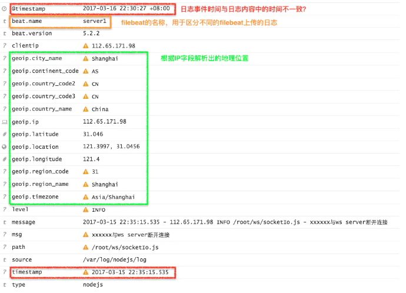
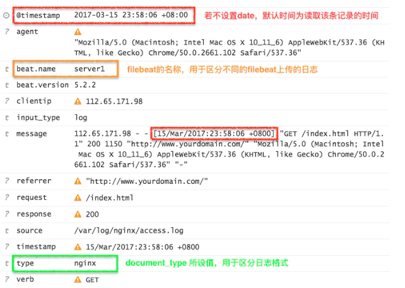
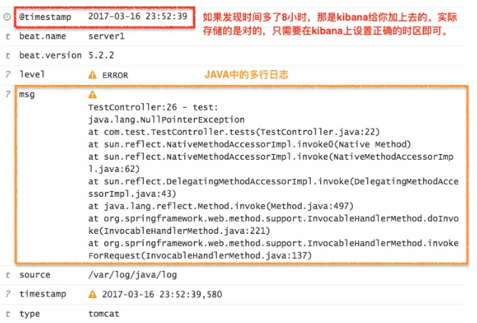

# 过滤 Filter

- <https://www.elastic.co/guide/en/logstash/current/filter-plugins.html>

logstash直接输入预定义好的 JSON 数据，这样就可以省略掉 filter/grok 配置,但是在我们的生产环境中，日志格式往往使用的是普通的格式，因此就不得不使用插件进行过滤

- grok：采用正则的方式，解析原始日志格式，使其结构化；
- geoip：根据IP字段，解析出对应的地理位置、经纬度等；
- date：解析选定时间字段，将其时间作为logstash每条记录产生的时间（若没有指定该字段，默认使用read line的时间作为该条记录时间）；
  
*注意：codec也是经常会使用到的，它主要作用在INPUTS和OUTPUTS中，[提供有json的格式转换、multiline的多行日志合并等

## 配置示例

``` json
input {
    log4j {
        port => "5400"
    }
    beats {
        port => "5044"
    }
}
filter {  # 多个过滤器会按声明的先后顺序执行
    grok {
        match => { "message" => "%{COMBINEDAPACHELOG}"}
    }
    geoip {
        source => "clientip"
    }
}
output {
    elasticsearch {
        action => "index"
        hosts => "127.0.0.1:9200"
        # 或者 ["IP Address 1:port1", "IP Address 2:port2", "IP Address 3"] ,
        # 支持均衡的写入ES的多个节点，一般为非master节点
        index  => "logstash-%{+YYYY-MM}"
    }
    stdout {
        codec=> rubydebug
    }
    file {
        path => "/path/to/target/file"
    }
}

```

ES Output插件主要的选项包括：

``` text
# action，默认是index，索引文档(logstash的事件)（ES架构与核心概念参考）。
# host，声明ES服务器地址端口
# index，事件写入的ES index，默认是logstash-%{+YYYY.MM.dd}，按天分片index，一般来说我们会按照时间分片，
# 时间格式参考 http://www.joda.org/joda-time/apidocs/org/joda/time/format/DateTimeFormat.html
```

## 场景

### 1. NodeJS 日志

- 日志格式

  `$time - $remote_addr $log_level $path - $msg`

- 日志内容

  `2017-03-15 18:34:14.535 - 112.65.171.98 INFO /root/ws/socketIo.js - xxxxxx与ws server断开连接`

- Filebeat配置（建议filebeat使用rpm安装，以systemctl start filebeat方式启动）

  ``` yaml
  filebeat:
    prospectors:
      - document_type: nodejs #申明type字段为nodejs，默认为log
        paths:
          - /var/log/nodejs/log #日志文件地址
        input_type: log #从文件中读取
        tail_files: true #以文件末尾开始读取数据
  output:
    logstash:
        hosts: ["${LOGSTASH_IP}:5044"]

  #General Setting
  name: "server1" #设置beat的名称，默认为主机hostname
  ```

- logstash中FILTERS配置

  ``` yaml
  filter {
      if [type] == "nodejs" { #根据filebeat中设置的type字段，来过滤不同的解析规则
          grok{
              match => { "message" => "%{TIMESTAMP_ISO8601:timestamp} - %{IPORHOST:clientip} %{LOGLEVEL:level} %{PATH:path} - %{GREEDYDATA:msg}" }
          }
          geoip {
              source => "clientip" #填写IP字段
          }
      }
  }
  ```

- Filter配置讲解

  1. grok中的match内容：

     - key：表示所需解析的内容；
     - value：表示解析的匹配规则，提取出对应的字段；
     - 解析语法：%{正则模板:自定义字段}，其中TIMESTAMP_ISO8601、IPORHOST 等都是grok提供的正则模板；

  2. geoip：通过分析IP值，产生IP对应的地理位置信息；

这里是否发现@timestamp与timestamp不一致，@timestamp表示该日志的读取时间，在elasticsearch中作为时间检索索引。下面讲解Nginx日志时，会去修正这一问题。

- 结果

  

### 2. Nginx 访问日志

- 日志格式

  ``` text
  $remote_addr - $remote_user [$time_local]
  "$request" $status $body_bytes_sent "$http_referer"
  "$http_user_agent" "$http_x_forwarded_for"
  ```

- 日志内容
  
  ``` text
  112.65.171.98 - - [15/Mar/2017:18:18:06 +0800] "GET /index.html HTTP/1.1" 200 1150 "http://www.yourdomain.com/" "Mozilla/5.0 (Macintosh; Intel Mac OS X 10_11_6) AppleWebKit/537.36 (KHTML, like Gecko) Chrome/50.0.2661.102 Safari/537.36" "-"
  ```

- filebeat中prospectors的配置
  
  ``` yaml
  - document_type: nginx
    paths:
      - /var/log/nginx/access.log #日志文件地址
    input_type: log #从文件中读取
    tail_files: true #以文件末尾开始读取数据
  ```

- logstash中FILTERS配置
  
  ``` json
  filter {
    if [type] == "nginx" {
        grok {
           match => { "message" => "%{COMBINEDAPACHELOG}" }
        }

       date {
            match => [ "timestamp" , "dd/MMM/yyyy:HH:mm:ss Z", "ISO8601" ]
            target => "@timestamp" #可省略
        }
    }

  ```

- Filter配置讲解

  1. grok：

     - 是不是很不可思议，上一示例中我们匹配规则写了一长串，这个仅仅一个COMBINEDAPACHELOG就搞定了！
     - grok除了提供上面那种基础的正则规则，还对常用的日志（java,http,syslog等）提供的相应解析模板，本质还是那么一长串正则，[详情见grok的120中正则模板；

  2. date

     - match：数组中第一个值为要匹配的时间字段，后面的n个是匹配规则，它们的关系是or的关系，满足一个即可；
     - target：将match中匹配的时间替换该字段，默认替换@timestamp；

    目前为止我们解析的都是单行的日志，向JAVA这样的，若果是多行的日志我们又该怎么做呢？

- 结果

  

### 3. JAVA Log4j 日志

- 日志内容

``` text
'2017-03-16 15:52:39,580 ERROR TestController:26 - test:
java.lang.NullPointerException
    at com.test.TestController.tests(TestController.java:22)
    at sun.reflect.NativeMethodAccessorImpl.invoke0(Native Method)
    at sun.reflect.NativeMethodAccessorImpl.invoke(NativeMethodAccessorImpl.java:62)
    at sun.reflect.DelegatingMethodAccessorImpl.invoke(DelegatingMethodAccessorImpl.java:43)
    at java.lang.reflect.Method.invoke(Method.java:497)
    at org.springframework.web.method.support.InvocableHandlerMethod.doInvoke(InvocableHandlerMethod.java:221)
    at org.springframework.web.method.support.InvocableHandlerMethod.invokeForRequest(InvocableHandlerMethod.java:137)'
```

- filebeat中prospectors的配置

  ``` yaml
  - document_type: tomcat
    paths:
      - /var/log/java/log #日志文件地址
    input_type: log #从文件中读取
    tail_files: true #以文件末尾开始读取数据
    multiline:
      pattern: ^\d{4}
      match: after
      negate: true
  ```

- logstash中FILTERS配置

  ``` json
  filter {
      if [type] == "tomcat" {
          grok{
              match => { "message" => "%{TIMESTAMP_ISO8601:timestamp} %{LOGLEVEL:level} %{JAVALOGMESSAGE:msg}" }
          }

          date {
              match => [ "timestamp" , "yyyy-MM-dd HH:mm:ss,S", "ISO8601" ]
          }
      }
  }
  ```

- Filter配置讲解
  - multiline 合并多行日志：
    - pattern：匹配规则，这里指匹配每条日志开始的年份；
    - match：有before与after，这里指从该行开始向后匹配；
    - negate：是否开始一个新记录，这里指当pattern匹配后，结束之前的记录，创建一条新日志记录；

当然在logstash input中使用codec multiline设置是一样的

小技巧：关于grok的正则匹配，官方有给出[Grok Constructor](http://grokconstructor.appspot.com/)方法，在这上面提供了debugger、自动匹配等工具，方便大家编写匹配规则

- 结果
  