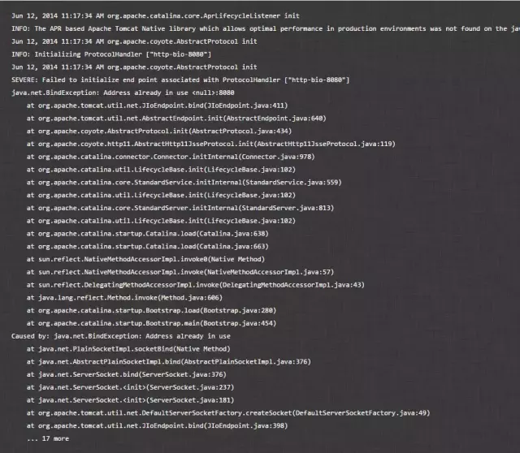
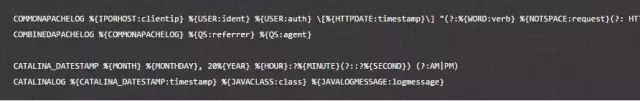

# Logstash 使用示例

[TOC]

## 1. stdin/stout示例

``` shell
bin/logstash -e 'input { stdin { } } output { stdout {} }'
#-e表示在启动时直接指定pipeline配置
```

或者将该配置写入一个配置文件中，然后通过指定配置文件来启动

``` conf
input {
    stdin {
       codec=> line
    }
}

filter {
    }

output {
    stdout{
        codec=>json
    }
}
```

在控制台输入：hello world，可以看到如下输出：

``` json
    {
    "@version" => "1",
    "host" => "localhost",
    "@timestamp" => 2018-09-18T12:39:38.514Z,
    "message" => "hello world"
    }
```

Logstash会自动为数据添加@version, host, @timestamp等字段

在这个示例中Logstash从标准输入中获得数据，仅在数据中添加一些简单字段后将其输出到标准输出

**其数据转换过程如下：**

- 将标准输入通过codec转换成line，filter这里为空即不做处理，然后在输出部分经过codec转换成json输出到标准输出

    ``` shell
    user@owen-ubuntu:/etc/logstash$ echo -e "foo\nbar"| /usr/share/logstash/bin/logstash -e 'input { stdin { } } output { stdout {} }'
    Using bundled JDK: /usr/share/logstash/jdk
    OpenJDK 64-Bit Server VM warning: Option UseConcMarkSweepGC was deprecated in version 9.0 and will likely be removed in a future release.
    WARNING: An illegal reflective access operation has occurred
    WARNING: Illegal reflective access by org.jruby.ext.openssl.SecurityHelper (file:/tmp/jruby-1262055/jruby3723351472316837071jopenssl.jar) to field java.security.MessageDigest.provider
    WARNING: Please consider reporting this to the maintainers of org.jruby.ext.openssl.SecurityHelper
    WARNING: Use --illegal-access=warn to enable warnings of further illegal reflective access operations
    WARNING: All illegal access operations will be denied in a future release
    WARNING: Could not find logstash.yml which is typically located in $LS_HOME/config or /etc/logstash. You can specify the path using --path.settings. Continuing using the defaults
    Could not find log4j2 configuration at path /usr/share/logstash/config/log4j2.properties. Using default config which logs errors to the console
    [INFO ] 2020-12-01 13:34:34.853 [main] runner - Starting Logstash {"logstash.version"=>"7.10.0", "jruby.version"=>"jruby 9.2.13.0 (2.5.7) 2020-08-03 9a89c94bcc OpenJDK 64-Bit Server VM 11.0.8+10 on 11.0.8+10 +indy +jit [linux-x86_64]"}
    [WARN ] 2020-12-01 13:34:35.238 [LogStash::Runner] multilocal - Ignoring the 'pipelines.yml' file because modules or command line options are specified
    [INFO ] 2020-12-01 13:34:36.317 [Converge PipelineAction::Create<main>] Reflections - Reflections took 24 ms to scan 1 urls, producing 23 keys and 47 values 
    [INFO ] 2020-12-01 13:34:36.781 [[main]-pipeline-manager] javapipeline - Starting pipeline {:pipeline_id=>"main", "pipeline.workers"=>4, "pipeline.batch.size"=>125, "pipeline.batch.delay"=>50, "pipeline.max_inflight"=>500, "pipeline.sources"=>["config string"], :thread=>"#<Thread:0xeca866e run>"}
    [INFO ] 2020-12-01 13:34:37.561 [[main]-pipeline-manager] javapipeline - Pipeline Java execution initialization time {"seconds"=>0.78}
    [INFO ] 2020-12-01 13:34:37.626 [[main]-pipeline-manager] javapipeline - Pipeline started {"pipeline.id"=>"main"}
    [INFO ] 2020-12-01 13:34:37.705 [Agent thread] agent - Pipelines running {:count=>1, :running_pipelines=>[:main], :non_running_pipelines=>[]}
    {
        "@timestamp" => 2020-12-01T05:34:37.699Z,
        "@version" => "1",
            "host" => "owen-ubuntu",
        "message" => "foo"
    }
    {
        "@timestamp" => 2020-12-01T05:34:37.711Z,
        "@version" => "1",
            "host" => "owen-ubuntu",
        "message" => "bar"
    }
    [INFO ] 2020-12-01 13:34:38.008 [[main]-pipeline-manager] javapipeline - Pipeline terminated {"pipeline.id"=>"main"}
    [INFO ] 2020-12-01 13:34:38.071 [Api Webserver] agent - Successfully started Logstash API endpoint {:port=>9601}
    [INFO ] 2020-12-01 13:34:38.284 [LogStash::Runner] runner - Logstash shut down.
    ```

    

    

## 2. Nginx log 示例

例如，要处理nginx日志，在/etc/logstash/conf.d 下创建一个 nginx_access.conf的日志。

``` json
input{
    file{
        path => "/var/log/nginx/access.log"
        start_position => "beginning"
        type => "nginx_access_log"
    }
}
filter{
    grok{
        match => {"message" => "%{IPORHOST:clientip} %{USER:ident} %{USER:auth} \[%{HTTPDATE:timestamp}\] \"%{WORD:verb} %{DATA:request} HTTP/%{NUMBER:httpversion}\" %{NUMBER:response:int} (?:-|%{NUMBER:bytes:int}) \"(?:-|%{DATA:referrer})\" \"%{DATA:user_agent}\" (?:%{IP:proxy}|-) %{DATA:upstream_addr} %{NUMBER:upstream_request_time:float} %{NUMBER:upstream_response_time:float}"}
        match => {"message" => "%{IPORHOST:clientip} %{USER:ident} %{USER:auth} \[%{HTTPDATE:timestamp}\] \"%{WORD:verb} %{DATA:request} HTTP/%{NUMBER:httpversion}\" %{NUMBER:response:int} (?:-|%{NUMBER:bytes:int}) \"%{DATA:referrer}\" \"%{DATA:user_agent}\" \"%{DATA:proxy}\""}
    }
    if [request] {
        urldecode {
            field => "request"
        }
       ruby {
           init => "@kname = ['url_path','url_arg']"
           code => "
               new_event = LogStash::Event.new(Hash[@kname.zip(event.get('request').split('?'))])
               event.append(new_event)"
       }
        if [url_arg] {
            ruby {
               init => "@kname = ['key', 'value']"
               code => "event.set('url_args', event.get('url_arg').split('&').collect {|i| Hash[@kname.zip(i.split('='))]})"
                }
        }
    }
    geoip{
        source => "clientip"
    }
    useragent{
        source => "user_agent"
        target => "ua"
        remove_field => "user_agent"
    }
    date {
        match => ["timestamp","dd/MMM/YYYY:HH:mm:ss Z"]
        locale => "en"
    }
    mutate{
        remove_field => ["message","timestamp","request","url_arg"]
    }
}
output{
    elasticsearch {
        hosts => "localhost:9200"
        index => "nginx-access-log-%{+YYYY.MM.dd}"
    }
#　　stdout {
#　　　　 codec => rubydebug
#　　}
}
```

`logstash -t -f /etc/logstash/conf.d/nginx.conf  #测试配置文件`

`logstash -f /etc/logstash/conf.d/nginx_access.conf  #启动logstash`


修改一下nginx的配置文件（nginx.conf）


## 4. Tomcat–>Logstash

tomcat的日志比nginx要复杂一些，打开对应的日志文件（catalina.out）,你会发现类似下面这样的日志结构：

logstash提供了强大的插件来帮助我们解析各种各样的日志输出结构，分析一下可以得出，日志结构是：时间戳，后面跟着类名，再后面跟着日志信息，这样，我们就可以根据这种结构来写过滤规则：



把这些规则存储在一个文件（/logstash安装路径/patterns/grok-patterns）中，接下来我们要改写logstash的配置文件了：

注意这里，我配置的是start_position => "beginning"，字面意思就是从日志文件头部开始解析，这样可以把一些原始日志给收集过来，但是可能会造成一些重复日志~~

## 5. Log4j–>Logstash

其实通过上面两个场景，你大概也知道是个什么尿性了，对，就是`指定好要监控的日志文件（input），然后解析对应的格式（filter），然后导入到对应的存储中（output），而且整个过程是管道化的`，前面提到了，由于咱们的测试环境是单机本地化，所以并没有使用消息队列，否则你会感受到更明显的管道化风格。

把log4j产生的日志导入到logstash要做的事儿依然如此，不过官方提供了更简单的方式：log4j-jsonevent-layout，这玩意儿的作用相当于我们在nginx中干的事儿，直接将log4j的日志格式定义成json的，有助于性能提升~

剩下的事儿就是老样子了，只需要改一下我们的logstash配置文件即可：
