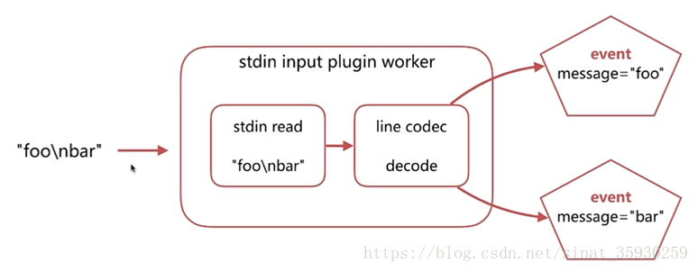
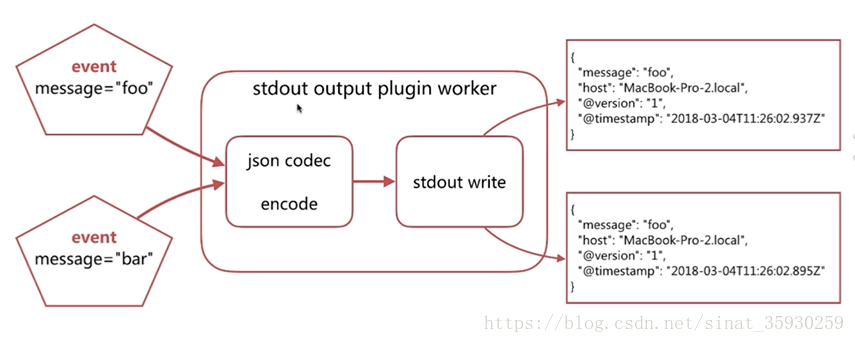

# Logstash 使用示例

## 1. Logstash Hello world

``` shell
bin/logstash -e 'input { stdin { } } output { stdout {} }'
#-e表示在启动时直接指定pipeline配置
```

或者将该配置写入一个配置文件中，然后通过指定配置文件来启动

``` conf
input {
    stdin {
       codec=> line
    }
}

filter {
    }

output {
    stdout{
        codec=>json
    }
}
```

在控制台输入：hello world，可以看到如下输出：

``` json
    {
    "@version" => "1",
    "host" => "localhost",
    "@timestamp" => 2018-09-18T12:39:38.514Z,
    "message" => "hello world"
    }
```

Logstash会自动为数据添加@version, host, @timestamp等字段

在这个示例中Logstash从标准输入中获得数据，仅在数据中添加一些简单字段后将其输出到标准输出

**其数据转换过程如下：**

- 将标准输入通过codec转换成line，filter这里为空即不做处理，然后在输出部分经过codec转换成json输出到标准输出

    ``` shell
    user@owen-ubuntu:/etc/logstash$ echo -e "foo\nbar"| /usr/share/logstash/bin/logstash -e 'input { stdin { } } output { stdout {} }'
    ....
    [INFO ] 2020-12-01 13:34:37.705 [Agent thread] agent - Pipelines running {:count=>1, :running_pipelines=>[:main], :non_running_pipelines=>[]}
    {
        "@timestamp" => 2020-12-01T05:34:37.699Z,
        "@version" => "1",
            "host" => "owen-ubuntu",
        "message" => "foo"
    }
    {
        "@timestamp" => 2020-12-01T05:34:37.711Z,
        "@version" => "1",
            "host" => "owen-ubuntu",
        "message" => "bar"
    }
    ```

    

    