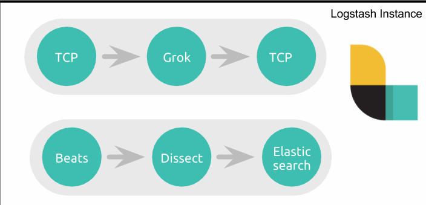
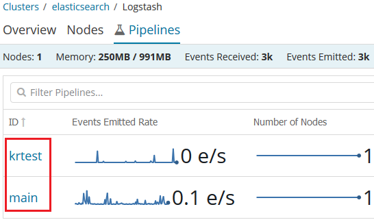

# Logstash-管道

[TOC]

最简单且最基本的 Logstash Pipeline 如下所示：

``` json
input { stdin { } }#该行可有可无，写来打印测试而已
input {
    #开启tcp插件的监听
    tcp {
    host => "127.0.0.1" #这个需要配置成本机IP，不然logstash无法启动
    port => 9600 #端口号
    codec => json_lines #将日志以json格式输入
  }
}

output {
   #输出打印
    stdout { codec => rubydebug }
}
```

## Multiple Pipelines

- https://www.elastic.co/guide/en/logstash/current/multiple-pipelines.html

作为生产者和消费者之间数据流的一个中心组件，需要一个 Logstash 实例负责驱动多个并行事件流的情况。默认情况下，这样的使用场景的配置让人并不太开心，使用者会遭遇所谓的条件地狱(Conditional hell)。因为每个单独的 Logstash 实例默认支持一个管道，该管道由一个输入、若干个过滤器和一个输出组成，`如果要处理多个数据流，就要到处使用条件判断`。

## 条件地狱(Conditional hell)

在一个管道中`实现多个独立流的方法`是使用条件判断。主要方式是在输入部分通过标签标记事件，然后在过滤器中和输出阶段创建条件分支，对贴有不同标签的事件，应用不同的插件集。这种方式虽然可以解决问题，但在实际的使用中却非常的痛苦！下面是一个简单的 demo 片段：

``` conf
input {
  beats { port => 3444  tag => apache   }
  tcp { port => 4222  tag => firewall   }
}
filter {
   if "apache" in [tags] {  
    dissect { ... }
   } else if "firewall" in [tags] {  
    grok { ... }
   }  
}
output {
   if "apache" in [tags] {  
    elasticsearch { ... }
   } else if "firewall" in [tags] {  
    tcp { ... }
   }  
}
```



很容易看出，由于存在单个管道和处理的单个阶段，随着复杂性的增加，配置会变得非常冗长，很难管理

### 缺乏拥塞隔离

如果您熟悉 Logstash 的工作原理，就会知道管道的输出部分接收到一批事件，并且在所有事件和完成所有输出之前不会移动到下一批事件。这意味着，对于上面的管道，如果 TCP 套接字目标不可达，Logstash将不会处理其他批次的事件，这也就意味着 Elasticsearch 将不会接收事件，并且会对 TCP 输入和 Beats 输入施加反压力。

### 不同的数据流需要以不同的方式处理

如果 TCP - > Grok - > TCP 数据流处理大量的小数据，而 Beats -> Dissect -> ES 数据流中的单个数据体积大但是数量少。那么前一个数据流希望有多个 worker 并行并其每一批次处理更多事件，第二个数据流则期望使用少量的 worker 和每批次处理少量的事件。使用单个管道，无法为单个数据流指定独立的管道配置

### 通过多个 Logstash 实例解决问题

上述问题可以通过在同一台机器上运行多个 Logstash 实例来解决，然后可以独立地管理这些实例。但是即使这样的解决方案也会产生其他问题：

- 需要管理多个实例(通过 init 系统管理多个后台服务)
- 每个 Logstash 的实例也意味着一个独立的 JVM
- 需要监视每个 Logstash 实例

这种方式其实很糟糕！

## 多个管道

- <https://www.elastic.co/cn/blog/logstash-multiple-pipelines>

从 Logstash 6.0 开始，引入了 Multiple Pipelines，才完美的解决了这个问题。Multiple Pipelines 的配置非常简单：在配置文件  pipelines.yml 中添加新的 pipeline 配置并指定其配置文件就可以了。下面是一个简单的 demo 配置：

``` yaml
- pipeline.id: apache
  pipeline.batch.size: 125
  queue.type: persisted
  path.config: "/path/to/config/apache.cfg"
  queue.page_capacity: 50mb

- pipeline.id: test
  pipeline.batch.size: 2
  pipeline.batch.delay: 1
  queue.type: memory
  config.string: "input { tcp { port => 3333 } } output { stdout {} }"

- pipeline.id: my-pipeline_1
  path.config: "/etc/path/to/p1.config"
  pipeline.workers: 3
- pipeline.id: my-other-pipeline
  path.config: "/etc/different/path/p2.cfg"
  queue.type: persisted
```

这个 YAML 文件包含一个散列(或字典)列表，其中每个散列表示一个管道，键和值为该管道设置名称。被省略的设置值返回到它们的默认值。

## 配置多个管道

- <https://www.elastic.co/guide/en/logstash/current/pipeline-to-pipeline.html>

除了在默认的配置文件目录(/etc/logstash/conf.d)中添加配置文件外，创建新的目录 /etc/logstash/myconf.d，并在 /etc/logstash/myconf.d 目录下创建 Logstash 配置文件 krtest.conf。然后在 /etc/logstash/pipelines.yml 文件中添加新的 pipeline 配置：

``` yaml
- pipeline.id: main
  path.config: "/etc/logstash/conf.d/*.conf"
- pipeline.id: krtest
  path.config: "/etc/logstash/myconf.d/krtest.conf"
```

当启动Logstash不带参数时，它将读取管道pipelines.yml。yml文件并实例化文件中指定的所有管道。另一方面，当使用-e或-f时，Logstash会忽略管道。

其中 pipeline.id 为 main 的管道是默认的配置，我们新添加了 id 为 krtest 的管道并指定了对应的配置文件路径。启动 Logstash，如果你安装的 X-Pack 插件就可以在 Kibana->Monitoring->Logstash 中看到新添加的名称为 krtest 的管道：



使用 Multiple Pipelines 后，Logstash 配置文件就可以写得像下面的代码一样简练(不再需要那么多的条件语句)了：

```  conf
input {
    beats {
        port => 5064
    }
}
filter {
    grok { ... }
}
output {
    elasticsearch { ... }
}

```