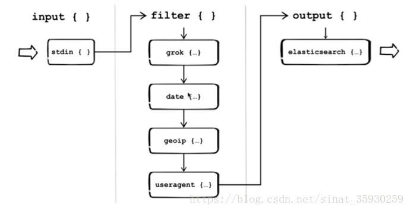

# Logstash

[TOC]

[Logstash](https://www.elastic.co/cn/logstash)是免费且开放的服务器端数据处理管道，能够从多个来源采集数据，转换数据，然后将数据发送到您最喜欢的“存储库”中。

Logstash能够动态地**采集、转换和传输数据**，不受格式或复杂度的影响。利用Grok从非结构化数据中派生出结构，从IP地址解码出地理坐标，匿名化或排除敏感字段，并简化整体处理过程。


## 工作原理

### 处理过程

Logstash使用**管道方式**进行日志的搜集处理和输出。有点类似Linux的管道命令 xxx | ccc | ddd，xxx执行完了会执行ccc，然后执行ddd


如上图，Logstash的数据处理过程主要包括：Inputs, Filters, Outputs 三部分， 另外在Inputs和Outputs中可以使用Codecs对数据格式进行处理。这四个部分均以插件形式存在，用户通过定义pipeline配置文件，设置需要使用的input，filter，output, codec插件，以实现特定的数据采集，数据处理，数据输出等功能  

1. Inputs：用于从数据源获取数据，常见的插件如file, syslog, redis, beats 等
2. Filters：用于处理数据如格式转换，数据派生等，常见的插件如grok, mutate, drop,  clone, geoip等  
    
3. Outputs：用于数据输出，常见的插件如elastcisearch，file, graphite, statsd等
4. Codecs：Codecs不是一个单独的流程，而是在输入和输出等插件中用于数据转换的模块，用于对数据进行编码处理，常见的插件如json，multiline

### 执行模型

1. 每个Input启动一个线程，从对应数据源获取数据  
2. Input会将数据写入一个队列：默认为内存中的有界队列（意外停止会导致数据丢失）。为了防止数据丢失Logstash提供了两个特性:
    - `Persistent Queues`：通过磁盘上的queue来防止数据丢失
    - `Dead Letter Queues`：保存无法处理的event（仅支持Elasticsearch作为输出源）
3. Logstash会有多个pipeline worker, 每一个pipeline worker会从队列中取一批数据，然后执行filter和output（worker数目及每次处理的数据量均由配置确定）

## 安装

- <https://www.elastic.co/guide/en/logstash/current/index.html>

### Docker部署

```shell
    docker run -d -it --restart=always \
    --privileged=true \
    --name=logstash -p 5040:5040 -p 9600:9600  \
    -v /data/logstash/pipeline/:/usr/share/logstash/pipeline/  \
    logstash:6.8.0
```

```shell
    docker run -d -it --restart=always \
    --privileged=true \
    --name=logstash -p 4560-4570:4560-4570  -p 9600:9600  \
    --link elasticsearch \
    --net efk_default \
    -v /data/logstash/pipeline/:/usr/share/logstash/pipeline/  \
    logstash:6.8.0
```

### Apt部署Logstash

``` shell
wget -qO - https://artifacts.elastic.co/GPG-KEY-elasticsearch | sudo apt-key add -
sudo apt-get install apt-transport-https
echo "deb https://artifacts.elastic.co/packages/7.x/apt stable main" | sudo tee -a /etc/apt/sources.list.d/elastic-7.x.list
sudo apt-get update && sudo apt-get install logstash
```

## logstash 相关配置文件

### log4j2.properties

包含log4j 2库的默认设置

### jvm.options

这个配置文件是有关jvm的配置，可以配置运行时内存的最大最小值，垃圾清理机制等

`-Xms256m   #设置内存大小`

### pipelines.yml

包含在单个Logstash实例中运行多个管道的框架和指令

``` yaml
user@owen-ubuntu:/etc/logstash$ cat pipelines.yml
# This file is where you define your pipelines. You can define multiple.
# For more information on multiple pipelines, see the documentation:
#   https://www.elastic.co/guide/en/logstash/current/multiple-pipelines.html

- pipeline.id: main
  path.config: "/etc/logstash/conf.d/*.conf"

```

### logstash.yml

`/etc/logstash/logstash.yml`：主要用于控制logstash运行时的状态

``` yaml
node.name  #默认主机名，该节点的描述名字
path.data  #LOGSTASH_HOME/data ，Logstash及其插件用于任何持久需求的目录
pipeline.id #默认main，pipeline的id
pipeline.java_execution #默认true，使用java执行引擎
pipeline.workers #默认为主机cpu的个数，表示并行执行管道的过滤和输出阶段的worker的数量
pipeline.batch.size #默认125 表示单个工作线程在尝试执行过滤器和输出之前从输入中收集的最大事件数
pipeline.batch.delay #默认50 在创建管道事件时，在将一个小批分派给管道工作者之前，每个事件需要等待多长时间(毫秒)
pipeline.unsafe_shutdown  #默认false，当设置为true时，即使内存中仍有运行的事件，强制Logstash在关闭期间将会退出。默认情况下，Logstash将拒绝退出，直到所有接收到的事件都被推入输出。启用此选项可能导致关机期间数据丢失
pipeline.ordered #默认auto，设置管道事件顺序。true将强制对管道进行排序，如果有多个worker，则阻止logstash启动。如果为false，将禁用维持秩序所需的处理。订单顺序不会得到保证，但可以节省维护订单的处理成本
path.config #默认LOGSTASH_HOME/config  管道的Logstash配置的路径
config.test_and_exit #默认false，设置为true时，检查配置是否有效，然后退出。请注意，使用此设置不会检查grok模式的正确性
config.reload.automatic #默认false，当设置为true时，定期检查配置是否已更改，并在更改时重新加载配置。这也可以通过SIGHUP信号手动触发
config.reload.interval  #默认3s ，检查配置文件频率
config.debug #默认false 当设置为true时，将完全编译的配置显示为调试日志消息
queue.type #默认memory ，用于事件缓冲的内部排队模型。为基于内存中的遗留队列指定内存，或为基于磁盘的脱机队列(持久队列)指定持久内存
path.queue #默认path.data/queue  ,在启用持久队列时存储数据文件的目录路径
queue.page_capacity #默认64mb ，启用持久队列时(队列)，使用的页面数据文件的大小。队列数据由分隔为页面的仅追加数据文件组成
queue.max_events #默认0，表示无限。启用持久队列时，队列中未读事件的最大数量
queue.max_bytes  #默认1024mb，队列的总容量，以字节为单位。确保磁盘驱动器的容量大于这里指定的值
queue.checkpoint.acks #默认1024，当启用持久队列(队列)时，在强制执行检查点之前被隔离的事件的最大数量
queue.checkpoint.writes #默认1024，当启用持久队列(队列)时，强制执行检查点之前的最大写入事件数
queue.checkpoint.retry #默认false，启用后，对于任何失败的检查点写，Logstash将对每个尝试的检查点写重试一次。任何后续错误都不会重试。并且不推荐使用，除非是在那些特定的环境中
queue.drain #默认false，启用后，Logstash将等待，直到持久队列耗尽，然后关闭
path.dead_letter_queue#默认path.data/dead_letter_queue，存储dead-letter队列的目录
http.host #默认"127.0.0.1" 表示endpoint REST端点的绑定地址。
http.port #默认9600 表示endpoint REST端点的绑定端口。
log.level #默认info，日志级别fatal，error，warn，info，debug，trace，
log.format #默认plain 日志格式
path.logs  #默认LOGSTASH_HOME/logs 日志目录
```

### startup.options

`/etc/logstash/startup.options`：logstash 运行相关参数

参数|用途
:--|:--|:--
JAVACMD=/usr/bin/java | 本地jdk
LS_HOME=/opt/logstash |logstash所在目录
LS_SETTINGS_DIR="${LS_HOME}/config" |默认logstash配置文件目录
LS_OPTS="–path.settings ${LS_SETTINGS_DIR}" | logstash启动命令参数 指定配置文件目录
LS_JAVA_OPTS="" | 指定jdk目录
LS_PIDFILE=/var/run/logstash.pid |logstash.pid所在目录
LS_USER=logstash |logstash启动用户
LS_GROUP=logstash | logstash启动组
LS_GC_LOG_FILE=/var/log/logstash/gc.log | logstash jvm gc日志路径
LS_OPEN_FILES=65534 | logstash最多打开监控文件数量

## Logstash 命令

<https://segmentfault.com/a/1190000016602985>