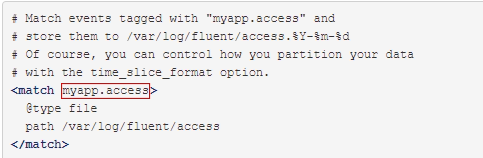

# Fluentd 

Fluentd是一个优秀的log信息收集的开源免费软件，目前以支持超过125种系统的log信息获取。Fluentd结合其他数据处理平台的使用，可以搭建大数据收集和处理平台，搭建商业化的解决方案

- https://docs.fluentd.org/


本质上，Fluentd可以分为客户端和服务端两种模块。客户端为安装在被采集系统中的程序，用于读取log文件等信息，并发送到Fluentd的服务端。服务端则是一个收集器。在Fluentd服务端，我们可以进行相应的配置，使其可以对收集到的数据进行过滤和处理，并最终路由到下一跳。下一跳可以是用于存储的数据库，如MongoDB, Amazon S3, 也可以是其他的数据处理平台，比如Hadoop


## 安装
由于Fluentd的安装较为麻烦，所以业界流行的稳定安装版本其实是有Treasure Data公司提供的td-agent。本质上td-agent和Fluentd是一个东西。

适于于Redhat&Centos的安装方式：

```
$ curl -L https://toolbelt.treasuredata.com/sh/install-redhat-td-agent3.sh | sh
启动td-agent服务并设置开机自启动:

$ sudo /etc/init.d/td-agent start
Starting td-agent: [  OK  ]
$ sudo /etc/init.d/td-agent status
td-agent (pid  21678) is running...
$ chkconfig td-agent on
```

### 安装 ntpd

ntpd ，以d结尾，是一个守护进程，全称是Network Time Protocol (NTP) daemon，它通过与一个Internet标准时钟服务器同步来维护系统时钟，同时也可以将本机做为一个时钟服务器对外提供时钟同步服务。更多信息请man一下ntpd。

安装ntpd是为了防止Fluentd在收集log的时候出现非法的时间戳。
`$ sudo apt-get install ntp`


- (Optional)优化机器内核TCP/IP参数
如果Fluentd处于一个高负载的运行环境，比如一个机器中运行了多个Fluentd实例，那么最好将下面的参数添加到 /etc/sysctl.conf 中：

```
net.ipv4.tcp_tw_recycle = 1
net.ipv4.tcp_tw_reuse = 1
net.ipv4.ip_local_port_range = 10240    65535
```
然后执行 sysctl -w 或者重启机器使之生效。

这个跟TCP/IP的细节有关系，我没有深究，貌似是为了防止短连接数过多，机器处于 TIME_WAIT 状态的TCP连接数过多，开启快速回收与重用。具体请参考 https://stackoverflow.com/questions/337115/setting-time-wait-tcp

## 配置
默认的Fluentd配置文件的目录是/etc/td-agent/td-agent.conf文件

### Post Sample Logs via HTTP
默认情况下，/etc/td-agent/td-agent.conf文件已经对td-agent进行了基本的配置。可以接收通过HTTP Post的数据，并将其路由、写入到/var/log/td-agent/td-agent.log中。

可尝试通过以下curl命令来尝试post数据。

`$ curl -X POST -d 'json={"json":"message"}' http://localhost:8888/debug.test`
执行之后，可在输出log的最后一行找到我们输入的测试数据。

### Syntax of Config
在Fluentd中，配置文件非常重要，它定义了Fluentd应该执行的操作。其语法很简单，详细内容可点击配置语法。

打开/etc/td-agent/td-agent.conf文件，可以看到配置文件的具体内容。配置文件中基本会出现的配置分为以下几种：
- source： 定义输入
- match：定义输出的目标，如写入文件，或者发送到指定地点。
filter：过滤，也即事件处理流水线，可在输入和输出之间运行。
system：系统级别的设置。
label：定义一组操作，从而实现复用和内部路由。
@include：引入其他文件，和Java、python的import类似。

#### source
Fluentd支持多输入。每一个输入配置必须包含类型／type，比如tcp数据输入，或者http类型输入。type将指定使用的input plugin。以下的示例中就定义了两个输入源，一个是从24224端口进入的tcp数据流，另一个是从9880端口进入的http数据。
```
# Receive events from 24224/tcp
# This is used by log forwarding and the fluent-cat command
<source>
  @type forward
  port 24224
</source>

# http://this.host:9880/myapp.access?json={"event":"data"}
<source>
  @type http
  port 9880
</source>
```
Source指定的input插件将带有{tag, time,record} 三个属性的事件／event提交给Fluentd的引擎，完成数据的输入。

#### match
Match配置了数据流的匹配规则和匹配成功后所需执行的动作，和路由表项类似。比如以下的配置中就对匹配myapp.access标签成功的数据包执行file类型动作，将数据写入到路径为/var/log/fluent/access的文件中。


标准的动作有file和forward等。File表明写入文件，而forward表明转发到下一跳。
Match Pattern的设计与正常的正则匹配没有区别，具体的分类如下：


此外，他们还可以混用，比如a.{b,c,d}.*等等。当标签内，有多个匹配模式时，将支持或逻辑的匹配，即只要匹配成功人一个都执行对应的操作。比如：


#### Logging
Fluentd支持两种类型的logging 配置，一种是全局的，另一种是针对插件的。

global
Plugin
支持的log的输出级别有如下几种：

fatal
error
warn
info
debug
trace
介绍完Config file的语法之后，我们还需要了解config file配置的对象Fluentd的Plugin/插件。


## 插件
Fluentd有七种类型的插件：输入(Input)，分析器(Parser)，过滤器(Filter)，输出(Output)，格式化(Formatter)，存储(Storage)，缓冲(Buffer)。

1. Input
    输入插件。内置的有tail、http、tcp、udp等
    - https://docs.fluentd.org/Input

2. Parser
    解析器。可自定义解析规则，如解析nginx日志
    - https://docs.fluentd.org/Parser

3. Filter
    Filter插件，可过滤掉事件，或增加字段，删除字段
    - https://docs.fluentd.org/Filter​

4. Output
    输出插件。内置的有file、hdfs、s3、kafka、elasticsearch、mongoDB、stdout等
    - https://docs.fluentd.org/output

5. Formatter
    Formatter插件。可自定义输出格式如json、csv等
    - https://docs.fluentd.org/Formatter

6. Storage
    Storage插件可将各状态保存在文件或其他存储中，如Redis、MongoDB等
    - https://docs.fluentd.org/Storage​

7. Buffer
    Buffer缓冲插件。缓冲插件由输出插件使用。在输出之前先缓冲，然后以如Kafka Producer Client的方式批量提交。有file、memory两种类型。flush_interval参数决定了提交的间隔，默认60秒刷新一次
    - https://docs.fluentd.org/output

- https://www.fluentd.org/plugins/all

td-agent的很多功能实现是通过安装插件来完成的，举个例子，如果想把日志路由到amazon的s3服务，则我们要安装fluent-plugin-s3这个插件：

$ sudo /usr/sbin/td-agent-gem install fluent-plugin-s3
查看插件是否安装成功： td-agent-gem list | grep s3

## Route
Route指的是数据在Fluentd中的处理流水线，一般的流程为

input -> filter -> output
input -> filter -> output with label
即由输入插件获取数据，然后交给filter做处理，然后交给output插件去转发。同时，也支持数据包／事件的重新提交，比如修改tag之后重新路由等等。

reroute event by tags
reroute event by record content
reroute event to other label

## Use Case

首先创建一个config file, 用于配置Fluentd的行为，可命名为”in_docker.conf“

```
<source>
  type forward
  port 24224
  bind 0.0.0.0
</source>

<match *.*>
  type stdout
</match>
```

然后保存文件。使用以下命令运行Fluentd。

$ fluentd -c in_docker.conf

若运行成功则可见输出信息如下所示：
```
$ fluentd -c in_docker.conf
2015-09-01 15:07:12 -0600 [info]: reading config file path="in_docker.conf"
2015-09-01 15:07:12 -0600 [info]: starting fluentd-0.12.15
2015-09-01 15:07:12 -0600 [info]: gem 'fluent-plugin-mongo' version '0.7.10'
2015-09-01 15:07:12 -0600 [info]: gem 'fluentd' version '0.12.15'
2015-09-01 15:07:12 -0600 [info]: adding match pattern="*.*" type="stdout"
2015-09-01 15:07:12 -0600 [info]: adding source type="forward"
2015-09-01 15:07:12 -0600 [info]: using configuration file: <ROOT>
  <source>
    @type forward
    port 24224
    bind 0.0.0.0
  </source>
  <match docker.*>
    @type stdout
  </match>
</ROOT>
2015-09-01 15:07:12 -0600 [info]: listening fluent socket on 0.0.0.0:24224
```

然后启动docker containner。如由于docker 本身支持Fluentd收集信息，所以可以通过启动命令来启动Fluentd的client／客户端。

$ docker run --log-driver=fluentd ubuntu echo "Hello Fluentd!"
Hello Fluentd!

启动容器后，查看默认的输出信息文件:/var/log/td-agent/td-agent.log,可在最后一行查看到输出的信息。


## 案例

这次介绍的以下场景下对Apache访问日志的设定，如配置其他应用程序的日志文件需确认日志文件路径及格式。

Apache日志文件：/var/log/httpd/access_log
日志文件格式：combined

事件信息收集设定
首先需要配置从哪里收集信息。


```
# gather apache access log
<source>
  type tail  ← 指定in_tail插件
  path /var/log/httpd/access_log  ← 指定日志文件路径
  tag apache.access  ← 指定标签，该标签用于 match 条件
  pos_file /var/log/td-agent/httpd-access_log.pos  ← 保存Apache log文件读取位置信息
  format apache2  ← 指定解析的日志文件格式
</source>
```
推荐配置「pos_file」参数，虽然不是必须配置的参数，是记录被监视文件读取位置(如第10行为止已读取)的重要文件。

in_tail插件提供读取追加内容后解析&转换为JSON格式的功能，「format」参数可指定如下正则表达式，并等于apache2。

```
/^(?[^ ]*) [^ ]* (?[^ ]*) \[(?[^\]]*)\] "(?\S+)(?: +(?[^ ]*) +\S*)?" (?[^ ]*) (?[^ ]*)(?: "(?[^\"]*)" "(?[^\"]*)")?$/
```

转换之后的JSON格式如下。

```
{
  "host": "**.***.***.***",
  "user": null,
  "method": "GET",
  "path": "/path/to/resource/",
  "code": 200,
  "size": 143320,
  "referer": "http://example.com/path/to/file",
  "agent":"Mozilla/5.0 (compatible; MSIE 10.0; Windows NT 6.2; WOW64; Trident/6.0; Touch; MDDCJS)"}
}
```

使用 out_file 插件进行日志文件的保存。

```
<match apache.access>  ← 指定标签
  type file  ← 指定out_file插件
  path /var/log/td-agent/httpd/access.log  ← 指定输出文件
  time_slice_format %Y%m%d  ← 文件添加日期信息
  time_slice_wait 10m  ← 文件添加日期信息
  compress gzip  ← gzip压缩输出文件
</match>
```
out_file插件不仅是输出信息至文件，还可以根据 time_slice_format 参数值进行输出文件的切换，例如参数值为 %Y%m%d 时，输出文件名根据日期后缀变为 .＜年＞＜月＞＜日＞。

需注意的是在fluentd，事件发生时间和fluentd接收事件信息时间有时会发生时差，因此会出现输出文件日期和实际内容不相符的情况。例如23:55发生的事件信息的接收事件是0:01，这时用日期切换输出文件可能会导致该事件信息的丢失。这时可指定 time_slice_wait 参数，该参数是out_file插件根据日期分割输出文件之后，等待多长时间之后向新文件输出信息，在这里10m是10分钟


## td-agent.config

```
<match td.*.*>
  @type tdlog
  apikey YOUR_API_KEY
  auto_create_table
  buffer_type file
  buffer_path /var/log/td-agent/buffer/td
  <secondary>
    @type file
    path /var/log/td-agent/failed_records
  </secondary>
</match>
<match debug.**>
  @type stdout
</match>
<source>
  @type forward
</source>
<source>
  @type http
  port 8888
</source>
<source>
  @type debug_agent
  bind 127.0.0.1
  port 24230
</source>
<source>
  @type tail
  path /var/log/nginx/moat.access.log
  pos_file /var/log/td-agent/moat-nginx-access.log.pos
  tag moat.nginx.access
  format /^(?<remote>[^ ]*) (?<host>[^ ]*) (?<user>[^ ]*) \[(?<time>[^\]]*)\] "(?<method>\S+)(?: +(?<path>[^\"]*) +\S*)?" (?<code>[^ ]*) (?<size>[^ ]*)(?: "(?<referer>[^\"]*)" "(?<agent>[^\"]*)" "(?<forwarded>[^\"]*)") (?<request_id>[^ ]*) (?<request_time>[^ ]*)$/
  time_format %d/%b/%Y:%H:%M:%S %z
</source>
<source>
  @type tail
  path /var/log/nginx/moat.error.log
  pos_file /var/log/td-agent/moat-nginx-error.log.pos
  tag moat.nginx.error
  format /^(?<time>[^ ]+ [^ ]+) \[(?<log_level>.*)\] (?<pid>\d*).(?<tid>[^:]*): (?<message>.*)$/
  time_format %Y/%m/%d %H:%M:%S
</source>
<filter moat.nginx.*>
  @type record_transformer
  <record>
    hostname ${hostname}
    area usa
  </record>
</filter>
<match moat.nginx.*>
  @type elasticsearch
  logstash_format true
  host 172.31.4.58
  port 9200
  logstash_prefix shaohualee-nginx-qa
  type_name fluentd
  content_type application/json
  template_name shaohualee-nginx
  template_file /etc/td-agent/shaohualee-nginx.json
  template_overwrite true
</match>
<source>
  @type tail
  path /opt/app/security-moat-sqa/logs/moat.log
  pos_file /var/log/td-agent/moat-api-access.log.pos
  tag moat.api.access
  <parse>
    @type multi_format
    <pattern>
      format /^(?<level>[^ ]*) \[(?<time>[^\]]*)\] "(?<service>[\S\s]+)" -- "(?<path>[\S\s]+)" "(?<app_version>[\S\s]+)" "(?<phone_model>[\S\s]+)" (?<token>\S+) (?<open_udid>\S+) (?<country>\S+) (?<language>\S+) (?<request_id>\S+) (?<user_id>\S+) (?<station_sn>\S+) (?<device_sn>\S+) (?<latency>[^ ]*) (?<code>[^ ]*) "(?<message>[\S\s]+)" (?<params>[\s\S]*)$/
      time_key time
    </pattern>
    <pattern>
      format /^(?<level>[^ ]*) \[(?<time>[^\]]*)\] "(?<service>[\S\s]+)" ~~ "(?<tag>[\S\s]+)" (?<action_id>\S+) (?<action_sub_id>\S+) (?<latency>[^ ]*) "(?<message>[\S\s]+)" (?<params>[\s\S]*)$/
      time_key time
    </pattern>
  </parse>
  time_format %Y-%m-%dT%H:%M:%S%z
</source>
<source>
  @type tail
  path /opt/app/security-moat-dev/logs/moat.log
  pos_file /var/log/td-agent/boat-api-access.log.pos
  tag moat.api.access
  <parse>
    @type multi_format
    <pattern>
      format /^(?<level>[^ ]*) \[(?<time>[^\]]*)\] "(?<service>[\S\s]+)" -- "(?<path>[\S\s]+)" "(?<app_version>[\S\s]+)" "(?<phone_model>[\S\s]+)" (?<token>\S+) (?<open_udid>\S+) (?<country>\S+) (?<language>\S+) (?<request_id>\S+) (?<user_id>\S+) (?<station_sn>\S+) (?<device_sn>\S+) (?<latency>[^ ]*) (?<code>[^ ]*) "(?<message>[\S\s]+)" (?<params>[\s\S]*)$/
    time_key time
    </pattern>
    <pattern>
      format /^(?<level>[^ ]*) \[(?<time>[^\]]*)\] "(?<service>[\S\s]+)" ~~ "(?<tag>[\S\s]+)" (?<action_id>\S+) (?<action_sub_id>\S+) (?<latency>[^ ]*) "(?<message>[\S\s]+)" (?<params>[\s\S]*)$/
    time_key time
    </pattern>
  </parse>
  time_format %Y-%m-%dT%H:%M:%S%z
</source>
<filter moat.api.*>
  @type record_transformer
  <record>
    hostname ${hostname}
    area usa
  </record>
</filter>
<match moat.api.*>
  @type elasticsearch
  logstash_format true
  host 172.31.4.58
  port 9200
  logstash_prefix shaohualee-api-sqa
  type_name fluentd
  content_type application/json
  template_name shaohualee-api
  template_file /etc/td-agent/shaohualee-api.json
  template_overwrite true
</match>
<source>
  @type tail
  path /opt/app/security-moat-sqa/logs/logging.log
  pos_file /var/log/td-agent/moat-logging-report.pos
  tag logging.report.moat
  <parse>
    @type json
  </parse>
</source>
<source>
  @type tail
  path /opt/app/security-emqtt-sqa/logs/logging.log
  pos_file /var/log/td-agent/boat-logging-report.pos
  tag logging.report.boat
  <parse>
    @type json
  </parse>
</source>
<match logging.report.*>
  @type elasticsearch
  logstash_format true
  host 172.31.4.58
  port 9200
  logstash_prefix logging-short-qa
  type_name doc
  content_type application/json
</match>
<system>
  log_level error
</system>


```


https://geowarin.com/spring-boot-logs-in-elastic-search-with-fluentd/