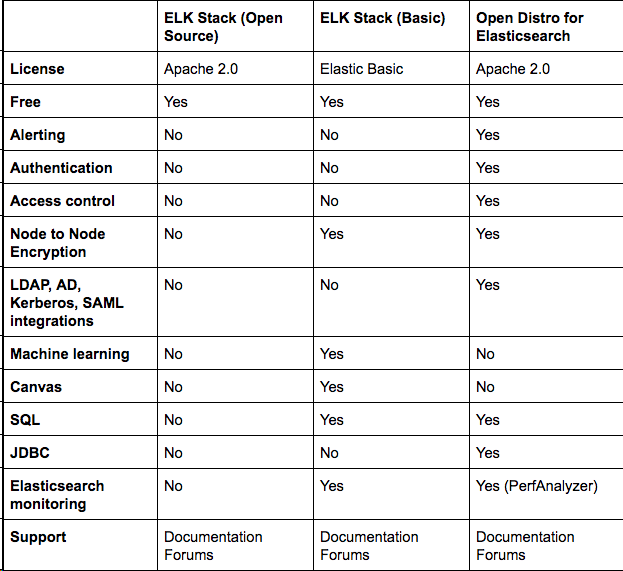
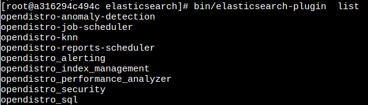
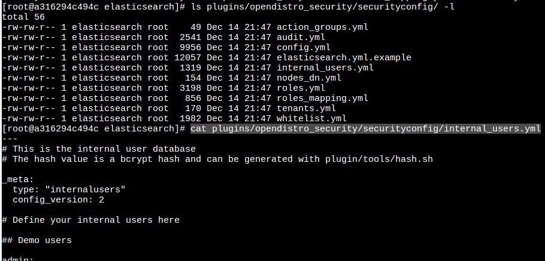
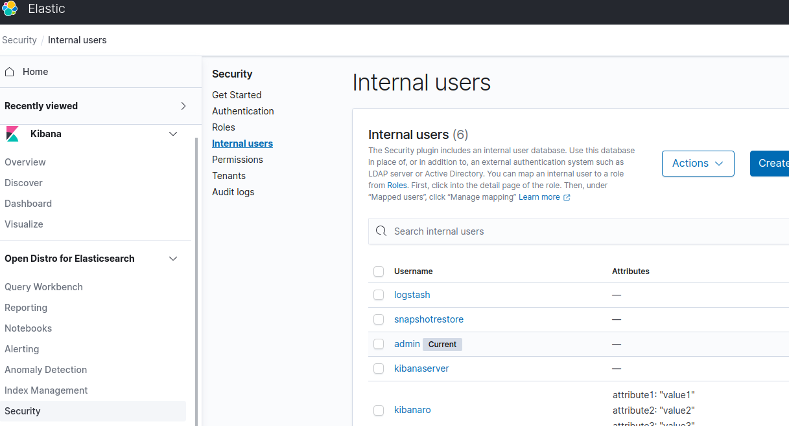
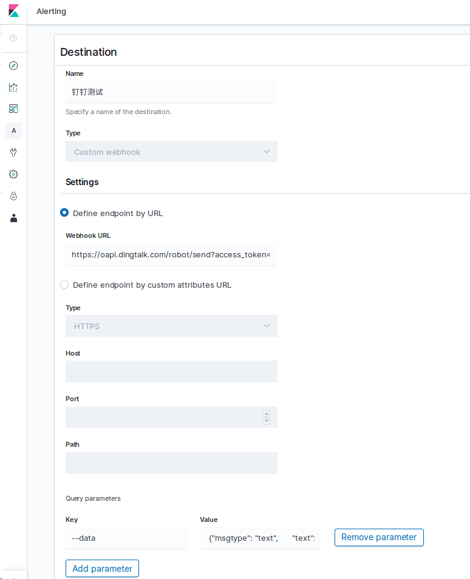
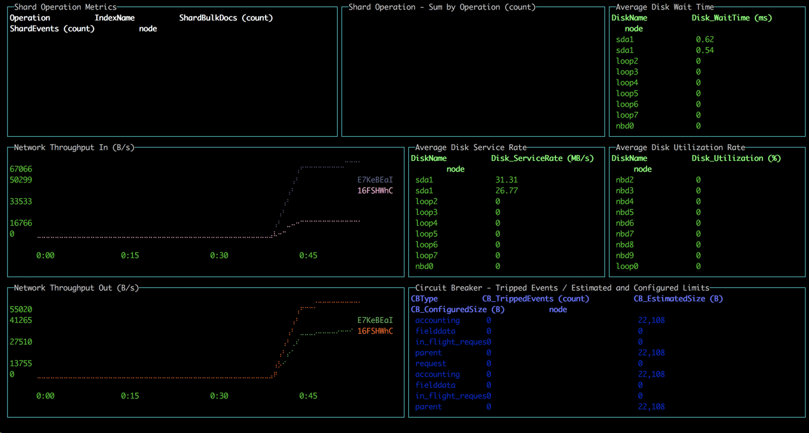

# OpenDistro

open distro for elasticsearch 是由亚马逊AWS支持的基于Apache License,Version 2.0协议的100%开源的Elasticsearch发行版。`与Elastic公司官方的Elasticsearch版本最大的区别是:剔除了基于elastic协议发布的xpack插件,增加了开源插件`。新增插件功能包括安全、告警、索引生命周期管理、性能分析、SQL等企业级功能。简单理解就是集成了开源版xpack插件的elasticsearch

Open Distro for Elasticsearch 提供了一套高级安全特性保证集群安全性，包括多种身份认证选项（如 Active Directory 和 OpenID）、节点间的加密访问、基于角色的访问控制、详细的审计日志记录等。

Open Distro for Elasticsearch 除了包含最核心的 Elasticsearch 外，还包含 Kibana

- https://opendistro.github.io/for-elasticsearch/
- https://opendistro.github.io/for-elasticsearch/downloads.html

## Open Distro 和 Elasticsearch 有什么区别




## 安装




### Standalone Elasticsearch plugin installation

If you don’t want to use the all-in-one Open Distro for Elasticsearch installation options, you can install the individual plugins on a compatible Elasticsearch cluster, just like any other Elasticsearch plugins.

https://opendistro.github.io/for-elasticsearch-docs/docs/install/plugins/

## 功能

### 安全认证

和xpack一样open distro也提供了security插件，实现加密通信、用户登陆认证、操作授权、文档和字段级别访问控制、日志审计等企业级安全功能。opendisro_security插件也支持有internaldatabase、Active Directory, LDAP,OpenID Connect 等多种后台认证服务组成的认证链。默认采用internaldatabase方式实现用户管理，内部的用户数据、权限数据、角色数据存储在ES集群的.opendistro_security索引中，和xpack的native realms 类似。系统默认初始化的用户有：

admin 超级管理员
readall 只读帐号
logstash logstash连接es时的后台帐号
kibanaserver kibana连接es时的后台帐号
kibanaro kibana只读帐号，不能修改kibana可视化面板
snapshotrestore 快照备份恢复帐号

#### 用户角色管理
opendisro_security插件默认支持三种用户管理方式：配置文件、kibana图形化界面、API命令

1. 配置文件

应用场景：适合Elasticsearch安装后初始化用户数据，不适合后续业务管理。

操作方法：

- 第一步，在`ES_HOME/plugins/opendistro_security/securityconfig/`中编辑internal_users.yml、roles_maping.yml、roles.yml 文件中的用户、角色和权限数据



- 第二步，启动Elasticsearch服务

- 第三步，运行`plugins/opendistro_security/tools/securityadmin.sh` 脚本将数据更新到`.opendistro_security` 索引中

2. kibana图形化界面

应用场景: 适合生产环境运维人员做人员管理
操作方法:
第一步, 安装并启动opendistrroforelasticsearch-kibana 版本的kibana
第二步, 在 security 模块添加用户和角色



3. API 命令

应用场景: 以上两种方式做用户管理时，不方便项目管理，不能用git等版本管理追踪到项目的全量和增量脚本,API 方式很好的弥补了这个问题.

#### 常用的用户管理API
查看用户 `GET _opendistro/_security/api/internalusers`

新建用户

```
PUT _opendistro/_security/api/internalusers/wangzhen
{
  "password":"6789@jkl",
  "backend_roles":[],
  "attributes":{
    "age":18
  }
}


#响应
{
  "status" : "CREATED",
  "message" : "'wangzhen' created."
}
```

修改用户

官方推荐的PATCH 方法修改用户并不能成功,并报错

```
PATCH _opendistro/_security/api/internalusers/wangzhen
{
  "op":"replace",
  "path":"/backend_roles",
  "value":["admin"]
}  
```
应该使用和新建用户一样的方法,且可以更新密码:

```
​PUT _opendistro/_security/api/internalusers/wangzhen
{
  "password":"6789@jkl",
  "backend_roles":["admin"],
  "attributes":{
    "age":18
  }
}


#响应
{
  "status" : "OK",
  "message" : "'wangzhen' updated."
}
```

删除用户

```
DELETE /_opendistro/_security/api/internalusers/wangzhen

#响应
{
  "status" : "OK",
  "message" : "'wangzhen' deleted."
}

```

#### LDAP 配置


#### TLS证书配置 


https://opendistro.github.io/for-elasticsearch-docs/docs/security/configuration/tls/


### Alerting

Open Distro for Elasticsearch 提供了一个功能强大、易于使用的事件监控和警报系统，能够监控存储的数据并自动向相关人员发送告警通知。凭借直观的 Kibana 界面以及强大的 API，很容易设置与管理告警通知。使用 Elasticsearch 的查询和脚本功能构建可以特定的警报条件。

在 Kibana 的新警报页面上，您将找到一个选项卡，您可以在其中定义要将警报发送到（目标）的位置。我尝试创建一个钉钉警报




然后，您需要构建所谓的触发器，该触发器定义监视器检查的特定条件以及触发警报时要执行的操作。

初步看看之后，Open Distro for Elasticsearch 中的警报机制仍然有点粗糙而且还不成熟。相比较 Elastic 那边复杂的 Alert 和收费来看, 方向已经很不错了.


### SQL

Open Distro for Elasticsearch 提供了 SQL 查询功能，使得用户能够轻松地使用 SQL 与 Elasticsearch 集群进行交互。SQL 提供了超过 40 个的函数、数据类型以及命令，包含 Join 支持和导出到 CSV 等功能。

### Performance Analyzer

Open Distro for Elasticsearch 提供了一个监视系统瓶颈的深度性能分析器，可以监控到 Elasticsearch 相关指标，以及网络、磁盘、操作系统级别的统计信息。这个工具独立运行，不会对 Elasticsearch 的性能产生任何影响。

Performance Analyzer 插件是可以在本地安装并用于查询群集上的性能指标的代理




https://www.infoq.cn/article/m7qAk4EqVCY5QxxDPPBV


https://www.infoq.cn/article/2iU2PuMU2Ngf7JP9yKIk

https://www.infoq.cn/article/ZHN5qgHTq5BjoHPiJg9L