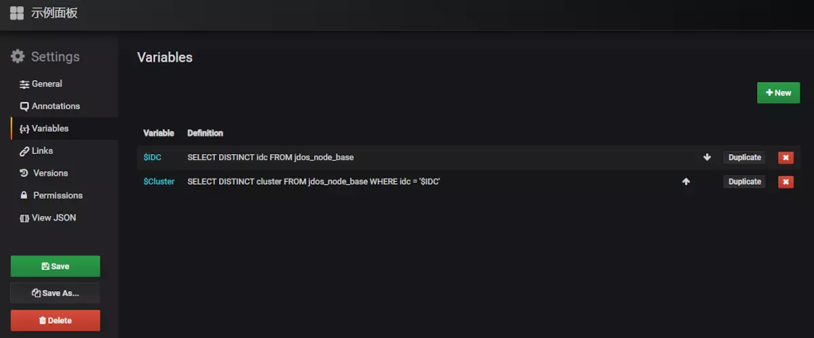

# Grafana 模板编辑  

- https://grafana.com/docs/grafana/latest/variables/templates-and-variables/

## Variables变量

Variables变量提供了用户和面板交互，并动态刷新面板的功能。不需要硬编码，不需要每次都修改SQL查询语句。变量的下拉菜单显示在面板的顶部，这样改变下拉菜单的值，即可改变变量的值，而且所有使用该变量的仪表板都会随着变量的改变而改变。

变量（Variables）的定义：
在dashboard的设置中定义的变量，可以作为该dashboard的全局变量使用，如下图所示

 

变量的表示符号IDC表示IDC这个变量，使用的时候，直接使用$IDC就可以获取IDC变量的值。

Type为变量的类型，总共有六种类型：Interval（时间间隔类），Query（查询类），Datasource（数据源类型），Custom（自定义类），Constant（常量类），Ad hoc filters（我也不知道啥玩意，未知类）

Refresh变量刷新方式
      

Refresh是指变量的刷新方式，总共三种: Never,On Dashboard Load,On Time Range Change.

- Never : 从来不刷新
- On Dashboard Load：面板加载的时候，刷新一次
- On Time Range Change：跟随面板刷新时间刷新该变量，面板的刷新设置在面板的右上角，如下

