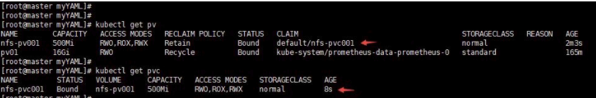
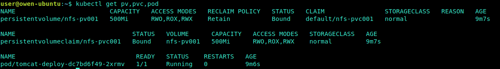

# 持久化存储 - PV&&PVC

[TOC]

## PV

- <https://kubernetes.io/docs/concepts/storage/persistent-volumes/>

PV全称叫做Persistent Volume，持久化存储卷。它是`用来描述或者说用来定义一个存储卷的`，这个通常都是有运维或者数据存储工程师来定义

PV 提供了一个抽象层，向用户屏蔽了具体的存储实现形式。

### PV与普通Volume的区别

普通Volume和使用它的Pod之间是一种静态绑定关系，在定义Pod的文件里，同时定义了它使用的Volume。Volume是Pod的附属品，我们无法单独创建一个Volume，因为它不是一个独立的K8S资源对象, 属于“计算资源”的一部分

而“网络存储”则是相对独立于“计算资源”而存在的一种实体资源。比如在使用云主机的情况下，我们通常会先创建一个网络存储，然后从中划出一个“网盘”并挂载到云主机上。PV 和与之相关联的 PVC实现了类似的功能

- PV 只能是网络存储，不属于任何 Node，但可以在每个 Node 上访问。
- PV 并不是定义在 Pod 上的，而是独立于 Pod 之外定义

### 创建PV

比如下面定义一个NFS类型的PV： (提前准备NFS存储)

``` yaml
apiVersion: v1
kind: PersistentVolume
metadata:  # PV建立不要加名称空间，因为PV属于集群级别的
  name: nfs-pv001  # PV名称
  labels: # 这些labels可以不定义
    name: nfs-pv001
    storetype: nfs
spec:  # 这里的spec和volumes里面的一样
  storageClassName: normal
  accessModes:  # 设置访问模型
    - ReadWriteMany
    - ReadWriteOnce
    - ReadOnlyMany
  capacity: # 设置存储空间大小
    storage: 500Mi
  persistentVolumeReclaimPolicy: Retain # 回收策略
  nfs:
    server: 172.20.249.5
    path: /var/nfs/sharedir
```

### 访问类型 - accessModes

accessModes：支持三种类型

- ReadWriteMany (RWX) 读写权限、允许被多个 Node 挂载。
- ReadWriteOnce (RWO) 读写权限、并且只能被单个 Node 挂载。
- ReadOnlyMany (ROX) 只读权限、允许被多个 Node 挂载。

这里的访问模型总共有三种，但是不同的存储类型支持的访问模型不同，具体支持什么需要查询官网。比如这里使用nfs，它支持全部三种。但是ISCI就不支持ReadWriteMany；HostPath就不支持ReadOnlyMany和ReadWriteMany。

### PV状态

- Available（可用） —— 空闲状态，还没有被任何声明绑定
- Bound（已绑定）   —— 已经绑定到某个 PVC 上
- Released（已释放）—— 对应的 PVC 已经删除，但资源还没有被集群收回
- Failed（失败）    —— PV 自动回收失败

## PVC

PVC是`用来描述希望使用什么样的或者说是满足什么条件的存储`，它的全称是Persistent Volume Claim，也就是持久化存储声明。开发人员使用这个来描述该容器需要一个什么存储。

PV 和 PVC类似Pods和Nodes的关系，Pod 消耗节点资源，PVC 消耗 PV 资源。PV 是提供了各种存储资源，PVC 提出需要的存储标准，然后从现有存储资源中匹配或者动态建立新的资源，最后将两者进行绑定。

### 创建PVC

比如下面使用NFS的PVC：

``` yaml
apiVersion: v1
kind: PersistentVolumeClaim
metadata:
  name: nfs-pvc001
  namespace: default
  labels: # 这些labels可以不定义， 对于PVC和PV的绑定没有关系
    name: nfs-pvc001
    storetype: nfs
    capacity: 500Mi
spec:
  storageClassName: normal
  accessModes:  # PVC也需要定义访问模式，不过它的模式一定是和现有PV相同或者是它的子集，否则匹配不到PV
  - ReadWriteMany
  resources: # 定义资源要求PV满足这个PVC的要求才会被匹配到
    requests:
      storage: 500Mi  # 定义要求有多大空间
```

这个PVC就会和上面的PV进行绑定，为什么呢？它有一些原则：

- PV 的存储大小和权限必须满足 PVC 的要求。
- PV 和 PVC 的 storageClassName 必须一致。如果没有指定 storageClassName 则默认是 "default" 或者 ""。

如果PVC没有绑定，则声明使用该PVC的Pod无法启动。



### 在Pod中如何使用PVC

Pods使用的是PersistentVolumeClaim,而非PersistentVolume。

``` yaml
apiVersion: apps/v1
kind: Deployment
metadata:
  name: tomcat-deploy
spec:
  replicas: 1
  selector:
    matchLabels:
      appname: myapp
  template:
    metadata:
      name: myapp
      labels:
        appname: myapp
    spec:
      containers:
      - name: myapp
        image: tomcat:8.5.38-jre8
        ports:
        - name: http
          containerPort: 8080
          protocol: TCP
        volumeMounts:
          - name: tomcatedata
            mountPath : "/data"
      volumes:
        - name: tomcatedata
          persistentVolumeClaim:
            claimName: nfs-pvc001
```




这里通过volumes来声明使用哪个PVC，可以看到和自己定义持久化卷类似，但是这里更加简单了，直接使用PVC的名字即可。在容器中使用/data目录就会把数据写入到NFS服务器上的目录中。

- 删除 pvc

    当执行 `delete pvc` 命令时候，命令窗口会一直Pending，但是 pvc状态已经变为 `Terminating`; 然后执行`delete pod` 之后，pvc才会被删除，同时PV 变成`Released`状态

    ``` shell
    user@owen-ubuntu:~$ kubectl delete persistentvolumeclaim/nfs-pvc001
    persistentvolumeclaim "nfs-pvc001" deleted
    ```

   

- PV在Retain策略Released状态下，PV资源不可用
  
  如果想让这个PV变为可用，就需要手动清理数据并删除这个PV。这里你可能会觉得矛盾，你让这个PV变为可用，为什么还要删除这个PV呢？其实所谓可用就是删除这个PV然后建立一个同名的, 否认，即使重新创建pvc,还是无法直接使用已经存在的PV
  
  如图所示，PV的元数据里包含删除的 PVC 信息

    

Kubernetes 中 PVC 和 PV 的设计，实际上类似于 接口 和 实现 的思想。开发者只要知道并会使用 接口，即PVC；而运维人员则负责给 接口 绑定具体的 实现，即 PV。这种解耦，避免了因为向开发者暴露过多的存储系统细节而带来的隐患。此外，这种职责的分离，往往也意味着出现事故时可以更容易定位问题和明确责任，从而避免“扯皮”现象的出现

另外你可能也会想到如果当前环境中没有合适的PV和PVC绑定，那么我创建的POD不就失败了么？的确是这样的，不过如果发现这个问题，那么就赶快创建一个合适的PV，那么这时候`持久化存储循环控制器`会不断的检查PVC和PV，当发现有合适的可以绑定之后它会自动给你绑定上然后被挂起的POD就会自动启动，而不需要你重建POD。

## PV/PVC生命周期

PV是群集中的资源。PVC是对这些资源的请求，并且还充当对资源的检查。PV和PVC之间的相互作用遵循以下生命周期：Provisioning--> Binding--> Using--> Releasing--> Recycling

1. 供应准备Provisioning --- 通过集群外的存储系统或者云平台来提供存储持久化支持。

   - 静态提供Static：集群管理员创建多个PV。 它们携带可供集群用户使用的真实存储的详细信息。 它们 存在于Kubernetes API中，可用于消费

   - 动态提供Dynamic：当管理员创建的静态PV都不匹配用户的PersistentVolumeClaim时，集群可能会 尝试为PVC动态配置卷。 此配置基于StorageClasses：PVC必须请求一个类，并且管理员必须已创建并 配置该类才能进行动态配置。 要求该类的声明有效地为自己禁用动态配置。

2. 绑定Binding---用户创建pvc并指定需要的资源和访问模式。

    在找到可用pv之前，pvc会保持未绑定状态。

3. 使用Using---用户可在pod中像volume一样使用pvc。

4. 释放Releasing---用户删除PVC来回收存储资源

    PV将变成“released”状态。由于还保留着之前的数据，这些数据需要根据不同的策略来处理，否则这些存储资源无法被其他pvc使用。

5. 回收Recycling---PV可以设置三种回收策略：保留（Retain），回收（Recycle）和删除（Delete）。

### PV回收策略 -persistentVolumeReclaimPolicy

这个策略是当与之关联的PVC被删除以后，这个PV中的数据如何被处理

- **保留 Retain：**保留现场，Kubernetes等待用户手工处理数据。
  当删除与之绑定的PVC时候，这个PV被标记为released（PVC与PV解绑但还没有执行回收策略）且之前的数据依然保存在该PV上，但是该PV不可用，`需要手动来处理这些数据并删除该PV`。

- **删除 Delete：**Kubernetes会自动删除数据

- **重用 Recycle：** 这个在1.14版本中以及被废弃，取而代之的是 动态存储供给策略（Dynamic Provisioning），它的功能是当删除与该PV关联的PVC时，自动删除该PV中的所有数据

**注意：** `PV必须先与POD创建，而且只能是网络存储不能属于任何Node，`虽然它支持HostPath类型,但由于你不知道POD会被调度到哪个Node上，所以你要定义HostPath类型的PV就要保证所有节点都要有HostPath中指定的路径。

## PV挂载过程

负责把PVC绑定到PV的是一个持久化存储卷控制循环，这个控制器也是kube-manager-controller的一部分运行在master上。

而真正把目录挂载到容器上的操作是在POD所在主机上发生的，所以通过kubelet来完成。而且创建PV以及PVC的绑定是在POD被调度到某一节点之后进行的，完成这些操作，POD就可以运行了。下面梳理一下挂载一个PV的过程：

1. 用户提交一个包含PVC的POD
2. 调度器把根据各种调度算法把该POD分配到某个节点，比如Node01
3. Node01上的kubelet等待Volume Manager准备存储设备
4. PV控制器调用存储插件创建PV并与PVC进行绑定
5. Attach/Detach Controller或Volume Manager通过存储插件实现设备的attach。（这一步是针对块设备存储）
6. Volume Manager等待存储设备变为可用后，挂载该设备到`/var/lib/kubelet/pods/<Pod 的 ID>/volumes/kubernetes.io~<Volume 类型 >/<Volume 名字 >`目录上
7. Kubelet被告知卷已经准备好，开始启动POD，通过映射方式挂载到容器中