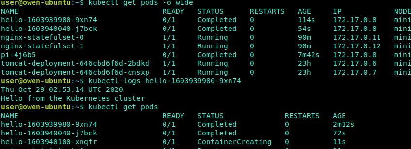

# Cronjob

## 特点

- 周期性任务，像Linux的Crontab一样。

- **应用场景：** 如通知，备份等

## 创建 Cronjob

**Cronjob Spec格式：**

- .spec.schedule指定任务运行周期，格式同Cron
- .spec.jobTemplate指定需要运行的任务，格式同Job
- .spec.startingDeadlineSeconds指定任务开始的截止期限
- .spec.concurrencyPolicy指定任务的并发策略，支持Allow、Forbid和Replace三个选项

**示例：**

每隔一分钟输出一条信息，打印hello

    ```yaml
    apiVersion: batch/v1beta1
    kind: CronJob
    metadata:
    name: hello
    spec:
    schedule: "*/1 * * * *"
    jobTemplate:
        spec:
        template:
            spec:
            containers:
            - name: hello
                image: busybox
                args:
                - /bin/sh
                - -c
                - date; echo Hello from the Kubernetes cluster
            restartPolicy: OnFailure
    ```

使用cronjob要慎重，用完之后要删掉，不然会占用很多资源


