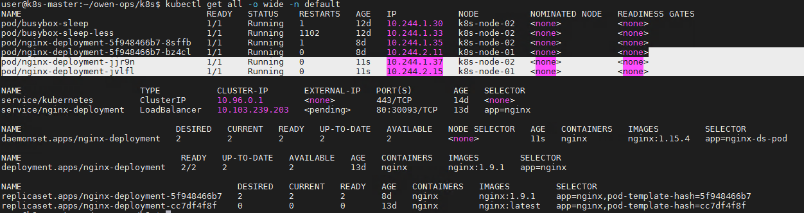

# DaemonSet

## 特点

- 在每一个Node上运行一个Pod

- 新加入的Node也同样会自动运行一个Pod

- **应用场景：** 监控，分布式存储，日志收集等

## 示例

用DaemonSet 控制器类型创建nginx pod资源，没有指定副本replicats，它会根据node节点的个数创建，如果再新加一个node节点，也会给新node节点创建pod

``` yaml
apiVersion: apps/v1
kind: DaemonSet
metadata:
  name: nginx-daemonset
  labels:
    app: nginx-ds
spec:
  selector:
    matchLabels:
      app: nginx-ds-pod
  template:
    metadata:
      labels:
        app: nginx-ds-pod
    spec:
      containers:
      - name: nginx
        image: nginx:1.15.4
        ports:
        - containerPort: 80
```



- 发现daemonset的资源已经分配到两个node节点上了，并且观察 `daemonset的pod` 和 `deployment的pod` 命名上的差别