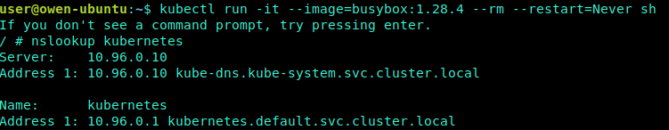

# SatefulSet

[TOC]

StatefulSet是Kubernetes提供的管理有状态应用的负载管理控制器API。在Pods管理的基础上，保证Pods的顺序和一致性。与Deployment一样，StatefulSet也是使用容器的Spec来创建Pod，与之不同StatefulSet创建的Pods在生命周期中会保持持久的标记（例如Pod Name）。

StatefulSet适用于具有以下特点的应用：

- 具有固定的网络标记（主机名）
- 具有持久化存储
- 需要按顺序部署和扩展
- 需要按顺序终止及删除
- 需要按顺序滚动更新

## 特点

- 部署有状态应用
- 解决Pod独立生命周期，保持Pod启动顺序和唯一性
- 稳定，唯一的网络标识符(包括hostname、集群内DNS中该Pod对应的A Record，并不能保证Pod re-schedule之后IP不变)
- 稳定的、持久的存储
- 有序部署（即0到N-1），有序伸缩（即从N-1到0），更新下一个 Pod 前，StatefulSet 控制器终止每个 Pod 并等待它们变成 Running 和 Ready

- **应用场景:** e.g. 数据库

## 相关知识概念

SatefulSet 涉及到一些其他概念和知识（特别是k8s存储），这里先提前介绍下有个认知，随后会在其他章节详细介绍。

### 有状态和无状态的区别

**无状态:**

1. deployment认为所有的pod都是一样的
2. 不用考虑顺序的要求
3. 不用考虑在哪个node节点上运行
4. 可以随意扩容和缩容

**有状态：**

1. 实例之间有差别，每个实例都有自己的独特性，元数据不同，例如etcd, zookeeper
2. 实例之间不对等的关系，以及依靠外部存储的应用。

### 常规service和无头服务

- service： 一组Pod访问策略，提供cluster-IP群集之间通讯，还提供负载均衡和服务发现。
- Headless service无头服务， 不需要cluster-IP，直接绑定具体的Pod的IP, 无头服务经常用于statefulset的有状态部署

### statefulset、volume、pvc、pv之间的关系

- volume
  
  volume是pod中用来挂在文件到容器中用的，支持多种的volume类型挂在，其中包括hostpath,emptydir,ceph-rbd等，，volume可以说是一个存储挂载的桥梁啦，可以通过volume关联中的persistentVolumeClaim关联pvc，然后用pvc关联的pv的存储。

- pv（persistentVolume）
  
  pv是用来向真正的存储服务器申请真正的存储资源的一个object，至于这个存储资源谁来用，那就是接下来说的pvc的职责所在。

- pvc（persistentVolumeClaim）
  
  pvc就是用来关联pv和pod的一个桥梁，当你创建啦pv的说话，如何使用它，就需要pvc来关联，两种方式：1. 在你容器中的volumeMount中指定对应的pvc的名字。2. 可以通过pod中volume关联中的persistentVolumeClaim关联pvc

- statefulset
  
  statefulset就是对应的存储的真正消费者，关联pv的方式用pvc，在你容器中的volumeMount中指定对应的pvc的名字，或者可以通过pod中volume关联中的persistentVolumeClaim关联pvc

## StatefulSet 操作

### 1. 创建statefulset资源

StatefulSet创建顺序是从0到N-1，终止顺序则是相反。如果需要对StatefulSet扩容，则之前的N个Pod必须已经存在。如果要终止一个Pod，则它的后序Pod必须全部终止

- 使用带有nslookup命令的busybox镜像启动一个Pod，检查集群内的DNS地址设置，验证DNS解析

    `kubectl run -it --image=busybox:1.28.4 --rm --restart=Never sh`

    

- 创建statefulset

    ``` yaml
    apiVersion: v1
    kind: Service
    metadata:
    name: nginx
    labels:
    app: nginx
    spec:
    ports:
    - port: 80
    name: web
    clusterIP: None #不使用clusterIP
    selector:
    app: nginx

    ---
    apiVersion: apps/v1
    kind: StatefulSet
    metadata:
    name: nginx-statefulset
    spec:
    serviceName: "nginx"
    replicas: 2
    selector:
    matchLabels:
    app: nginx
    template:
    metadata:
    labels:
        app: nginx
    spec:
    containers:
    - name: nginx
        image: nginx:latest
        ports:
        - containerPort: 80
        name: web
    ```

    

- 匹配 Pod name ( 网络标识 ) 的模式为：$(statefulset名称)-$(序号)，比如上面的示例：nginx-statefulset-0，nginx-statefulset-1，nginx-statefulset-2

- StatefulSet 为每个 Pod 副本创建了一个 DNS 域名，这个域名的格式为： `$(podname).(headless servername)`，也就意味着服务间是通过Pod域名来通信而非Pod IP，因为当Pod所在Node发生故障时， Pod 会被飘移到其它 Node 上，Pod IP 会发生变化，但是 Pod 域名不会有变化

- StatefulSet 使用 Headless 服务来控制 Pod 的域名，这个域名的 FQDN 为：`$(servicename).$(namespace).svc.cluster.local`，其中，“cluster.local” 指的是集群的域名。 根据 volumeClaimTemplates，为每个 Pod 创建一个 pvc，pvc 的命名则匹配模式：`(volumeClaimTemplates.name)-(pod_name)`，比如上面的volumeMounts.name=www， Podname=web-[0-2]，因此创建出来的 PVC 是 www-web-0、www-web-1、www-web-2

- 删除 Pod 不会删除其 pvc，手动删除 pvc 将自动释放 pv


### 2. 扩容statefulset资源


## StatefulSet 和 Deployment区别

相比于Deployment而言，StatefulSet是有身份的！（序列编号区分唯一身份）

身份三要素：

- 域名 nginx-statefulset-0.nginx
- 主机名 nginx-statefulset-0
- 存储 （PVC)

