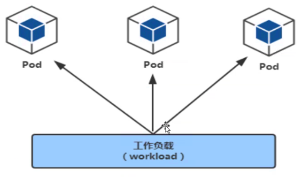

# Kubernetes 控制器

- <https://kubernetes.io/docs/concepts/workloads/controllers/>

Kubernetes中内建了很多controller（控制器），这些相当于一个状态机，用来控制Pod的具体状态和行为

1. deployment：适合`无状态`的服务部署

2. StatefullSet：适合`有状态`的服务部署

3. DaemonSet：一次部署，所有的node节点都会部署，例如一些典型的应用场景：

    - 运行集群存储 daemon，例如在每个Node上运行 glusterd、ceph
    - 在每个Node上运行日志收集 daemon，例如 fluentd、 logstash
    - 在每个Node上运行监控 daemon，例如 Prometheus Node Exporter

4. Job：一次性的执行任务

5. Cronjob：周期性的执行任务

控制器又被称为工作负载，pod通过控制器实现应用的运维，比如伸缩、升级等

