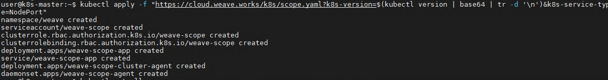

# weave scope

Weave Scope是Docker和Kubernetes的可视化监控管理软件

Weave Scope 会自动生成容器之间的关系图，方便理解容器之间的关系，也方便监控容器化和微服务化的应用

## 安装

官方安装文档：<https://www.weave.works/docs/scope/latest/installing/#k8s>

### 单节点部署安装
  
  ``` shell
  sudo curl -L git.io/scope -o /usr/local/bin/scope
  sudo chmod a+x /usr/local/bin/scope
  scope launch
  ```

访问：<http://localhost:4040>

### 集群上部署

实验环境：Hosts

  192.168.137.3
  192.168.137.4
  192.168.137.5

第一步：在每台主机上运行

  ``` shell
  sudo curl -L git.io/scope -o /usr/local/bin/scope
  sudo chmod a+x /usr/local/bin/scope
  ```

第二步：在每台Host主机运行时添加集群其他主机

- 192.168.137.3 主机运行：
`scope launch 192.168.137.4 192.168.137.5`

- 192.168.137.4 主机运行;
``scope launch 192.168.137.3 192.168.137.5`

- 192.168.137.5 主机运行;

`scope launch 192.168.137.3 192.168.137.4`

访问（集群内任意主机ip都可）：<http://localhost:4040>

### Kubernetes上部署

- 安装

  `kubectl apply -f "https://cloud.weave.works/k8s/scope.yaml?k8s-version=$(kubectl version | base64 | tr -d '\n')&k8s-service-type=NodePort"`
  
  

- 查看  `kubectl get pod -n weave`
  

- 效果
  
  