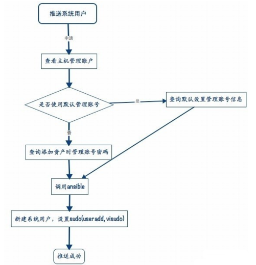

# jumpserver

https://www.cnblogs.com/Su-per-man/p/10000185.html
## 名词解释

用户：用户是授权和登陆的主体，将来为每个员工建立一个账户，用来登录跳板机， 将资产授权给该用户，查看用户登陆记录命令历史等。
用户组：多个用户可以组合成用户组，为了方便进行授权，可以将一个部门或几个用户 组建成用户组，在授权中使用组授权，该组中的用户拥有所有授权的主机权限。
资产：资产通常是我们的服务器、网络设备等，将资产授权给用户，用户则会有权限登 录资产，执行命令等。
管理账户：添加资产时需要添加一个管理账户，该账户是该资产上已有的有管理权限的用户， 如root，或者有 NOPASSWD: ALL sudo权限的用户，该管理账户用来向资产推送系统用户， 为系统用户添加sudo，获取资产的一些硬件信息。
资产组：同用户组，是资产组成的集合，为了方便授权。
机房：又称IDC，这个不用解释了吧。
Sudo：这里的sudo其实是Linux中的sudo命令别名，一个sudo别名包含多个命令， 系统用户关联sudo就代表该系统用户有权限sudo执行这些命令。
系统用户：系统用户是服务器上建立的一些真实存在的可以ssh登陆的用户,如 dev, sa, dba等，系统用户可使用jumpserver推送到服务器上，也可以利用自己公司 的工具进行推送，授权时将用户、资产、系统用户关联起来则表明用户有权限登陆该资产的这个系统用户，比如用户小明 以 dev系统用户登录 172.16.1.1资产, 简单理解就是 将某个资产上的某个系统用户映射给这个用户登录。

推送系统用户：添加完系统用户，需要推送，推送操作是使用ansible，把添加的系统用户和系统用户管理的sudo，推送到资产上，具体体现是在资产上useradd该系统用户，设置它的key,然后设置它的sudo，为了让用户可以登录它。

授权规则：授权规则是将资产系统用户和用户关联起来，用来完成授权。 这样用户就可以以某个系统用户账号登陆资产。大家对这好像不是很理解，其实也是对系统用户， 用户这里没有搞清楚。我们可以把用户当做虚拟的用户，而系统用户是真实再服务器上存在的用户， 系统用户可以使用jumpserver推送，也可以自己手动建立，但是推送的过程一定要有，哪怕是模拟 推送（不选择秘钥和密码推送，如网络设备），因为添加授权规则会检查推送记录。为了简化理解， 我们暂时 以 用户 资产 系统用户 来理解，暂时不考虑组，添加这样的规则意思是 授权 用户 在这个资产上 以这个系统用户来登陆, 系统用户是一组具有通用性，具有sudo的用户， 不同的用户授权不同的 系统用户，比如 dba可能有用数据库的sudo权限。

日志审计：分为以下5个方式：1）在线：查看当前在线的用户(非web在线)，可以监控用户的命令执行，强制结束用户 登录；2）实时监控：实时监控用户的操作；3）登录历史：查看以往用户的登录历史，可以查看用户登陆操作的命令，可以回放用户 执行命令的录像；4）命令记录：查看用户批量执行命令的历史，包含执行命令的主机，执行的命令，执行的结果；5）上传下载：查看用户上传下载文件的记录。

默认设置：默认设置里可以设置 默认管理账号信息，包括账号密码密钥，默认信息为了方便添加资产 而设计，添加资产时如果选择使用默认管理账号，则会使用这里设置的信息，端口是资产的ssh端口，添加 资产时，默认会使用该端口。


-------------------------------------------Jumpserver中的用户，系统用户，管理用户对比---------------------------------------


为了简单的描述这个问题，可以举例来说明，：
1）用户：小王(公司员工)，
2）系统用户：dev(后端服务器上存在的账号),
授权时将系统用户dev在某台后段服务器授权给小王，这样小王登陆后端服务器，其实是登陆了服务器上的dev用户,类似执行"ssh dev@somehost"
3)管理账号: 是为了帮助大家推送系统用户用的
在jumpserver上新建系统用户并推送， 其实相当于执行了"ssh 管理账户@somehost -e 'useradd 系统账号'", 这个是用ansible完成这样的操作。


下面简单说下在Jumpserver的web界面里添加用户、推送用户等操作流程：

1. 添加用户
用户管理 - 查看用户 - 添加用户 填写基本信息，完成用户添加。
用户添加完成后，根据提示记住用户账号密码，换个浏览器登录下载key，
ssh登录jumpserver测试

2. 添加资产
资产管理 - 查看资产 - 添加资产 填写基本信息，完成资产添加

3. 添加sudo
授权管理 - Sudo - 添加别名 输入别名名称和命令，完成sudo添加

4. 添加系统用户
授权管理 - 系统用户 - 添加 输入基本信息，完成系统用户添加

5. 推送系统用户
授权管理 - 推送 - 选择需要推送的资产或资产组完成推送

推送只支持服务器，使用密钥是指用户从跳板机跳转时使用key，反之使用密码，
授权时会检查推送记录，如果没有推送过则无法完成系统用户在该资产上的授权。
如果资产时网络设备，请不要选择密码和秘钥，模拟一下推送，目的是为了生成
推送记录。

6. 添加授权规则
授权管理 - 授权规则 - 添加规则 选择刚才添加的用户，资产，系统用户完成授权

7. 测试登录
用户下载key 登录跳板机，会自动运行connect.py，根据提示登录服务器
用户登陆web 查看授权的主机，点击后面的链接，测试是否可以登录服务器

8. 监控和结束会话
日志审计 - 在线 查看当前登录的用户登录情况，点击监控查看用户执行的命令， 点击阻断，结束用户的会话

9. 查看历史记录
日志审计 - 登录历史 查看登录历史,点击统计查看命令历史，点击回放查看录像

10. 执行命令
同7 测试命令的执行，命令记录查看 批量执行命令的日志

11. 上传下载
同7 测试文件的上传下载，日志审计 - 上传下载 查看上传下载记录

下面分享几个问题的排查注意点：

1）查看日志
tail -f logs/jumpserver.log
里面包含了详细的日志，包含了账号和密码，一切完成后，请将 jumpserver.conf中的log改为 warning等

2）推送系统用户失败
在系统用户列表，点击系统用户名称，查看系统用户详情，把鼠标放到失败按钮上，会看到失败的原因，通常是因为 管理账号添加的不对（见管理账号名称解释），或服务器没有安装sudo(推送系统用户时，会推送sudo设置)

3）邮件发送失败
如果出现mail,smtp等错误通常都是由于发送邮件导致的，请尝试不同提供商的邮件设置

4）service启动失败
请进入/opt/jumpserver目录，手动运行
```
# python manage.py runserver 0.0.0.0:80
# python run_websocket.py
```
如果启动失败，可能是由于 80端口和3000端口已经被占用，或者数据库账号密码不对，请检查

5)监控，websocket, web命令执行失败
它们会像运行的websocket服务发起请求， 可能是websocket没有启动，可能是Jumpserver.conf中websocket的地址不正确(注意这个文件里的ip地址的配置，内外网地址？端口通不通？)，务必保证设置的地址用户可以访问到(映射或防火墙等), service.sh先关掉服务器，手动运行, 查看websocket的console输出

6）Crypto，HAVE_DECL_MPZ_POWM_SEC等错误
很常见的错误，通常是由 pycrypto的版本问题，请卸载重新安装
```
# pip uninstall pycrypto
# rm -rf /usr/lib64/python2.6/site-packages/Crypto/
# pip install pycrypto
```