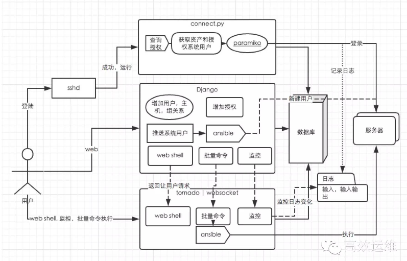

# JumpServer开发

https://blog.51cto.com/99698/2089308>  - 二次开发

录像回放借鉴了TermRecord

Web Terminal
使用了tornado来完成了websocket的任务，放弃了之前的nodejs，原因是tornado是python的框架，并且对websocket支持很好。前端js使用的是term.js，找个案例看一下很容易实现，这里实现的核心是 将用户的输入中转传给paramiko的channel，将channel返回的数据push给用户浏览器。感叹一下，用tornado实现web socket真的很简单。

来自 <https://chuansongme.com/n/2247199> 

重构整合 Django class base view, 提供 Restful API

