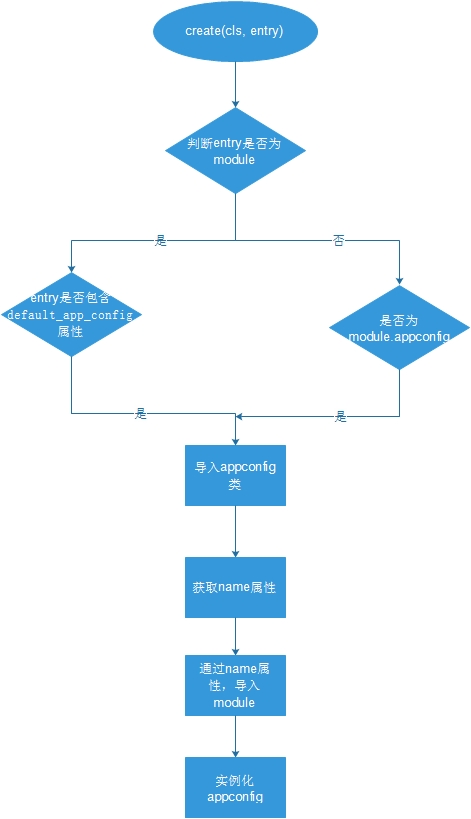

# AppConfig

django的project由多个app组成。project的设置由setting指定，而每个app的设置由AppConfig指定。app和project主要由INSTALL_APPS联系，也有url和middleware等等.

通过__init__初始化的属性：

- name：django应用的完整python路径，eg.'django.contrib.admin'，在初始化参数中由app_name参数指定。

- module：django应用的根模块，是一个模块对象，eg.<module 'django.contrib.admin' from 'django/contrib/admin/__init__.pyc'>,也就是django应用所在的包，在我的理解下目录下的__init__.py就是对Python包的抽象，在Python看来包也就是一个模块。

 - apps：Apps注册表的引用，该注册表保存管理着这个AppConfig。当注册表注册这个AppConfig实例的时候，由注册表进行设置。

- label：

- path：django应用的文件系统的路径。eg.'usr/lib/python2.7/dist-packages/django/contrib/admin'。

- models_module：包含models的模块，也就是models.py文件，这是由import_models()设置，若没有则为None。
- models：映射小写的模型名到模型类上。初始化的时候为None,避免在import_models运行前意外的访问。





源码

```
def create(cls, entry):
        try:
            # If import_module succeeds, entry is a path to an app module,
            # which may specify an app config class with default_app_config.
            # Otherwise, entry is a path to an app config class or an error.
　　　　　　　　
            
            module = import_module(entry)  
　　　　　　　# entry可以是一个app模块的路径，也可以是一个app config类的路径。
　　　　　　　#首先用import_module方法导入App模块，这个App模块也许用default_app_config这变量指定了一个app config
　　　　　　  #若导入成功话，这就是说entry是一个app模块的路径。

        except ImportError:
            # Track that importing as an app module failed. If importing as an
            # app config class fails too, we'll trigger the ImportError again.
　　　　　　 
            # 作为app模块导入失败后，如果尝试作为app config类导入也失败的话，触发这个导入错误。
            module = None

            mod_path, _, cls_name = entry.rpartition('.')
　　　　　　　# 获取这个config类的python模块的python路径。
            # Raise the original exception when entry cannot be a path to an
            # app config class.
            if not mod_path:  #这个python路径不存在抛出错误。
                raise

        else:
            try:
                # If this works, the app module specifies an app config class.
                # 如果导入app模块成功的话，接着就尝试获取这个app模块的config配置。

                entry = module.default_app_config
            except AttributeError:
                # Otherwise, it simply uses the default app config class.
　　　　　　　　　没有这个属性将会简单滴使用默认的app config类，返回AppConfig类的实例。

                return cls(entry, module)
            else:
                mod_path, _, cls_name = entry.rpartition('.')
　　　　　　　　　 #如果存在，返回这个config类的python模块点路径。

        # If we're reaching this point, we must attempt to load the app config
        # class located at <mod_path>.<cls_name>
　　　　　　
        mod = import_module(mod_path)
       # 导入config类的模块，并尝试获取这个App config这个类
        try:
            cls = getattr(mod, cls_name)

        except AttributeError:
            if module is None:
                # If importing as an app module failed, that error probably
                # contains the most informative traceback. Trigger it again.
                import_module(entry)
　　　　　　　　　# 如果导入失败，这主要用来获取做为详细的错误跟踪。
            else:
                raise

        # Check for obvious errors. (This check prevents duck typing, but
        # it could be removed if it became a problem in practice.)
        if not issubclass(cls, AppConfig):
            raise ImproperlyConfigured(
                "'%s' isn't a subclass of AppConfig." % entry)

        # Obtain app name here rather than in AppClass.__init__ to keep
        # all error checking for entries in INSTALLED_APPS in one place.
        try:
            app_name = cls.name
        except AttributeError:
            raise ImproperlyConfigured(
                "'%s' must supply a name attribute." % entry)

        # Ensure app_name points to a valid module.
        try:
            app_module = import_module(app_name)
        except ImportError:
            raise ImproperlyConfigured(
                "Cannot import '%s'. Check that '%s.%s.name' is correct." % (
                    app_name, mod_path, cls_name,
                )
            )

        # Entry is a path to an app config class.
        return cls(app_name, app_module)
```

Entry is a path  to an app config class。本质上来说，因为根据源码可知即使entry在INSTALLED_APPS是django应用模块最后定位还是其中配置的AppConfig类。要配置一个应用，要子类化AppConfig 并将这个子类的路径放在INSTALLED_APPS 中，调用get_app_config返回的是这个子类化的AppConfig。当INSTALLED_APPS 包含一个应用模块的路径后，Django 将在这个模块中检查一个default_app_config 变量。如果这个变量有定义，它应该是这个应用的AppConfig 子类的路径，调用get_app_config返回的是这个子类化的AppConfig。如果没有default_app_config，Django 将使用AppConfig 基类，调用get_app_config返回的是AppConfig基类