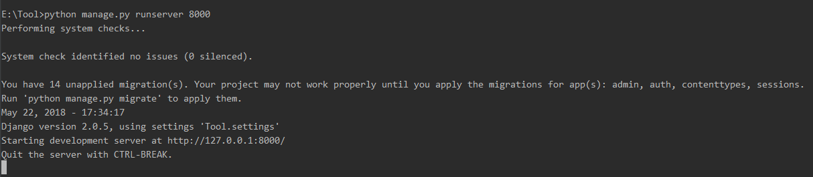
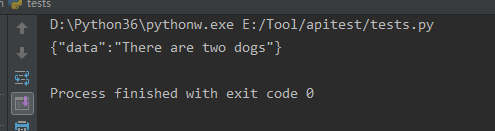

# Django REST framework

Django REST framework 框架是一个用于构建Web API 的强大而又灵活的工具，通常简称为DRF框架 或 REST framework。

DRF框架是建立在Django框架基础之上，由Tom Christie大牛二次开发的开源项目。

[Django rest-framework框架学习](https://www.cnblogs.com/yang-China/p/9711175.html)

https://www.django-rest-framework.org/tutorial/quickstart/#quickstart

**特点**
- 提供了定义序列化器Serializer的方法，可以快速根据 Django ORM 或者其它库自动序列化/反序列化；
- 提供了丰富的类视图、Mixin扩展类，简化视图的编写；
- 丰富的定制层级：函数视图、类视图、视图集合到自动生成 API，满足各种需要；
- 多种身份认证和权限认证方式的支持；
- 内置了限流系统；
- 直观的 API web 界面；
- 可扩展性，插件丰富

**安装**

`pip3 install djangorestframework`

打开settings.py，增加一段配置：

```
INSTALLED_APPS = [
    'django.contrib.admin',
    'django.contrib.auth',
    'django.contrib.contenttypes',
    'django.contrib.sessions',
    'django.contrib.messages',
    'django.contrib.staticfiles',
    'apitest',                           #添加apitest app
    'rest_framework',                    #添加rest_framework
]
```

增加一段REST_FRAMEWORK配置
```
REST_FRAMEWORK = {
    # Use Django's standard `django.contrib.auth` permissions,
    # or allow read-only access for unauthenticated users.
    'DEFAULT_PERMISSION_CLASSES': [
        'rest_framework.permissions.DjangoModelPermissionsOrAnonReadOnly'
    ],
    'DEFAULT_RENDERER_CLASSES': (
        'rest_framework.renderers.JSONRenderer',
    ),
    'DEFAULT_PARSER_CLASSES': (
        'rest_framework.parsers.JSONParser',
    )
}
```

在apitest目录下新建一个api.py，让我们来写一些测试代码：
  ```
  #coding=utf-8
  from rest_framework import permissions
  from rest_framework.response import Response
  from rest_framework.decorators import api_view, permission_classes
  from django.views.decorators.csrf import csrf_exempt

  @csrf_exempt
  @api_view(http_method_names=['post'])                #只允许post
  @permission_classes((permissions.AllowAny,))
  def inventory(request):
      parameter = request.data
      id = parameter['data']
      if id == 1:
          data = 'There are three dogs'
      elif id == 2:
          data = 'There are two dogs'
      else:
          data = 'nothing'
  return Response({'data':data})
  ```

在urls.py添加刚刚创建的api路由：
  ```
  urlpatterns = [
      path('admin/', admin.site.urls),
      path('food/', api.inventory),               #添加api中inventory路由
  ]

  ```
上面配置好了之后本地调试下，输入命令：python manage.py runserver 8000


可以通过约定好的名词food来获取或者更改资源；写个小脚本测试下上面的接口：

```
import requests
url= 'http://127.0.0.1:8000/food/'
data = {'data':2}
h=requests.post(url,json=data)
print(h.text)
```

输出：



## Django-Restful API

1. 安装
    ```
    pip install djangorestframework
    pip install django-filter  # Filtering support
    ```
2. 在setting中加载
    ```
    # Application definition
    INSTALLED_APPS = [
        'rest_framework',
    ]
    ```

3. 在urls中配置api访问地址

    `  url(r'^api/devops/', include('devops.urls.api_urls', namespace='api-devops')),`

4. devops.urls.api_urls的文件中具体配置
    ```
    # coding:utf-8
    from django.conf.urls import url
    from .. import api
    from rest_framework_bulk.routes import BulkRouter

    app_name = 'devops'

    router = BulkRouter()
    router.register(r'v1/pci', api.PCIViewSet, 'pci')
    router.register(r'v1/pci-build', api.PCIBuildViewSet, 'pci-build')
    router.register(r'v1/pci-builds', api.PCIBuildsViewSet, 'pci-builds')
    router.register(r'v1/pci-release', api.PCIReleaseViewSet, 'pci-release')
    router.register(r'v1/online-version', api.OnlineVersionViewSet, 'online-version')

    urlpatterns = []
    urlpatterns += router.urls
    ```                  

5. 定义models
- 参考之前文章Django-models

6. 创建api.py

    ```
    from common.mixins import IDInFilterMixin
    from rest_framework_bulk import BulkModelViewSet
    from . import serializers
    from devops.models import PCI,PCI_RELEASE,ONLINE_VERSION,PCI_BUILDS

    class PCIViewSet(IDInFilterMixin,BulkModelViewSet):
        queryset = PCI.objects.all()
        serializer_class = serializers.PCISerializer

    class PCIBuildViewSet(IDInFilterMixin,BulkModelViewSet):
        queryset = PCI_BUILDS.objects.all()
        serializer_class = serializers.PCIBuildSerializer

        def get_queryset(self):
            queryset = super(PCIBuildViewSet, self).get_queryset()
            pci_id = self.request.query_params.get('pci_id', '')
            if pci_id:
                self.queryset = queryset.filter(pci__id=pci_id)
            return self.queryset
    ```  

7. 创建Serializer
    ```
    # -*- coding: utf-8 -*-
    from rest_framework import serializers
    from rest_framework_bulk import BulkListSerializer, BulkSerializerMixin
    from devops.models import PCI,PCI_RELEASE,ONLINE_VERSION,PCI_BUILDS
    from projects.models import Project
    class PCISerializer(BulkSerializerMixin, serializers.ModelSerializer):
        pro = serializers.SlugRelatedField(slug_field='name',required=False,allow_null=True,queryset=Project.objects.all())
        class Meta:
            model = PCI
            list_serializer_class = BulkListSerializer
            fields = ["pro", "job_name", "pro_scm","last_build_number", "last_build_result", "last_build_url", "last_update_time","id"]
    ```
8. 访问
- http://ip:18080/api/devops/


