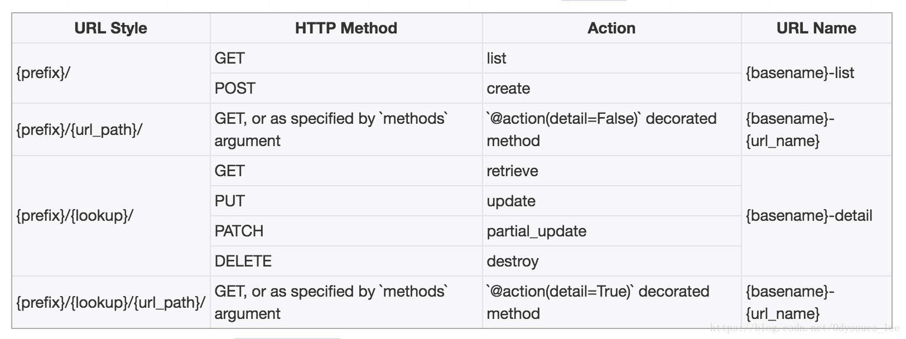
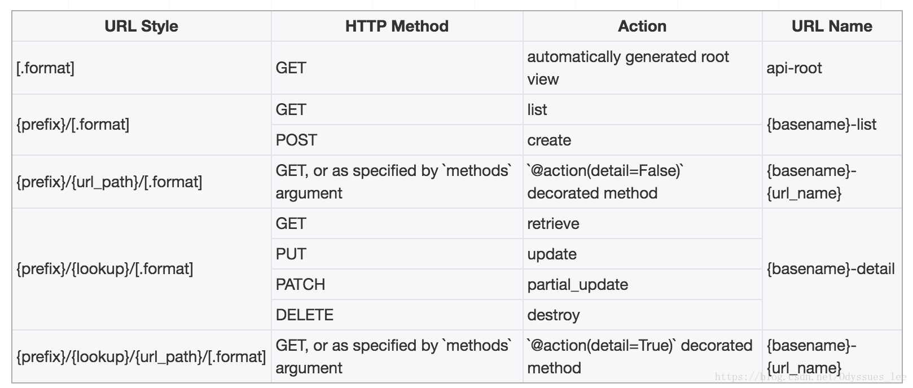

# 路由Routers
对于视图集ViewSet，我们除了可以自己手动指明请求方式与动作action之间的对应关系外，还可以使用Routers来帮助我们快速实现路由信息。

REST framework提供了两个router

- SimpleRouter
- DefaultRouter

## 1. 使用方法

1） 创建router对象，并注册视图集，例如

```
from rest_framework import routers

router = routers.SimpleRouter()
router.register(r'books', BookInfoViewSet, base_name='book')
```

register(prefix, viewset, base_name)
- prefix 该视图集的路由前缀
- viewset 视图集
- base_name 路由名称的前缀

如上述代码会形成的路由如下：
```
^books/$    name: book-list
^books/{pk}/$   name: book-detail
```
2）添加路由数据

可以有两种方式：
```
urlpatterns = [
    ...
]
urlpatterns += router.urls
```
或
```
urlpatterns = [
    ...
    url(r'^', include(router.urls))
]
```
## 2. 视图集中附加action的声明
在视图集中，如果想要让**Router自动帮助我们为自定义的动作生成路由信息**，需要使用rest_framework.decorators.action装饰器。

以action装饰器装饰的方法名会作为action动作名，与list、retrieve等同。

action装饰器可以接收两个参数：
- methods: 声明该action对应的请求方式，列表传递
- detail: 声明该action的路径是否与单一资源对应，及是否是xxx/<pk>/action方法名/
  - True 表示路径格式是xxx/<pk>/action方法名/
  - False 表示路径格式是xxx/action方法名/


举例：

```
from rest_framework import mixins
from rest_framework.viewsets import GenericViewSet
from rest_framework.decorators import action

class BookInfoViewSet(mixins.ListModelMixin, mixins.RetrieveModelMixin, GenericViewSet):
    queryset = BookInfo.objects.all()
    serializer_class = BookInfoSerializer

    # detail为False 表示路径名格式应该为 books/latest/
    @action(methods=['get'], detail=False)
    def latest(self, request):
        """
        返回最新的图书信息
        """
        ...

    # detail为True，表示路径名格式应该为 books/{pk}/read/
    @action(methods=['put'], detail=True)
    def read(self, request, pk):
        """
        修改图书的阅读量数据
        """
        ...
```
由路由器自动为此视图集自定义action方法形成的路由会是如下内容：
- ^books/latest/$    name: book-latest
- ^books/{pk}/read/$  name: book-read


## 3. 路由router形成URL的方式
1） SimpleRouter

    

2）DefaultRouter

  

DefaultRouter与SimpleRouter的区别是，DefaultRouter会多附带一个默认的API根视图，返回一个包含所有列表视图的超链接响应数据。


## 定义多级路由

1. 定义路由 url.py

```
#比如我们要传递多层路由http://www.baidu.com/hosts/{ID}/detail/

router = DefaultRouter()
router.register('hosts',views.ServerView,basename="server_base")
urlpatterns = [
    path('v1/',include(router.urls)),
]
```
2、编写多级路由的方法

```
#使用action装饰器
from rest_framework.decorators import action

#在类里面创建函数
class ServerView(ViewSet):
	@action(methods=['get'], detail=True, url_path='detail', url_name='change_password', 			permission_classes=[])
	def information(self, request, *args, **kwargs):
    	pass 
    
#url_path: 子级路径名称
#url_name: 子级路径名字
```
- http://www.igolang.cn/api/v1/hosts/{id}/detail/ 就会到action装饰器的函数下去访问