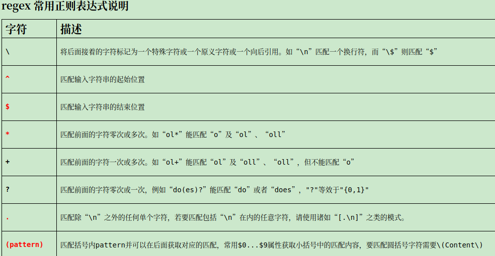

# Nginx URL重写（rewrite）配置及信息详解
    URL重写有利于网站首选域的确定，对于同一资源页面多条路径的301重定向有助于URL权重的集中

## Nginx URL重写（rewrite）介绍
    和apache等web服务软件一样，rewrite的组要功能是实现RUL地址的重定向。Nginx的rewrite功能需要PCRE软件的支持，即通过perl兼容正则表达式语句进行规则匹配的。默认参数编译nginx就会支持rewrite的模块，但是也必须要PCRE的支持

    rewrite是实现URL重写的关键指令，根据regex（正则表达式）部分内容，重定向到replacement，结尾是flag标记。

rewrite语法格式及参数语法说明如下:

```
rewrite    <regex>    <replacement>    [flag];

    关键字      正则        替代内容          flag标记 

    关键字：其中关键字error_log不能改变
    正则：perl兼容正则表达式语句进行规则匹配
    替代内容：将正则匹配的内容替换成replacement
    flag标记：rewrite支持的flag标记 

flag标记说明：
last  #本条规则匹配完成后，继续向下匹配新的location URI规则
break  #本条规则匹配完成即终止，不再匹配后面的任何规则
redirect  #返回302临时重定向，浏览器地址会显示跳转后的URL地址
permanent  #返回301永久重定向，浏览器地址栏会显示跳转后的URL地址
```

## rewrite参数的标签段位置：
server,location,if

例子：
rewrite ^/(.*) http://www.czlun.com/$1 permanent;

说明：                                        

rewrite为固定关键字，表示开始进行rewrite匹配规则
regex部分是 ^/(.*) ，这是一个正则表达式，匹配完整的域名和后面的路径地址
replacement部分是http://www.czlun.com/$1 $1，是取自regex部分()里的内容。匹配成功后跳转到的URL。
flag部分 permanent表示永久301重定向标记，即跳转到新的 http://www.czlun.com/$1 地址上




## rewrite 企业应用场景

Nginx的rewrite功能在企业里应用非常广泛：

- 可以调整用户浏览的URL，看起来更规范，合乎开发及产品人员的需求。
- 为了让搜索引擎搜录网站内容及用户体验更好，企业会将动态URL地址伪装成静态地址提供服务。
- 网址换新域名后，让旧的访问跳转到新的域名上。例如，访问京东的360buy.com会跳转到jd.com
- 根据特殊变量、目录、客户端的信息进行URL调整等

## Nginx配置rewrite过程介绍
（1）创建rewrite语句
`vi conf/vhost/www.abc.com.conf`

#vi编辑虚拟主机配置文件

文件内容
```
server {

        listen 80;
        server_name abc.com;
        rewrite ^/(.*) http://www.abc.com/$1 permanent;
}

server {
        listen 80;
        server_name www.abc.com;
        location / {
                root /data/www/www;
                index index.html index.htm;
        }
        error_log    logs/error_www.abc.com.log error;
        access_log    logs/access_www.abc.com.log    main;
}
```
或者
```
server {
        listen 80;
        server_name abc.com www.abc.com;
        if ( $host != 'www.abc.com'  ) {
                rewrite ^/(.*) http://www.abc.com/$1 permanent;
        }

        location / {
                root /data/www/www;
                index index.html index.htm;

        }
        error_log    logs/error_www.abc.com.log error;
        access_log    logs/access_www.abc.com.log    main;
}
```

2）重启服务
确认无误便可重启，操作如下：

nginx -t

#结果显示ok和success没问题便可重启

nginx -s reload

（3）查看跳转效果
打开浏览器访问abc.com

页面打开后，URL地址栏的abc.com变成了www.abc.com说明URL重写成功。