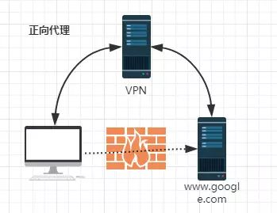
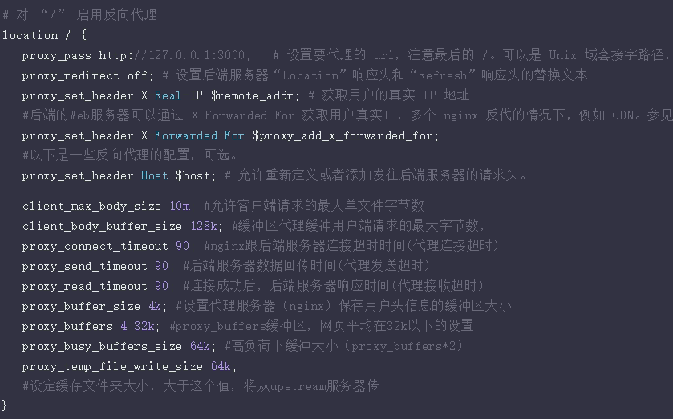

# Nginx-反向代理

Nginx可以实现多种代理方式：

- HTTP/HTTPS
- ICMP\POP\IMAP
- SMTP

## 代理区别

区别在于代理的对象不一样：

客户端必须设置正向代理服务器，当然前提是要知道正向代理服务器的IP地址，还有代理程序的端口。
反向代理正好与正向代理相反，对于客户端而言代理服务器就像是原始服务器，并且客户端不需要进行任何特别的设置。客户端向反向代理的命名空间（name-space）中的内容发送普通请求，接着反向代理将判断向何处（原始服务器）转交请求，并将获得的内容返回给客户端。

- 正向代理代理的对象是客户端
由于防火墙的原因，我们并不能直接访问谷歌，那么我们可以借助VPN来实现，这就是一个简单的正向代理的例子。这里你能够发现，正向代理“代理”的是客户端，而且客户端是知道目标的，而目标是不知道客户端是通过VPN访问的。


- 反向代理代理的对象是服务端

当我们在外网访问百度的时候，其实会进行一个转发，代理到内网去，这就是所谓的反向代理，即反向代理“代理”的是服务器端，而且这一个过程对于客户端而言是透明的。


## 反向代理 -proxy_pass

所谓反向代理，很简单，其实就是在location这一段配置中的root替换成proxy_pass即可。root说明是静态资源，可以由Nginx进行返回；而proxy_pass说明是动态请求，需要进行转发，比如代理到Tomcat上。

比如说request -> Nginx -> Tomcat，那么对于Tomcat而言，请求的IP地址就是Nginx的地址，而非真实的request地址，这一点需要注意。不过好在Nginx不仅仅可以反向代理请求，还可以由用户自定义设置HTTP HEADER。



## 反向代理服务器模型

反向代理服务器通常有两种模型，它可以作为内容服务器的替身，也可以作为内容服务器集群的负载均衡器。

 1，作内容服务器的替身
 如果您的内容服务器具有必须保持安全的敏感信息，如信用卡号数据库，可在防火墙外部设置一个代理服务器作为内容服务器的替身。当外部客户机尝试访问内容服务器时，会将其送到代理服务器。实际内容位于内容服务器上，在防火墙内部受到安全保护。代理服务器位于防火墙外部，在客户机看来就像是内容服务器。

当客户机向站点提出请求时，请求将转到代理服务器。然后，代理服务器通过防火墙中的特定通路，将客户机的请求发送到内容服务器。内容服务器再通过该通道将结果回传给代理服务器。代理服务器将检索到的信息发送给客户机，好像代理服务器就是实际的内容服务器（参见图 2）。如果内容服务器返回错误消息，代理服务器会先行截取该消息并更改标头中列出的任何 URL，然后再将消息发送给客户机。如此可防止外部客户机获取内部内容服务器的重定向 URL。

 这样，代理服务器就在安全数据库和可能的恶意攻击之间提供了又一道屏障。与有权访问整个数据库的情况相对比，就算是侥幸攻击成功，作恶者充其量也仅限于访问单个事务中所涉及的信息。未经授权的用户无法访问到真正的内容服务器，因为防火墙通路只允许代理服务器有权进行访问。


可以配置防火墙路由器，使其只允许特定端口上的特定服务器（在本例中为其所分配端口上的代理服务器）有权通过防火墙进行访问，而不允许其他任何机器进出。

2，作为内容服务器的负载均衡器

 可以在一个组织内使用多个代理服务器来平衡各 Web 服务器间的网络负载。在此模型中，可以利用代理服务器的高速缓存特性，创建一个用于负载平衡的服务器池。此时，代理服务器可以位于防火墙的任意一侧。如果 Web 服务器每天都会接收大量的请求，则可以使用代理服务器分担 Web 服务器的负载并提高网络访问效率。

对于客户机发往真正服务器的请求，代理服务器起着中间调停者的作用。代理服务器会将所请求的文档存入高速缓存。如果有不止一个代理服务器，DNS 可以采用“循环复用法”选择其 IP 地址，随机地为请求选择路由。客户机每次都使用同一个 URL，但请求所采取的路由每次都可能经过不同的代理服务器。

可以使用多个代理服务器来处理对一个高用量内容服务器的请求，这样做的好处是内容服务器可以处理更高的负载，并且比其独自工作时更有效率。在初始启动期间，代理服务器首次从内容服务器检索文档，此后，对内容服务器的请求数会大大下降。


## 配置Nginx反向代理

```
#运行用户
#user somebody;
#启动进程,通常设置成和cpu的数量相等
worker_processes  1;
#全局错误日志
error_log  D:/Tools/nginx-1.10.1/logs/error.log;
error_log  D:/Tools/nginx-1.10.1/logs/notice.log  notice;
error_log  D:/Tools/nginx-1.10.1/logs/info.log  info;

#PID文件，记录当前启动的nginx的进程ID
pid        D:/Tools/nginx-1.10.1/logs/nginx.pid;

#工作模式及连接数上限
events {
   worker_connections 1024;    #单个后台worker process进程的最大并发链接数
}

#设定http服务器，利用它的反向代理功能提供负载均衡支持
http {
   #设定mime类型(邮件支持类型),类型由mime.types文件定义
   include       D:/Tools/nginx-1.10.1/conf/mime.types;
   default_type  application/octet-stream;
   #设定日志
   log_format  main  '[$remote_addr] - [$remote_user] [$time_local] "$request" '
                      '$status $body_bytes_sent "$http_referer" '
                     '"$http_user_agent" "$http_x_forwarded_for"';

   access_log    D:/Tools/nginx-1.10.1/logs/access.log main;
   rewrite_log     on;
 
   #sendfile 指令指定 nginx 是否调用 sendfile 函数（zero copy 方式）来输出文件，对于普通应用， 
   #必须设为 on,如果用来进行下载等应用磁盘IO重负载应用，可设置为 off，以平衡磁盘与网络I/O处理速度，降低系统的uptime.
 
   sendfile        on;
   #tcp_nopush     on;
 
   #连接超时时间
   keepalive_timeout  120;
   tcp_nodelay        on;
 
   #gzip压缩开关
   #gzip  on;

   #设定实际的服务器列表
   upstream zp_server1{
       server 127.0.0.1:8089;
   }

   #HTTP服务器
   server {       
       listen       80; #监听80端口，80端口是知名端口号，用于HTTP协议
       server_name  www.helloworld.com;    #定义使用www.xx.com访问
       
       index index.html          #首页
       #指向webapp的目录 
       root D:_WorkspaceProjectgithubzpSpringNotesspring-securityspring-shirosrcmainwebapp;
        
        #编码格式
       charset utf-8;
 
       #代理配置参数 
       proxy_connect_timeout 180; 
       proxy_send_timeout 180; 
       proxy_read_timeout 180; 
       proxy_set_header Host $host; 
       proxy_set_header X-Forwarder-For $remote_addr; 
      
       #反向代理的路径（和upstream绑定），location 后面设置映射的路径 
       location / { 
           proxy_pass http://zp_server1; 
       }
 
       #静态文件，nginx自己处理 
       location ~ ^/(images|javascript|js|css|flash|media|static)/ { 
           root D:_WorkspaceProjectgithubzpSpringNotesspring-securityspring-shirosrcmainwebappiews; 
           #过期30天，静态文件不怎么更新，过期可以设大一点，如果频繁更新，则可以设置得小一点。 
           expires 30d; 
       }   
 
       #设定查看Nginx状态的地址 
       location /NginxStatus { 
           stub_status           on; 
           access_log            on; 
           auth_basic            "NginxStatus"; 
           auth_basic_user_file  conf/htpasswd; 
       }
 
       #禁止访问 .htxxx 文件 
       location ~ /.ht { 
           deny all; 
       }  
 
       #错误处理页面（可选择性配置） 
       #error_page   404              /404.html; 
       #error_page   500 502 503 504  /50x.html; 
       #location = /50x.html { 
       #    root   html; 
       #} 
   }
}
```