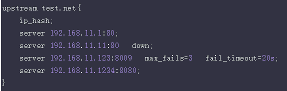

# Nginx-负载均衡

upstream是Nginx的HTTP Upstream模块，这个模块通过一个简单的调度算法来实现客户端IP到后端服务器的负载均衡。


反向代理中，我们通过proxy_pass来指定Tomcat的地址，很显然我们只能指定一台Tomcat地址，那么我们如果想指定多台来达到负载均衡呢？

第一，通过upstream来定义一组Tomcat，并指定负载策略（IPHASH、加权论调、最少连接），健康检查策略（Nginx可以监控这一组Tomcat的状态）等。
第二，将proxy_pass替换成upstream指定的值即可。

**负载均衡可能带来的问题？**
负载均衡所带来的明显的问题是，一个请求，可以到A server，也可以到B server，这完全不受我们的控制，当然这也不是什么问题，只是我们得注意的是：用户状态的保存问题，如Session会话信息，不能在保存到服务器上

## 调度算法
Nginx的负载均衡模块目前支持4种调度算法：

- 轮询（默认）。每个请求按时间顺序逐一分配到不同的后端服务器，如果后端某台服务器宕机，故障系统被自动剔除，使用户访问不受影响。Weight 指定轮询权值，Weight值越大，分配到的访问机率越高，主要用于后端每个服务器性能不均的情况下。

- ip_hash。每个请求按访问IP的hash结果分配，这样来自同一个IP的访客固定访问一个后端服务器，有效解决了动态网页存在的session共享问题。

- fair。这是比上面两个更加智能的负载均衡算法。此种算法可以依据页面大小和加载时间长短智能地进行负载均衡，也就是根据后端服务器的响应时间来分配请求，响应时间短的优先分配。Nginx本身是不支持fair的，如果需要使用这种调度算法，必须下载Nginx的upstream_fair模块。

- url_hash。此方法按访问url的hash结果来分配请求，使每个url定向到同一个后端服务器，可以进一步提高后端缓存服务器的效率。Nginx本身是不支持url_hash的，如果需要使用这种调度算法，必须安装Nginx 的hash软件包。

## 参数配置
upstream可以设定每个后端服务器在负载均衡调度中的状态，支持的状态参数：
- down，表示当前的server暂时不参与负载均衡
- backup，预留的备份机器。当其他所有的非backup机器出现故障或者忙的时候，才会请求 backup机器，因此这台机器的压力最轻。
- max_fails，允许请求失败的次数，默认为 1。当超过最大次数时，返回 proxy_next_upstream 模块定义的错误。
- fail_timeout，在经历了 max_fails次失败后，暂停服务的时间。 max_fails可以和 fail_timeout一起使用。

注，当负载调度算法为ip_hash时，后端服务器在负载均衡调度中的状态不能是weight和backup

## 配置Nginx负载均衡

假设这样一个应用场景：将应用部署在 192.168.1.11:80、192.168.1.12:80、192.168.1.13:80 三台linux环境的服务器上。网站域名叫 www.helloworld.com，公网IP为 192.168.1.11。在公网IP所在的服务器上部署 nginx，对所有请求做负载均衡处理。

```
http { 
    #设定mime类型,类型由mime.type文件定义
 
   include       /etc/nginx/mime.types; 
   default_type  application/octet-stream; 
   
   #设定日志格式 
   access_log    /var/log/nginx/access.log;
 
   #设定负载均衡的服务器列表 
   upstream load_balance_server { 
       #weigth参数表示权值，权值越高被分配到的几率越大 
       server 192.168.1.11:80   weight=5; 
       server 192.168.1.12:80   weight=1; 
       server 192.168.1.13:80   weight=6; 
   }
 
  #HTTP服务器
 
  server { 
       #侦听80端口 
       listen       80; 
       #定义使用www.xx.com访问 
       server_name  www.helloworld.com;
 
       #对所有请求进行负载均衡请求 
       location / { 
           root        /root;                 #定义服务器的默认网站根目录位置 
           index       index.html index.htm;  #定义首页索引文件的名称 
           
           proxy_pass  http://load_balance_server ;#请求转向load_balance_server 定义的服务器列表 
           
           #以下是一些反向代理的配置(可选择性配置) 
           #proxy_redirect off; 
           proxy_set_header Host $host; 
           proxy_set_header X-Real-IP $remote_addr;
           
           #后端的Web服务器可以通过X-Forwarded-For获取用户真实IP
           proxy_set_header X-Forwarded-For $remote_addr;
           proxy_connect_timeout 90;          #nginx跟后端服务器连接超时时间(代理连接超时)
           proxy_send_timeout 90;             #后端服务器数据回传时间(代理发送超时)
           proxy_read_timeout 90;             #连接成功后，后端服务器响应时间(代理接收超时)
           proxy_buffer_size 4k;              #设置代理服务器（nginx）保存用户头信息的缓冲区大小 
           proxy_buffers 4 32k;               #proxy_buffers缓冲区，网页平均在32k以下的话，这样设置 
           proxy_busy_buffers_size 64k;       #高负荷下缓冲大小（proxy_buffers*2） 
           proxy_temp_file_write_size 64k;    #设定缓存文件夹大小，大于这个值，将从upstream服务器传         
           client_max_body_size 10m;          #允许客户端请求的最大单文件字节数 
           client_body_buffer_size 128k;      #缓冲区代理缓冲用户端请求的最大字节数 
       }
 
   }
 
}


```
