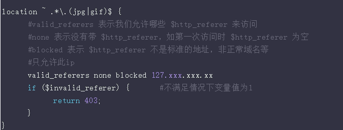

# Nginx-防盗链

防止服务器内的静态资源被其他网站所套用。此处介绍的 nginx 防盗链为基础方式，其它更加深入的方式将在之后的文章介绍。

首先，需要理解一个nginx变量：
$http_referer 

表示当前请求上一次页面访问的地址，换句话说，访问 www.baidu.com 主页，这是第一次访问，所以 $http_referer 为空，但是 访问此页面的时候还需要获取一张首页图片，再请求这张图片的时候 $http_referer 就为 www.baidu.com。

