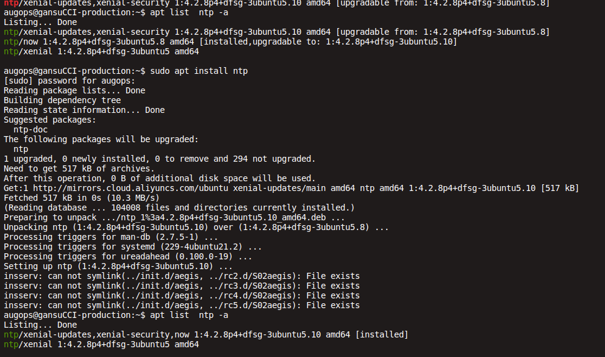

# NTP

NTP（Network Time Protocol，网络时间协议）是一种以数据包交换把两台电脑的时钟同步化的网络协议。ntpd是其中的一个操作系统守护进程。 NTP 4.2.8p6版本至4.2.8p10版本中的ntpd的ctl_getitem方法存在信息泄露漏洞。远程攻击者可借助带有ntpd实例的特制数据包利用该漏洞造成拒绝服务（越边界读取）

NTP全名“Network TimeProtocol”，即网络时间协议，是由RFC 1305定义的时间同步协议，用来在分布式时间服务器和客户端之间进行时间同步。

NTP基于UDP报文进行传输，使用的UDP端口号为123。使用NTP的目的是对网络内所有具有时钟的设备进行时钟同步，使网络内所有设备的时钟保持一致，从而使设备能够提供基于统一时间的多种应用。对于运行NTP的本地系统，既可以接收来自其他时钟源的同步，又可以作为时钟源同步其他的时钟，并且可以和其他设备互相同步

NTP服务器在应用于时间同步中分为客户端NTP服务器和服务端NTP服务器两种。客户端主要应用于现有NTP网络环境中，获取前端NTP服务器，主要是利用已经存在的网络环境，搭建时间同步系统，实现的是一个从时钟的功能。服务端NTP服务器主要是指用于后端网络环境中设备的时间同步，为网络中的服务器，计算机等网络设备提供一个时间统一的功能，实现主时钟的同步功能

TP服务器主要用来同步网络中各个计算机的时间的协议。它的用途是把计算机的时钟同步到世界协调时UTC，其精度在局域网内可达0.1ms，在互联网上绝大多数的地方其精度可以达到1-50ms。它可以使计算机对其服务器或时钟源（如石英钟，GPS等等）进行时间同步，它可以提供高精准度的时间校正，而且可以使用加密确认的方式来防止病毒的协议攻击。

很多人可能会说，我的计算机每天自己走时，为何还需要用一个ntp服务器再同步时间呢？这主要是因为在计算机中芯片本身通常并不具备时钟信号源，因此须由专门的时钟电路提供时钟信号，石英晶体振荡器(Quartz Crystal OSC)就是一种最常用的时钟信号振荡源。石英晶片之所以能当为振荡器使用，是基于它的压电效应：在晶片的两个极上加一电场，会使晶体产生机械变形；在石英晶片上加上交变电压，晶体就会产生机械振动，同时机械变形振动又会产生交变电场。虽然这种交变电场的电压极其微弱，但其振动频率是十分稳定的。

从PC诞生至今，主板上一直都使用一颗14.318MHz的石英晶体振荡器作为基准频率源。主板上除了这颗14.318MHz的晶振，还能找到一颗频率为32.768MHz的晶振，它被用于实时时钟(RTC)电路中，显示精确的时间和日期。初始化后以每秒约18.2次发出脉冲，这些脉冲经过操作系统计算形成BIOS日时钟计数。通过由BIOS电池供电,关机后它仍然正常运行。这也就是为啥我们关了电源，第二天开机依然会显示正确时间的原因。

每个计算机各自有了时钟，但是一旦它们联网后，又出现一个问题：各自运行的计算机时钟，彼此之间日积月累的累计误差如何解决。这就出现了网络时间协议NTP，它是用于互联网中时间同步的标准之一，它的用途是把计算机的时钟同步到世界协调时UTC，并满足于用户环境中的计算机（服务器同理）设备的时间同步。

## 为什么要使用ntp服务器

对大多数人来说可能会很疑问，我的计算机时间已经够我用了啊，我为何需要单独的ntp服务器。那么问题来了，一个系统里整体运行的所有计算机服务器，如果都独立运行那整个系统工作是否都乱套了？

我们举几个简单的例子：如果公共大楼遇到突发事情每个监控装置时间不一，后期事故调查取证监控时间参差不齐无法还原本质，责任谁来担当？医院系统各个科室职能兼受，若时间相互差开，病人数据记录与实际时间前后出入，若出现分歧责任甩给设备原因，设备是否能够出面来协调？电力电厂系统中有很多需要互相协调合作的设备，若出现各个系统设备之间时间紊乱，就会导致运行机制无法协调合作，那整个电厂的运行失调，所造成的损失无法估量。

所以，ntp服务器在各行各业系统发挥协调作用的同时，已经成为了不可或缺的必备系统，是各个系统稳定运行基于安全因素中必须存在的重要设备。ntp服务器服务器应用于不同行业系统中，为网络内设备提供标准的时间基准，使得各个独立又相互关联的设备有了可参考的维度标准。

随着科技电子产业的发展，ntp服务器在社会国家发展中具有必然存在的重要性。在不同行业，不同领域中由于系统环境的要求对ntp服务器的配置也不尽相同。

https://linux.cn/article-8091-1.html

