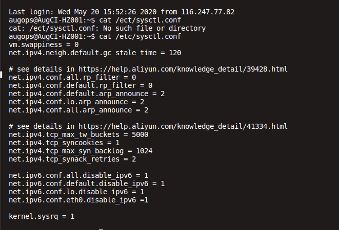
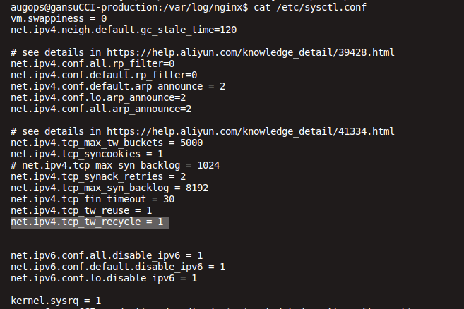

# TCP Retransmission

- https://blog.csdn.net/elie_yang/article/details/100737434

- https://www.cnblogs.com/zgq123456/p/9935653.html
- https://blog.csdn.net/chenlycly/article/details/52402945
- https://www.cnblogs.com/shijingxiang/articles/11448752.html

  

  

今天发生了一个奇怪的现象，在家里始终打开公司的网站打开不了，我就齐了怪了，然后我就各种测试，从ping到dig域名，然后再curl，都是没有问题的，但是就是打不开，最好没有办法只能抓包了，从抓包的然后来看就是syn-ack没有返回，然后就google到底是因为什么？
 
原因就是net.ipv4.tcp_timestamps=1，启用了时间戳，原理如下：
问题出在了 tcp 三次握手，如果有一个用户的时间戳大于这个链接发出的syn中的时间戳，服务器上就会忽略掉这个syn，不返会syn-ack消息，表现为用户无法正常完成tcp3次握手，从而不能打开web页面。在业务闲时，如果用户nat的端口没有被使用过时，就可以正常打开；业务忙时，nat端口重复使用的频率高，很难分到没有被使用的端口，从而产生这种问题。
 
解决：
net.ipv4.tcp_timestamps = 0

然后syctlp -p生效即可。

https://blog.csdn.net/sunny05296/article/details/68496865
https://blog.csdn.net/majianting/article/details/96476449