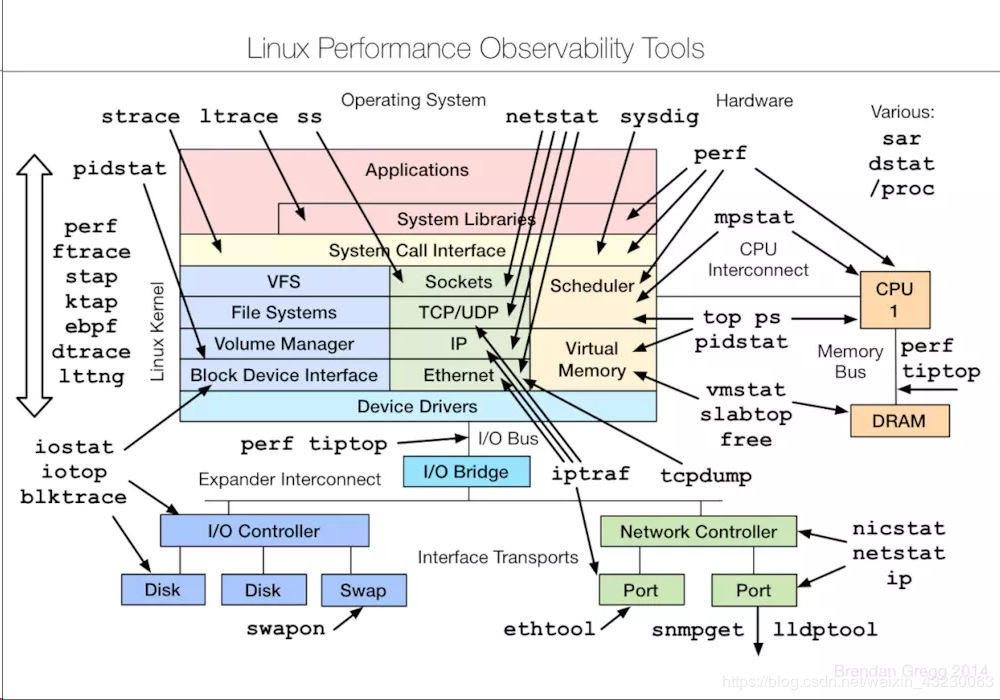

# 故障排查

linux系统故障的一般处理思路
- 报错信息--->查阅日志文件--->分析定位问题--->解决问题。

https://www.cnblogs.com/dan2/p/12613539.html
https://developer.51cto.com/art/202004/614022.htm?utm_source=tuicool&utm_medium=referral
## linux网络故障处理思路流程

1. 检查权限是否打开，iptables，selinux 
2. 服务是否正常，用Telnet或netstat检查服务是否正常开启
3. 检查本机网络是否正常，ping自身IP、同网段主机、网关
4. 检查DNS解析是否正常，/etc/hosts和/etc/resolv.conf
5. 检测网卡ip设置，route检查路由是否正确
6. 检查网路硬件，网卡、路由器、集线器、网线、交换机（lsmod、ifconfig、ip）

个人总结的情况如下
1、lsmod | grep ip            查看相关的网卡模块是否已加载
2、ifconfig -a                    能使用该命令查找到对应网卡配置信息，则说明网卡驱动程序正常
3、使用ping命令、依次ping自己、ping局域网主机、ping网关
    - ping自己异常，问题：服务异常、网卡配置未生效
    - ping局域网主机异常，问题：配置文件有误、网卡配置未生效、网线损坏
    - ping网关异常，问题：配置文件有误、网卡配置未生效

4、当前3步还不能正常上外网的话。所有route查看默认路由表。
    处理方法：删除不必要的路由信息，并保证默认路由是从对应网关地址出去的。

5、临时停止iptables服务、SELinux服务、NetworkManager服务

6、如能上网但访问域名有异常时，那将需要检查/etc/hosts、/etc/resolv.conf两个配置

7、假如以上6步检查完毕之后，还发现不能上网。有如下可能。
     7.1、主机MAC地址被路由器禁止上网
     7.2、外网服务异常。如宽带账号欠费、光纤被挖断等物理攻击。

## Linux系统无法启动
常见系统故障，比如突然断电，配置更新，软件升级，内核升级等都有可能造成无法正常启动。常见的情况如：

1.文件系统破坏，一般是linux的根分区文件系统遭到破坏，一般由系统突然断点或者非法关机引起。
2.文件系统配置不当，比如/etc/fstab文件、/etc/inittab文件等配置文件错误或者丢失，一般是执行配置更新时人为导致的。
3.linux内核文件丢失或者崩溃。一般由内核升级错误或者内核存在bug引起。
4.系统引导程序问题。比如grub丢失或者损坏，一般由人为修改错误或者文件系统故障。
5.系统硬件故障。主板、电源、硬盘等出现问题。

## 分析日志文件与故障排查
一、日志文件的概述
1.概念：记录系统和应用程序的运行信息，用于排查和诊断系统的故障；
2.linux系统中日志记录的范围：加载内核、init进程启动、启动/etc/rc.d/rc3.d/S
开头的服务、用户登录、系统程序运行；

3.日志分类：
内核及系统日志：通常由rsyslog进行管理；
用户日志：记录用户的行为；
程序日志：通常独立管理，不交给rsyslog；

二、分析日志文件；
1.常见的日志文件：

/var/log/messages：启动过程日志文件，通常有硬件加载信息，也称为公共志；

/var/log/dmesg：启动过程日志文件，通常有硬件加载信息，对解决硬件故障有帮

助；

/var/log/secure：用户登录认证日志文件；

2.rsyslog服务：管理内核、系统、用户的日志

vi /etc/rsyslog.conf ##编写日志的规则（rules）

语法：设备.优先级 日志存放位置

设备（程序）：auth（认证，与security相同）、cron（计划任务）、kern（内

核）、mail（邮件）、user（用户）、local1-local17 （用户自定义存放位置）

优先级：严重级别从低到高，1.debug调试 2.info信息 3.notice提醒 4.warn注意

5.error错误 6.crit严重 7.alert警告 8.emerg紧急，等于panic恐慌

特殊符号：*代表所有的设备或优先级，；表示隔开多个区域

3.查看/var/log/messages文件；

tail /var/log/messages ##查看尾部的文件内容

日志格式 时间 主机名 程序（或设备） 日志内容

4.用户日志分析：

查询当前系统的登陆状况： users ##每个用户对应一个终端

查询登陆系统的详细信息： who ##包括用户、终端、日期

查询当前系统中的每个用户和其所运行的进程： w ##包括用户、终端、进程

查询最近成功登陆系统的用户： last

查询最近登陆失败的用户：lastb

5.程序日志文件分析：

并无使用rsyslog服务来管理程序日志，由程序自己维护日志；

三、linux系统常见启动故障
1.MBR扇区故障

MBR扇区概述：位于物理硬盘的第一个扇区（512B），又称为主引导扇区，前

446个字节是主引导记录（GRUB引导）， 后64个字节包含了整个硬盘的分区

表，还有2个字节大小的分区标志；

故障原因：病毒木马等的破坏，不正确分区，磁盘读写误操作等；

故障现象：找不到引导，启动中断，无法加载操作系统，开机后黑屏；

解决思路：应先做好sda中的备份，然后使用系统光盘进救援模式进行恢复；

a.备份：因为MBR扇区存放了整块硬盘的分区信息，所以必须新添加一块硬盘

进行挂载，然后dd MBR中的数据到挂 载点(dd if=/dev/sda of=/benet

/sda.bat bs=512 count=1)；

b.若出现此故障，则开机屏幕会显示Operating system not found，在测试环

境中可以模拟故障（dd if=/dev/zero of=/dev/sda bs=512 count=1）；

c.需使用系统光盘，调整bois启动，进入急救模式后（注：在急救模式中，使用的

是光盘的linux目录结构），所以找 不到MBR扇区所在磁盘的任何分区信

息，需要在光盘下新建挂载点，然后将备份数据所在的硬盘挂载到挂载点，在

进行数据恢复（dd 挂载点下备份内容到MBR所在位置）；

2.grub引导故障：

GRUB引导概述：GRUB大多为linux默认的引导程序，主配置文件/boot/grub

/grub.conf；

故障原因：主配置文件grub.conf文件丢失；

故障现象：引导停滞，无法启动系统，出现grub>字段；

解决思路：

a.备份：将grub引导程序的主配置文件/boot/grub/grub.conf备份到别的存储位

置；

b.模拟故障：将主机的/boot/grub/grub.conf文件删除，重启主机；

c.修复1：手动在grub>字段后输入grub信息 ，进入系统后进行修补grub.conf文件；

d.修复2：进入光盘救援模式；

chroot /mnt/sysimage ##光盘模式默认是光盘的目录结构，由于系统的分

区表没有损坏，那么救援模式将linux

主机的目录架构挂载到了/mnt/sysimage下，需要使用此命令切换到待修复的linux系统；

cp grub.conf备份文件位置 /boot/grub/ ##将备份的grub.conf文件恢复到/boot

目录下

exit ##退出待修复的系统模式

reboot ##重启验证是否修复成功

e.若通过以上步骤无法修复grub引导问题，那么需要进入光盘救援模式，重新

安装grub引导程序，若grub.conf配置文件内部字段被损坏，可以执行重新安装引

导，若此文件丢失则无法安装123；

chroot /mnt/sysimage

grub-install /dev/sda ##重新安装grub引导程序到sda分区中

exit ##退出待修复的系统模式

reboot

3.遗忘root的密码：

解决思路：两种方案

a.进入单用户模式进行修改root密码：开机到秒数时按下键--选择grub行按e键--

将光标移动到kernel行按e键--输入

空格1然后回车--将光标移动到kernel行按b键--进入单用户模式；passwd 更改

root的密码；

b.进入光盘救援模式进行修改root密码：

chroot /mnt/sysimage ##切换到待修复linux系统的的模式下；

passwd ##更改root的密码

exit ##退出待修复linux系统的模式

reboot ##重启主机，登陆验证

4.文件系统故障：

故障原因：非正常关机、突然断电、设备读写失误等（文件系统的超级块super-

block信息被损坏）；

故障现象：无法向分区中读取或写入数据，启动后显示Give root password for

maintenance；

解决思路：

a.模拟故障：dd if=/dev/zero of=/dev/sdb1 bs=512b count=4 ##将sdb1分

区的文件系统破坏掉

b.测试挂载：出现mount: you must specify the filesystem type；

c.修复文件系统：fsck -y -t ext4 /dev/sdb1 ##修复文件系统

d.再次测试挂载：mount /dev/sdb1 /benet

5.磁盘资源耗尽故障：

故障原因：磁盘空间已被大量的数据占满，空间耗尽，有可用空间，但文件数i节

点（磁盘中的文件的指针，当Linux系 统要查找某个文件时，它会先搜索inode

table找到这个文件的属性及数据存放地点，然后再查找数据存放的Block进 而将

数据取出）耗尽；

故障现象：无法写入新的文件，提示设备上没有空间，部分程序无法运行，甚至系

统无法启动；解决思路：

a.清理磁盘空间、删除无用的占用i节点的小文件；

b.为用户设置磁盘限额；

注：df -i ##查看磁盘分区的i节点使用情况

6.磁盘坏道的检测：

故障原因：磁盘设备中存在逻辑的或者物理的坏道情况

故障现象：读取磁盘中的数据时，磁盘设备发出声响、访问磁盘中的文件时，反

复读取且出错，提示文件损坏、新建立的 分区无法格式化；

解决思路：

a.检测磁盘时候存在坏道情况（badblocks -sv /dev/sdb）；

b.修复硬盘或者更换新的硬盘

四、扩展：为grub引导菜单设置密码；
grub-md5-crypt ##生成MD5加密的字符串

将密码加密串写入配置文件/boot/grub/grub.conf 配置文件

在hiddenmenu 和 title之间增加加密信息，如下

password --md5 加密字符串 ##设置密文密码

password=123123 ##设置明文密码

## 常用工具
- ps :可以查看当前Linux 正在运行的进程的状态，找出进程对应的PID 号，进程的CPU 和内存占用，运行时间等。
- strace :可以追踪进程的系统调用。
- lsof: 可以给出进程所有打开的文件，而Linux 下一切皆文件，比如硬件设备、网络连接等

### ps

`ps auxf`

USER  该进程输入哪个user
PID   进程的pid 号
%CPU  占用CPU 资源比例
%MEM  占用物理内存比例
VSZ   占用虚拟内存量（单位Kbytes）
RSS   实际占用内存量（单位Kbytes）
TTY   该进程在哪个终端上运行，如果与终端无关，则显示? 如果连入的终端，显示tty，网络连入显示pts/0
STAT  进程状态
START 进程启动的时间
TIME  进程占用CPU 的时间
COMMAND  进程的运行指令

#### STAT 进程状态
R   运行
S   睡眠，等待某个条件的形成或者信号
I   Idle空闲
Z   僵死，（a defunct process）但进程描述符存在, 直到父进程调用wait4()系统调用后释放。
D   不可中断，收到信号不唤醒和不可运行, 进程必须等待直到有中断发生。
T   终止，进程收到SIGSTOP, SIGSTP, SIGTIN, SIGTOU信号后停止运行运行。
P   等待交换页
W   无驻留页
X   死掉的进程
<   高优先级进程，高优先序的进程
N   低优先级进程，低优先序的进程
L   内存锁页，有记忆体分页分配并缩在记忆体内
s   进程的领导者（在它之下有子进程）
l   多进程的（使用 CLONE_THREAD, 类似 NPTL pthreads）
+   位于后台的进程组 

### strace
strace常用来跟踪进程执行时的系统调用和所接收的信号。 通过strace可以知道应用程序打开了哪些文件,以及读写了什么内容,包括消耗的时间以及返回值等。在Linux世界，进程不能直接访问硬件设备，当进程需要访问硬件设备(比如读取磁盘文件，接收网络数据等等)时，必须由用户态模式切换至内核态模式，通 过系统调用访问硬件设备。strace可以跟踪到一个进程产生的系统调用,包括参数，返回值，执行消耗的时间

strace 常用指令

strace -p <pid>   跟踪进程的系统调用
strace -f -p <pid>   跟踪进程及其子进程的系统调用
strace -ttt -p <pid>   跟踪的同时显示时间信息
strace -c -p <pid>  显示进程的profilling 信息

### lsof

lsof 常用指令
lsof <filename>    显示打开某个文件的进程
lsof +D <DIR>      显示所有打开该目录的进程，注意，如果不想显示其子目录的进程，可以使用+d。
lsof -u <username>   显示某个用户启动进程所打开的文件
lsof -u^<username>   显示除了某个用户外的其他所以用户的启动进程打开的文件
lsof -i [4|6][@hostname|ip][:service|port]       显示打开某ip或者端口的进程 （可以和netstat 配合使用）, 4和6 用来区分ip 协议
lsof -i    列出所有的网络连接（注意，网络连接也是文件）
lsof -i TCP:1-1024   列出所有使用TCP 协议，端口范围是1-1024 的网络连接

lsof 输出列代表的含义

FD – Represents the file descriptor. Some of the values of FDs are

cwd – Current Working Directory
txt – Text file
mem – Memory mapped file
mmap – Memory mapped device
NUMBER – Represent the actual file descriptor. The character after the number i.e ‘1u’, represents the mode in which the file is opened. r for read, w for write, u for read and write.

TYPE – of files and it’s identification.

DIR – Directory
REG – Regular file
CHR – Character special file.
FIFO – First In First Out
