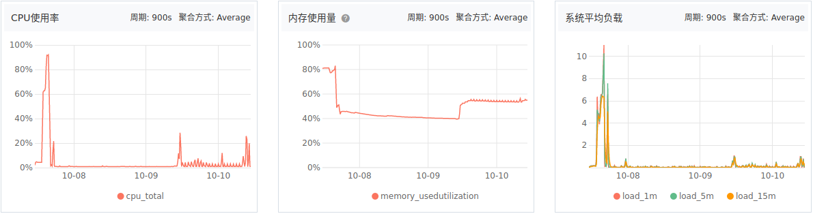
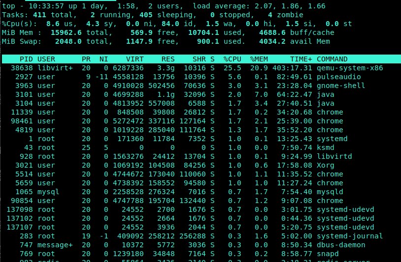
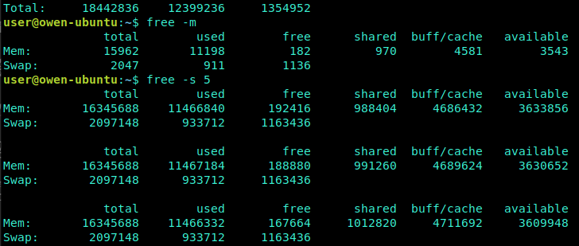

# CPU/内存/负载 故障监控

[TOC]



## 1. CPU

### top

top命令是Linux下常用的性能分析工具，能够实时显示系统中各个进程的资源占用状况，类似于Windows的任务管理器



**数值的解释:**

统计信息区前五行是系统整体的统计信息。

- 第一行： 系统运行时间和平均负载，同 uptime  命令的执行结果

``` text
user@owen-ubuntu:~$ uptime
 10:06:17 up 1 day,  1:31,  2 users,  load average: 2.25, 1.75, 1.79
 当前时间  系统运行时间，当前登录用户数， 系统负载，即任务队列的平均长度。三个数值分别为  1分钟、5分钟、15分钟前到现在的平均值

```

- 第二行： 任务

任务的总数、运行中(running)的任务、休眠(sleeping)中的任务、停止(stopped)的任务、僵尸状态(zombie)的任务

- 第三行： CPU的信息。当有多个CPU时，这些内容可能会超过两行

```text
%us：user： 运行(未调整优先级的) 用户进程的CPU时间
%sy：system: 运行内核进程的CPU时间
%ni：niced：运行已调整优先级的用户进程的CPU时间
%id：idle:空闲cpu时间
%wa：IO wait: 用于等待IO完成的CPU时间
%hi：处理硬件中断的CPU时间
%si：处理软件中断的CPU时间
%st：这个虚拟机被hypervisor偷去的CPU时间（译注：如果当前处于一个hypervisor下的vm，实际上hypervisor也是要消耗一部分CPU处理时间的）

注：99.0 id，表示空闲CPU，即CPU未使用率，100%-99.0%=1%，即系统的cpu使用率为1%。
```

- 第四行： 内存
全部可用内存、已使用内存、空闲内存、缓冲内存

- 第五行： swap
全部、已使用、空闲和缓冲交换空间

- 第七行至N行： 各进程任务的的状态监控

    | 字段  | 释义  |
    |---|---|
    |PID   | 进程ID，进程的唯一标识符  |
    |USER| 进程所有者的实际用户名  |
    |PR| 进程的调度优先级。这个字段的一些值是'rt'。这意味这这些进程运行在实时态。  |
    |NI| 进程的nice值（优先级）。越小的值意味着越高的优先级。负值表示高优先级，正值表示低优先级   |
    |VIRT| virtual memory usage 虚拟内存,进程使用的虚拟内存。进程使用的虚拟内存总量，单位kb。VIRT=SWAP+RES<br>1、进程“需要的”虚拟内存大小，包括进程使用的库、代码、数据等<br>2、假如进程申请100m的内存，但实际只使用了10m，那么它会增长100m，而不是实际的使用量 |
    |RES   | resident memory usage 常驻内存,驻留内存大小。驻留内存是任务使用的非交换物理内存大小。进程使用的、未被换出的物理内存大小，单位kb。RES=CODE+DATA<br>1、进程当前使用的内存大小，但不包括swap out<br>2、包含其他进程的共享<br>3、如果申请100m的内存，实际使用10m，它只增长10m，与VIRT相反<br>4、关于库占用内存的情况，它只统计加载的库文件所占内存大小  |
    | SHR | SHR：shared memory 共享内存<br>1、除了自身进程的共享内存，也包括其他进程的共享内存<br>2、虽然进程只使用了几个共享库的函数，但它包含了整个共享库的大小<br>3、计算某个进程所占的物理内存大小公式：RES – SHR<br>4、swap out后，它将会降下来  |
    | S  |这个是进程的状态。它有以下不同的值:<br>D - 不可中断的睡眠态。<br>R – 运行态<br>S – 睡眠态<br>T – 被跟踪或已停止<br>Z – 僵尸态   |
    |%CPU   |自从上一次更新时到现在任务所使用的CPU时间百分比。%CPU显示的是进程占用一个核的百分比，而不是整个cpu（N核）的百分比，有时候可能大于100，那是因为该进程启用了多线程占用了多个核心，所以有时候我们看该值得时候会超过100%，但不会超过总核数*100   |
    | %MEM | 进程使用的可用物理内存百分比  |
    |TIME+ |任务启动后到现在所使用的全部CPU时间，精确到百分之一秒  |
    |COMMAND| 运行进程所使用的命令。进程名称（命令名/命令行）  |

- **常用参数:**

    ``` text
    d：指定每两次屏幕信息刷新之间的时间间隔。当然用户可以使用s交互命令来改变之。

    p:通过指定监控进程ID来仅仅监控某个进程的状态。

    top –p PID
    -H： 设置线程模式

    显示某个进程所有活跃的线程消耗情况

    top -H -p pid
    ```

## 2. 内存

### free

可以显示Linux系统中空闲的、已用的物理内存及swap内存,及被内核使用的buffer。在Linux系统监控的工具中，free命令是最经常使用的命令之一。

``` text
-b 　以Byte为单位显示内存使用情况。
-k 　以KB为单位显示内存使用情况。
-m 　以MB为单位显示内存使用情况。
-g   以GB为单位显示内存使用情况。
-o 　不显示缓冲区调节列。
-s <间隔秒数> 　持续观察内存使用状况。
-t 　显示内存总和列。
-V 　显示版本信息。
```



- 数值的解释：

    ``` text
    total:总计物理内存的大小
    used:已使用多大
    free:可用有多少
    Shared:多个进程共享的内存总额
    Buff/cache:磁盘缓存的大小

    第三行是交换分区SWAP的，也就是我们通常所说的虚拟内存。
    当可用内存少于额定值的时候，就会进行交换
    ```

## 3. 负载

```text
load average: 1.39, 1.55, 1.41
```

load average:表示系统在 `1,5,15分钟` 的平均工作负载

系统平均负载是CPU的Load，它所包含的信息不是CPU的使用率状况，而是在一段时间内CPU正在处理以及等待CPU处理的进程数之和的统计信息，也就是CPU使用队列的长度的统计信息。`这个数字越小越好`。

### CPU负载 和 CPU利用率

- CPU利用率:显示的是程序在运行期间实时占用的CPU百分比

- CPU负载:显示的是一段时间内正在使用和等待使用CPU的平均任务数。CPU利用率高，并不意味着负载就一定大。

举例来说：如果我有一个程序它需要一直使用cpu的运算功能，那么此时cpu的使用率可能达到100%，但是cpu的工作负载则是趋近于“1”，因为cpu仅负责一个工作嘛！如果同时执行这样的程序两个呢？cpu的使用率还是100%，但是工作负载则变成2了。所以也就是说，当cpu的工作负载越大，代表cpu必须要在不同的工作之间进行频繁的工作切换。

无论CPU的利用率是高是低，跟后面有多少任务在排队(cpu负载)没有必然关系。

**负载为多少才算比较理想？**

CPU负载小于等于0.5算是一种理想状态。

在评估CPU负载时，我们只以5分钟为单位为统计任务队列长度。如果每隔5分钟统计的时候，发现任务队列长度都是1，那么CPU负载就为1。假如我们只有一个单核的CPU，负载一直为1，意味着没有任务在排队，还不错。

如果是双核又CPU，等于是有4个内核，每个内核的负载为1的话，总负载为4。这就是说，如果我那台服务器的CPU负载长期保持在4左右，还可以接受。

但是每个内核的负载为1，并不能算是一种理想状态！这意味着我们的CPU一直很忙，不得清闲。`理想的状态是每个内核的负载为0.7左右，0.7乘以内核数，得出服务器理想的CPU负载 - 在多处理器系统中，负载均值是基于内核的数量决定的`

`cat /proc/cpuinfo` - 获取你系统上的每个处理器的信息。

如果你只想得到数字，那么就使用下面的命令： `grep 'model name' /proc/cpuinfo | wc -l`

**如何来降低服务器的CPU负载？**

最简单办法的是更换性能更好的服务器，不要想着仅仅提高CPU的性能，那没有用，CPU要发挥出它最好的性能还需要其它软硬件的配合。

在服务器其它方面配置合理的情况下，CPU数量和CPU核心数（内核数）都会影响到CPU负载，因为任务最终是要分配到CPU核心去处理。两块CPU要比一块CPU好，双核要比单核好。

因此，我们需要记住，除去CPU性能上的差异，CPU负载是基于内核数来计算的！有一个说法，“有多少内核，即有多少负载”
