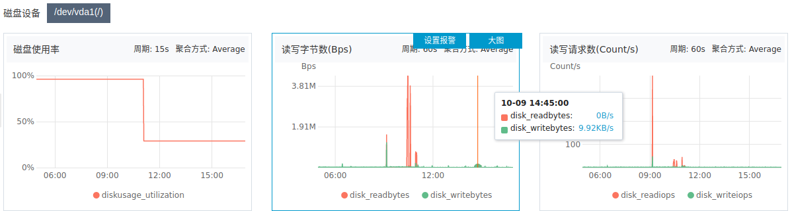
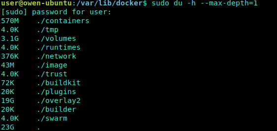
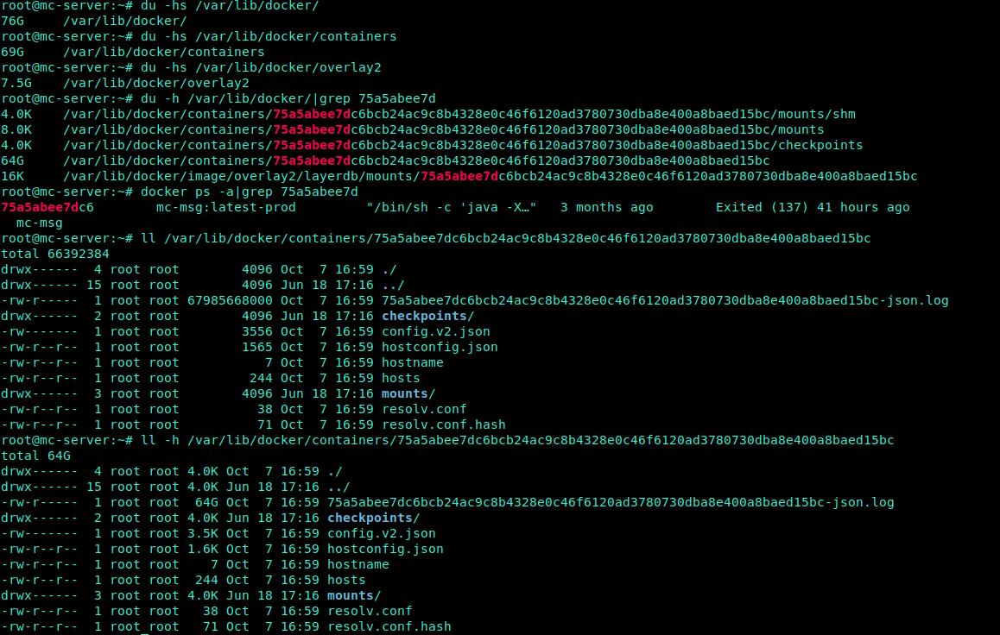

# 磁盘 故障监控

[TOC]

工作中可能会遇到 “磁盘使用率100%” 的情况，结合实践说下类似 “磁盘” 故障的解决思路和办法。

## 磁盘性能指标

五个常见指标: 使用率、饱和度、IOPS、吞吐量以及响应时间。这五个指标，是衡量磁盘性能的基本指标。

- 使用率，是指磁盘处理 I/O 的时间百分比。过高的使用率（比如超过 80%），通常意味着磁盘 I/O 存在性能瓶颈。

- 饱和度，是指磁盘处理 I/O 的繁忙程度。过高的饱和度，意味着磁盘存在严重的性能瓶颈。当饱和度为 100% 时，磁盘无法接受新的 I/O 请求。

- IOPS（Input/Output Per Second），即 每秒磁盘进行多少次 I/O 读写。

- 吞吐量，每秒磁盘 I/O 的流量，即磁盘写入加上读出的数据的大小。

- 响应时间，是指 I/O 请求从发出到收到响应的间隔时间。

## 使用命令 -查看磁盘情况

- 磁盘使用率与inode使用率可以参考df命令
- 磁盘读写可以参考iostat命令

### df/dh

- 列出文件系统的磁盘使用量（以易读的KB、MB、GB方式显示）`df -h`

- 查看当前目录总共占的容量,而不单独列出各子项占用的容量 `du -sh`

- 查看当前目录各个目录空间占用情况 `du -h --max-depth=1` (--max-depth=<目录层数> 超过指定层数的目录后，予以忽略)

  

### iostat

主要用于监控系统设备的 IO 负载情况，iostat 首次运行时显示自系统启动开始的各项统计信息，之后运行 iostat 将显示自上次运行该命令以后的统计信息。用户可以通过指定统计的次数和时间来获得所需的统计信息

## 常见问题

### docker overlay2 占用大量磁盘空间处理方法

`docker system df命令`，类似于Linux上的df命令，用于查看Docker的磁盘使用情况

如图，发现 `/var/lib/docker/containers/{container_id}/` 下存在数据较大的 `*-json.log日志文件`, 其实这些是docker容器运行的标准输入日志。 可通过如下方式清理

`cat /dev/null > *-json.log`

或者使用 `docker system prune命令` 可以用于清理磁盘，删除关闭的容器、无用的数据卷和网络，以及dangling镜像(即无tag的镜像)。

`docker system prune -a命令` 清理得更加彻底，可以将没有容器使用Docker镜像都删掉。注意，这两个命令会把你暂时关闭的容器，以及暂时没有用到的Docker镜像都删掉了… 所以使用之前一定要想清楚。