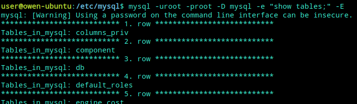
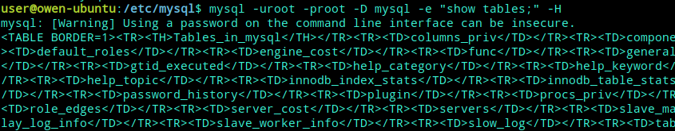
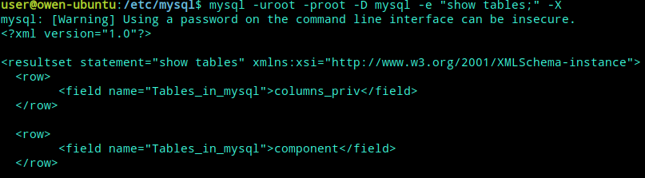

# MySQL 操作

[TOC]

## 加载执行SQL语句

- 第一种方法: 命令行下(未连接数据库)

  `mysql -h localhost -u root -p123456 < C:\db.sql`

  `mysql  -hhostname -Pport -uusername -ppassword  -e`

- 第二种方法: 命令行下(已连接数据库,此时的提示符为 mysql>: ), 输入 source C:\db.sql

## 日常操作

``` shell
#!/bin/bash

HOSTNAME="192.168.111.84"  #数据库信息
PORT="3306"
USERNAME="root"
PASSWORD=""

DBNAME="test_db_test"  #数据库名称
TABLENAME="test_table_test"   #数据库中表的名称
```

### 创建数据库

``` shell
create_db_sql="create database IF NOT EXISTS ${DBNAME}"
mysql -h${HOSTNAME}  -P${PORT}  -u${USERNAME} -p${PASSWORD} -e "${create_db_sql}"
```

### 创建表

``` shell
create_table_sql="create table IF NOT EXISTS ${TABLENAME} (  name varchar(20), id int(11) default 0 )"
mysql -h${HOSTNAME}  -P${PORT}  -u${USERNAME} -p${PASSWORD} ${DBNAME} -e "${create_table_sql}"
```

### 插入数据

``` shell
insert_sql="insert into ${TABLENAME} values('billchen',2)"
mysql -h${HOSTNAME}  -P${PORT}  -u${USERNAME} -p${PASSWORD} ${DBNAME} -e "${insert_sql}"
```

### 查询

``` shell
select_sql="select * from ${TABLENAME}"
mysql -h${HOSTNAME}  -P${PORT}  -u${USERNAME} -p${PASSWORD} ${DBNAME} -e "${select_sql}"
```

### 更新数据

``` shell
update_sql="update ${TABLENAME} set id=3"
mysql -h${HOSTNAME}  -P${PORT}  -u${USERNAME} -p${PASSWORD} ${DBNAME} -e "${update_sql}"
mysql -h${HOSTNAME}  -P${PORT}  -u${USERNAME} -p${PASSWORD} ${DBNAME} -e "${select_sql}"
```

### 删除数据

``` shell
delete_sql="delete from ${TABLENAME}"
mysql -h${HOSTNAME}  -P${PORT}  -u${USERNAME} -p${PASSWORD} ${DBNAME} -e "${delete_sql}"
mysql -h${HOSTNAME}  -P${PORT}  -u${USERNAME} -p${PASSWORD} ${DBNAME} -e "${select_sql}"
```

### 查看运行线程

对于一个Mysql连接，或者说一个线程，任何时刻都有一个状态，该状态表示了mysql当前正在做什么。

show processlist 是显示用户正在运行的线程，需要注意的是，除了 root 用户能看到所有正在运行的线程外，其他用户都只能看到自己正在运行的线程，看不到其它用户正在运行的线程。除非单独个这个用户赋予了PROCESS 权限.

``` shell
user@owen-ubuntu:~$ mysql -uroot -proot -e 'show processlist'
mysql: [Warning] Using a password on the command line interface can be insecure.
+----+-----------------+-----------+------+---------+-------+------------------------+------------------+
| Id | User            | Host      | db   | Command | Time  | State                  | Info             |
+----+-----------------+-----------+------+---------+-------+------------------------+------------------+
|  5 | event_scheduler | localhost | NULL | Daemon  | 75848 | Waiting on empty queue | NULL             |
| 19 | root            | localhost | NULL | Query   |     0 | starting               | show processlist |
+----+-----------------+-----------+------+---------+-------+------------------------+------------------+

user@owen-ubuntu:~$ mysqladmin -uroot -proot processlist
mysqladmin: [Warning] Using a password on the command line interface can be insecure.
+----+-----------------+-----------+----+---------+-------+------------------------+------------------+
| Id | User            | Host      | db | Command | Time  | State                  | Info             |
+----+-----------------+-----------+----+---------+-------+------------------------+------------------+
| 5  | event_scheduler | localhost |    | Daemon  | 75855 | Waiting on empty queue |                  |
| 20 | root            | localhost |    | Query   | 0     | starting               | show processlist |
+----+-----------------+-----------+----+---------+-------+------------------------+------------------+
```

通常只会显示100条如果想看跟多的可以使用full修饰（show full processlist）

`mysql -uroot -e  -p password  'show processlist\G';`

`mysql -uroot -e 'show processlist\G'|grep 'Info'|grep -v "NULL"|awk -F ":" '{print $2}'|sort|uniq -c|sort -rn;(查看正在执行的语句有哪些,并做好归并排序:)`

## MySQL 命令行参数

``` shell
Usage: mysql [OPTIONS] [database]   //命令方式
 -?, --help          //显示帮助信息并退出
 -I, --help          //显示帮助信息并退出
 --auto-rehash       //自动补全功能，就像linux里面，按Tab键出提示差不多，下面有例子

 -A, --no-auto-rehash  //默认状态是没有自动补全功能的。-A就是不要自动补全功能
 -B, --batch         //ysql不使用历史文件，禁用交互
 (Enables --silent)
 --character-sets-dir=name   //字体集的安装目录
 --default-character-set=name    //设置数据库的默认字符集
 -C, --compress      //在客户端和服务器端传递信息时使用压缩
 -#, --debug[=#]     //bug调用功能
 -D, --database=name //使用哪个数据库
 --delimiter=name    //mysql默认命令结束符是分号，下面有例子
 -e, --execute=name  //执行mysql的sql语句
 -E, --vertical      //垂直打印查询输出
 -f, --force         //如果有错误跳过去，继续执行下面的
 -G, --named-commands //*Enable named commands. Named commands mean this program's internal commands; see mysql> help . When enabled, the
 named commands can be used from any line of the query, otherwise only from the first line, before an enter.
 Disable with --disable-named-commands. This option is disabled by default.*/
 -g, --no-named-commands
 /*Named commands are disabled. Use \* form only, or use named commands only in the beginning of a line ending
 with a semicolon (;) Since version 10.9 the client now starts with this option ENABLED by default! Disable with
 '-G'. Long format commands still work from the first line. WARNING: option deprecated; use --disable-named-commands instead.*/
 -i, --ignore-spaces //忽视函数名后面的空格.
 --local-infile      //启动/禁用 LOAD DATA LOCAL INFILE.
 -b, --no-beep       //sql错误时，禁止嘟的一声
 -h, --host=name     //设置连接的服务器名或者Ip
 -H, --html          //以html的方式输出
 -X, --xml           //以xml的方式输出
 --line-numbers      //显示错误的行号
 -L, --skip-line-numbers  //忽略错误的行号
 -n, --unbuffered    //每执行一次sql后，刷新缓存
 --column-names      //查寻时显示列信息，默认是加上的
 -N, --skip-column-names  //不显示列信息
 -O, --set-variable=name  //设置变量用法是--set-variable=var_name=var_value
 --sigint-ignore     //忽视SIGINT符号(登录退出时Control-C的结果)
 -o, --one-database  //忽视除了为命令行中命名的默认数据库的语句。可以帮跳过日志中的其它数据库的更新。
 --pager[=name]      //使用分页器来显示查询输出，这个要在linux可以用more,less等。
 --no-pager          //不使用分页器来显示查询输出。
 -p, --password[=name] //输入密码
 -P, --port=#        //设置端口
 --prompt=name       //设置mysql提示符
 --protocol=name     //使用什么协议
 -q, --quick         //不缓存查询的结果，顺序打印每一行。如果输出被挂起，服务器会慢下来，mysql不使用历史文件。
 -r, --raw           //写列的值而不转义转换。通常结合--batch选项使用。
 --reconnect         //如果与服务器之间的连接断开，自动尝试重新连接。禁止重新连接，使用--disable-reconnect。
 -s, --silent        //一行一行输出，中间有tab分隔
 -S, --socket=name   //连接服务器的sockey文件
 --ssl               //激活ssl连接，不激活--skip-ssl
 --ssl-ca=name       //CA证书
 --ssl-capath=name   //CA路径
 --ssl-cert=name     //X509 证书
 --ssl-cipher=name   //SSL cipher to use (implies --ssl).
 --ssl-key=name      //X509 密钥名
 --ssl-verify-server-cert //连接时审核服务器的证书
 -t, --table         //以表格的形势输出
 --tee=name          //将输出拷贝添加到给定的文件中，禁时用--disable-tee
 --no-tee            //根--disable-tee功能一样
 -u, --user=name     //用户名
 -U, --safe-updates  //Only allow UPDATE and DELETE that uses keys.
 -U, --i-am-a-dummy  //Synonym for option --safe-updates, -U.
 -v, --verbose       //输出mysql执行的语句
 -V, --version       //版本信息
 -w, --wait          //服务器down后，等待到重起的时间
 --connect_timeout=# //连接前要等待的时间
 --max_allowed_packet=# //服务器接收／发送包的最大长度
 --net_buffer_length=# //TCP / IP和套接字通信缓冲区大小。
 --select_limit=#    //使用--safe-updates时SELECT语句的自动限制
 --max_join_size=#   //使用--safe-updates时联接中的行的自动限制
 --secure-auth       //拒绝用(pre-4.1.1)的方式连接到数据库
 --server-arg=name   //Send embedded server this as a parameter.
 --show-warnings     //显示警告
```

### 命令行示例

#### 1. auto-rehash自动补全

二种方法可以实现自动补全功能

``` text
－－－－－－－－－－－－－－－－－－－－－－－－－－－－－－－－－－－－－－－
[mysql]
#no-auto-rehash
auto-rehash
－－－－－－－－－－－－－－－－－－－－－－－－－－－－－－－－－－－－－－－
mysql -u root --auto-rehash
```

#### 2. -E 垂直打印查询输出



#### 3. -H 以html的方式输出



#### 3. -X 以xml的方式输出

