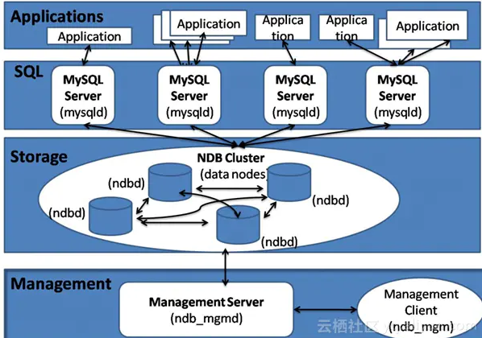

# MySQL 高可用方案

考虑MySQL数据库的高可用架构时，主要考虑如下几方面：

- 如果数据库发生了宕机或者意外中断等故障，能尽快恢复数据库的可用性，尽可能的减少停机时间，保证业务不会因为数据库的故障而中断。

- 用作备份、只读副本等功能的非主节点的数据应该和主节点的数据实时或者最终保持一致。

- 当业务发生数据库切换时，切换前后的数据库内容应当一致，不会因为数据缺失或者数据不一致而影响业务。

**参考：**

- https://www.cnblogs.com/wuxu/p/13161438.html

## 1.主从复制

主从复制是通过重放binlog实现主库数据的异步复制。即当主库执行了一条sql命令，那么在从库同样的执行一遍，从而达到主从复制的效果。在这个过程中，master对数据的写操作记入二进制日志文件中(binlog)，生成一个 log dump 线程，用来给从库的 i/o线程传binlog。而从库的i/o线程去请求主库的binlog，并将得到的binlog日志写到中继日志（relaylog）中，从库的sql线程，会读取relaylog文件中的日志，并解析成具体操作，通过主从的操作一致，而达到最终数据一致。

MySQL Replication一主多从的结构，主要目的是实现数据的多点备份（没有故障自动转移和负载均衡）。相比于单个的mysql，一主多从下的优势如下：

- 如果让后台读操作连接从数据库，让写操作连接主数据库，能起到读写分离的作用，这个时候多个从数据库可以做负载均衡。
- 可以在某个从数据库中暂时中断复制进程，来备份数据，从而不影响主数据的对外服务（如果在master上执行backup，需要让master处于readonly状态，这也意味这所有的write请求需要阻塞）。

就各个集群方案来说，其优势为：

- 主从复制是mysql自带的，无需借助第三方。
- 数据被删除，可以从binlog日志中恢复。
- 配置较为简单方便。

其劣势为：

- 从库要从binlog获取数据并重放，这肯定与主库写入数据存在时间延迟，因此从库的数据总是要滞后主库。
- 对主库与从库之间的网络延迟要求较高，若网络延迟太高，将加重上述的滞后，造成最终数据的不一致。
- 单一的主节点挂了，将不能对外提供写服务。

## 2.MHA集群结构

MHA是在MySQL Replication的基础上，对其进行优化。

MHA（Master High Availability）是`多主多从`结构，这是日本DeNA公司的youshimaton开发，主要提供更多的主节点，但是缺少VIP（虚拟IP），需要配合keepalived等一起使用。

要搭建MHA，要求一个复制集群中必须最少有三台数据库服务器，一主二从，即一台充当master，一台充当备用master，另外一台充当从库

**优势：**

- 可以进行故障的自动检测和转移
- 具备自动数据补偿能力，在主库异常崩溃时能够最大程度的保证数据的一致性。

**劣势：**

- MHA架构实现读写分离，最佳实践是在应用开发设计时提前规划读写分离事宜，在使用时设置两个连接池，即读连接池与写连接池，也可以选择折中方案即引入SQL Proxy。但无论如何都需要改动代码；

- 关于读负载均衡可以使用F5、LVS、HAPROXY或者SQL Proxy等工具，只要能实现负载均衡、故障检查及备升级为主后的读写剥离功能即可，建议使用LVS

## 3.MMM集群结构

MMM是在MySQL Replication的基础上，对其进行优化。

MMM（Master Replication Manager for MySQL）是`双主多从`结构，这是Google的开源项目，使用Perl语言来对MySQL Replication做扩展，提供一套支持双主故障切换和双主日常管理的脚本程序，主要用来监控mysql主主复制并做失败转移。

注意：这里的双主节点，虽然叫做双主复制，`但是业务上同一时刻只允许对一个主进行写入`，另一台备选主上提供部分读服务，以加速在主主切换时刻备选主的预热。

**优势：**

- 自动的主主Failover切换，一般3s以内切换备机。
- 多个从节点读的负载均衡。

**劣势：**

- 无法完全保证数据的一致性。如主1挂了，MMM monitor已经切换到主2上来了，而若此时双主复制中，主2数据落后于主1（即还未完全复制完毕），那么此时的主2已经成为主节点，对外提供写服务，从而导致数据不一。

- 由于是使用虚拟IP浮动技术，类似Keepalived，故RIP（真实IP）要和VIP（虚拟IP）在同一网段。如果是在不同网段也可以，需要用到虚拟路由技术。但是绝对要在同一个IDC机房，不可跨IDC机房组建集群。

**优势:**

- 自动的主主Failover切换，一般3s以内切换备机。
- 多个从节点读的负载均衡。

**劣势：**

- 无法完全保证数据的一致性。如主1挂了，MMM monitor已经切换到主2上来了，而若此时双主复制中，主2数据落后于主1（即还未完全复制完毕），那么此时的主2已经成为主节点，对外提供写服务，从而导致数据不一。

- 由于是使用虚拟IP浮动技术，类似Keepalived，故RIP（真实IP）要和VIP（虚拟IP）在同一网段。如果是在不同网段也可以，需要用到虚拟路由技术。但是绝对要在同一个IDC机房，不可跨IDC机房组建集群。

## MySQL官方Cluster架构

- https://dev.mysql.com/doc/refman/8.0/en/mysql-cluster.html
- 安装: https://dev.mysql.com/doc/refman/8.0/en/mysql-cluster-installation.html
- https://www.jianshu.com/p/1abafc5679d2

集群成员：

- 管理节点（MGM） 进程名 ndb_mgmd
- 数据节点（Data Nodes） 进程名 ndbd
- SQL节点（Sql Nodes） 进程名 mysqld

**优点：**

- 99.999%的高可用性
- 快速的自动失效切换
- 灵活的分布式体系结构，没有单点故障
- 高吞吐量和低延迟
- 可扩展性强，支持在线扩容

**缺点：**

- 存在很多限制，比如：不支持外键
- 部署、管理、配置很复杂
- 占用磁盘空间大，内存大
- 备份和恢复不方便
- 重启的时候，数据节点将数据load到内存需要很长时间

## 4.其他集群结构

Percona XtraDB Cluster

