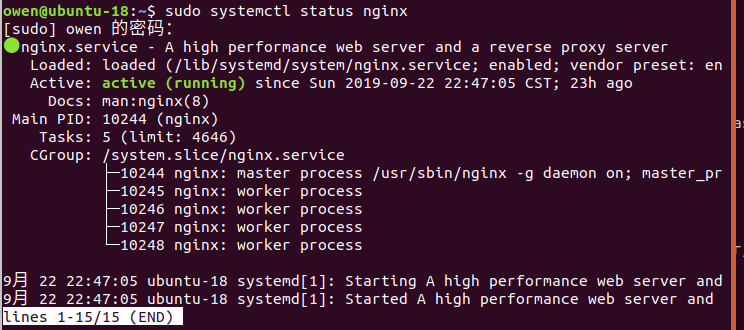

# Nginx 安装/卸载

[TOC]

下载地址：http://nginx.org/en/download.html

## Docker 方式运行

`docker run --name nginx -p 8080:80 -d nginx`

## Ubuntu上安装

- http://nginx.org/en/linux_packages.html#Ubuntu

``` shell
sudo apt-get install software-properties-common
sudo add-apt-repository ppa:nginx/stable 
sudo apt-get update
sudo apt-get install nginx
```

启动Nginx `$sudo /etc/init.d/nginx start`

安装完成后，请检查Nginx服务的状态和版本：`sudo systemctl status nginx` 

访问：http://localhost:80



启动时候若显示端口80被占用： `Starting nginx: [emerg]: bind() to 0.0.0.0:80 failed (98: Address already in use)，`
修改文件：/etc/nginx/sites-available/default,把 listen 后面的 80 端口号改为自己的端口，访问是需要添加端口号。
安装完后如出现403错误，那可能是nginx配置文件里的网站路径不正确

## 卸载Nginx

``` shell
sudo apt-get remove nginx nginx-common # 卸载删除除了配置文件以外的所有文件。
sudo apt-get purge nginx nginx-common # 卸载所有东东，包括删除配置文件。
sudo apt-get autoremove # 在上面命令结束后执行，主要是卸载删除Nginx的不再被使用的依赖包。
sudo apt-get remove nginx-full nginx-common #卸载删除两个主要的包。
```

## Nginx 操作

```shell
- sudo nginx #打开 nginx
- nginx -s reload|reopen|stop|quit #重新加载配置|重启|停止|退出 nginx
- nginx -t #测试配置是否有语法错误

nginx [-?hvVtq] [-s signal] [-c filename] [-p prefix] [-g directives]

-?,-h : 打开帮助信息
-v : 显示版本信息并退出
-V : 显示版本和配置选项信息，然后退出
-t : 检测配置文件是否有语法错误，然后退出
-q : 在检测配置文件期间屏蔽非错误信息
-s signal : 给一个 nginx 主进程发送信号：stop（停止）, quit（退出）, reopen（重启）, reload（重新加载配置文件）
-p prefix : 设置前缀路径（默认是：/usr/local/Cellar/nginx/1.2.6/）
-c filename : 设置配置文件（默认是：/usr/local/etc/nginx/nginx.conf）
-g directives : 设置配置文件外的全局指令
```

直接安装nginx的方式，会自动在/etc/init.d/nginx新建服务脚本，所以我们可以直接用如下命令：

停止nginx: `sudo systemctl stop nginx`

启动nginx: `sudo systemctl start nginx`

默认，nginx是随着系统启动的时候自动运行，`sudo systemctl disable nginx`可以禁止nginx开机启动：

重新配置nginx开机自动启动: `sudo systemctl enable nginx`

重启nginx: `sudo systemctl restart nginx` / 平滑加载配置(不会断开用户访问）：`sudo systemctl reload nginx`

https://blog.csdn.net/qq_16605855/article/details/79715993

- reload，重新加载的意思，reload会重新加载配置文件，nginx服务不会中断，而且reload时会测试conf语法等，如果出错会rollback用上一次正确配置文件保持正常运行。
- restart，重启，会重启nginx服务。这个重启会造成服务一瞬间的中断，当然如果配置文件出错会导致服务启动失败，那就是更长时间的服务中断了。

## Nginx目录结构

网站文件位置

- /var/www/html: 网站文件存放的地方, 默认只有我们上面看到nginx页面，可以通过改变nginx配置文件的方式来修改这个位置。

服务器配置

- /etc/nginx: nginx配置文件目录。所有的nginx配置文件都在这里。
- /etc/nginx/nginx.conf: Nginx的主配置文件. 可以修改他来改变nginx的全局配置。
- /etc/nginx/sites-available/: 这个目录存储每一个网站的"server blocks"。nginx通常不会使用这些配置，除非它们陪连接到  sites-enabled 目录 (see below)。一般所有的server block 配置都在这个目录中设置，然后软连接到别的目录 。
- /etc/nginx/sites-enabled/: 这个目录存储生效的 "server blocks" 配置. 通常,这个配置都是链接到 sites-available目录中的配置文件
- /etc/nginx/snippets: 这个目录主要可以包含在其它nginx配置文件中的配置片段。重复的配置都可以重构为配置片段。

日志文件

- /var/log/nginx/access.log: 每一个访问请求都会记录在这个文件中，除非你做了其它设置
- /var/log/nginx/error.log: 任何Nginx的错误信息都会记录到这个文件中
