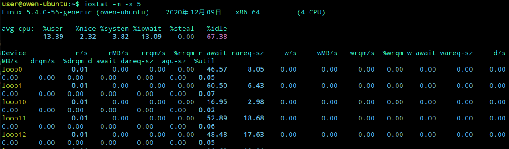

# MySQL-优化

[TOC]

一个成熟的数据库架构并不是一开始设计就具备高可用、高伸缩等特性的，它是随着用户量的增加，基础架构才逐渐完善.大致分为以下五个阶段:

## 1. 数据库表优化

对于数据库来说，这点很重要，如果设计不当，会直接影响访问速度和用户体验。影响的因素很多，比如慢查询、低效的查询语句、没有适当建立索引、数据库堵塞（死锁）等

## 2. 数据库部署

项目初期访问量不会很大，所以单台部署足以应对在1500左右的QPS（每秒查询率）。考虑到高可用性，可采用`MySQL主从复制+Keepalived`做双机热备，常见集群软件有Keepalived、Heartbeat

## 3. 数据库性能优化

`在不经过任何优化情况下，MySQL理论值正常可以处理2000左右QPS`，经过优化后，有可能会提升到2500左右QPS，否则，访问量当达到1500左右并发连接时，数据库处理性能就会变慢，而且硬件资源还很富裕，这时就该考虑软件问题了。那么怎样让数据库最大化发挥性能呢？一方面可以单台运行多个MySQL实例让服务器性能发挥到最大化，另一方面是对数据库进行优化，往往操作系统和数据库默认配置都比较保守，会对数据库发挥有一定限制，可对这些配置进行适当的调整，尽可能的处理更多连接数。

具体优化有以下三个层面：

### 3.1 数据库配置优化

MySQL常用有两种存储引擎，一个是`MyISAM`，不支持事务处理，读性能处理快，表级别锁。另一个是`InnoDB`，支持事务处理（ACID），设计目标是为处理大容量数据发挥最大化性能，行级别锁。

- 表锁：开销小，锁定粒度大，发生死锁概率高，相对并发也低。
- 行锁：开销大，锁定粒度小，发生死锁概率低，相对并发也高。

为什么会出现表锁和行锁呢？主要是为了保证数据的完整性，举个例子，一个用户在操作一张表，其他用户也想操作这张表，那么就要等第一个用户操作完，其他用户才能操作，表锁和行锁就是这个作用。否则多个用户同时操作一张表，肯定会数据产生冲突或者异常

根据以上看来，使用InnoDB存储引擎是最好的选择，也是MySQL5.5以后版本中默认存储引擎。每个存储引擎相关联参数比较多，以下列出主要影响数据库性能的参数。

**公共参数默认值：**

``` text
max_connections = 151
#同时处理最大连接数，推荐设置最大连接数是上限连接数的80%左右

sort_buffer_size = 2M
#查询排序时缓冲区大小，只对order by和group by起作用，可增大此值为16M

query_cache_limit = 1M
#查询缓存限制，只有1M以下查询结果才会被缓存，以免结果数据较大把缓存池覆盖

query_cache_size = 16M
#查看缓冲区大小，用于缓存SELECT查询结果，下一次有同样SELECT查询将直接从缓存池返回结果，可适当成倍增加此值

open_files_limit = 1024
#打开文件数限制，如果show global status like 'open_files'查看的值等
```

**MyISAM参数默认值：**

``` text
key_buffer_size = 16M
#索引缓存区大小，一般设置物理内存的30-40%

read_buffer_size = 128K
#读操作缓冲区大小，推荐设置16M或32M
```

**InnoDB参数默认值：**

``` text
innodb_buffer_pool_size = 128M
#索引和数据缓冲区大小，一般设置物理内存的60%-70%

innodb_buffer_pool_instances = 1
#缓冲池实例个数，推荐设置4个或8个

innodb_flush_log_at_trx_commit = 1
#关键参数，0代表大约每秒写入到日志并同步到磁盘，数据库故障会丢失1秒左右事务数据。1为每执行一条SQL后写入到日志并同步到磁盘，I/O开销大，执行完SQL要等待日志读写，效率低。2代表只把日志写入到系统缓存区，再每秒同步到磁盘，效率很高，如果服务器故障，才会丢失事务数据。对数据安全性要求不是很高的推荐设置2，性能高，修改后效果明显。

innodb_file_per_table = OFF
#默认是共享表空间，共享表空间idbdata文件不断增大，影响一定的I/O性能。推荐开启独立表空间模式，每个表的索引和数据都存在自己独立的表空间中，可以实现单表在不同数据库中移动。

innodb_log_buffer_size = 8M
#日志缓冲区大小，由于日志最长每秒钟刷新一次，所以一般不用超过16M
```

### 3.2 系统内核优化

大多数MySQL都部署在linux系统上，所以操作系统的一些参数也会影响到MySQL性能，以下对linux内核进行适当优化

``` text
net.ipv4.tcp_fin_timeout = 30
#TIME_WAIT超时时间，默认是60s

net.ipv4.tcp_tw_reuse = 1
#1表示开启复用，允许TIME_WAIT socket重新用于新的TCP连接，0表示关闭

net.ipv4.tcp_tw_recycle = 1
#1表示开启TIME_WAIT socket快速回收，0表示关闭

net.ipv4.tcp_max_tw_buckets = 4096
#系统保持TIME_WAIT socket最大数量，如果超出这个数，系统将随机清除一些TIME_WAIT并打印警告信息

net.ipv4.tcp_max_syn_backlog = 4096
#进入SYN队列最大长度，加大队列长度可容纳更多的等待连接
```

在linux系统中，如果进程打开的文件句柄数量超过系统默认值1024，就会提示“too many files open”信息，所以要调整打开文件句柄限制。

``` yaml
# vi /etc/security/limits.conf #加入以下配置，*代表所有用户，也可以指定用户，重启系统生效
* soft nofile 65535
* hard nofile 65535
# ulimit -SHn 65535 #立刻生效
```

### 3.3 硬件配置

加大物理内存，提高文件系统性能。linux内核会从内存中分配出缓存区（系统缓存和数据缓存）来存放热数据，通过文件系统延迟写入机制，等满足条件时（如缓存区大小到达一定百分比或者执行sync命令）才会同步到磁盘。也就是说物理内存越大，分配缓存区越大，缓存数据越多。当然，服务器故障会丢失一定的缓存数据。

SSD硬盘代替SAS硬盘，将RAID级别调整为RAID1+0，相对于RAID1和RAID5有更好的读写性能（IOPS），毕竟数据库的压力主要来自磁盘I/O方面。

## 4. 数据库架构扩展

随着业务量越来越大，单台数据库服务器性能已无法满足业务需求，该考虑加机器了，该做集群了~~~。主要思想是分解单台数据库负载，突破磁盘I/O性能，热数据存放缓存中，降低磁盘I/O访问频率。

### 4.1 主从复制与读写分离

因为生产环境中，数据库大多都是读操作，所以部署`一主多从`架构，主数据库负责写操作，并做双击热备，多台从数据库做负载均衡，负责读操作，主流的负载均衡器有LVS、HAProxy、Nginx。

怎么来实现读写分离呢？大多数企业是在代码层面实现读写分离，效率比较高。另一个种方式通过代理程序实现读写分离，企业中应用较少，常见代理程序有MySQL Proxy、Amoeba。在这样数据库集群架构中，大大增加数据库高并发能力，解决单台性能瓶颈问题。如果从数据库一台从库能处理2000 QPS，那么5台就能处理1w QPS，数据库横向扩展性也很容易。

有时，面对大量写操作的应用时，单台写性能达不到业务需求。如果做双主，就会遇到数据库数据不一致现象，产生这个原因是在应用程序不同的用户会有可能操作两台数据库，同时的更新操作造成两台数据库数据库数据发生冲突或者不一致。在单库时MySQL利用存储引擎机制表锁和行锁来保证数据完整性，怎样在多台主库时解决这个问题呢？有一套基于perl语言开发的主从复制管理工具，叫`MySQL-MMM`（Master-Master replication managerfor Mysql，Mysql主主复制管理器），这个工具最大的优点是在同一时间只提供一台数据库写操作，有效保证数据一致性。

主从复制博文：http://lizhenliang.blog.51cto.com/7876557/1290431

读写分离博文：http://lizhenliang.blog.51cto.com/7876557/1305083

MySQL-MMM博文：http://lizhenliang.blog.51cto.com/7876557/1354576

### 4.2 增加缓存

给数据库增加缓存系统，把热数据缓存到内存中，如果缓存中有要请求的数据就不再去数据库中返回结果，提高读性能。缓存实现有本地缓存和分布式缓存，本地缓存是将数据缓存到本地服务器内存中或者文件中。分布式缓存可以缓存海量数据，扩展性好，主流的分布式缓存系统有memcached、redis，memcached性能稳定，数据缓存在内存中，速度很快，QPS可达8w左右。如果想数据持久化就选择用redis，性能不低于memcached。

工作过程：


### 4.3 分库

分库是根据业务不同把相关的表切分到不同的数据库中，比如web、bbs、blog等库。如果业务量很大，还可将切分后的库做主从架构，进一步避免单个库压力过大

如何将数据库IO性能的问题平均分配出来，很显然将数据进行分库操作可以很好地解决单台数据库的性能问题。

[单KEY业务，数据库水平切分架构实践 | 架构师之路](https://mp.weixin.qq.com/s?__biz=MjM5ODYxMDA5OQ==&mid=2651960212&idx=1&sn=ab4c52ab0309f7380f7e0207fa357128&chksm=bd2d06488a5a8f5e3b7c9de0cc5936818bd9a6ed4058679ae8d819175e0693c6fbd9cdea0c87&mpshare=1&scene=24&srcid=0903t4lvUDhWto8H2e87XwaV#rd "单KEY业务，数据库水平切分架构实践 | 架构师之路")

[多key业务，数据库水平切分架构一次搞定](https://mp.weixin.qq.com/s?__biz=MjM5ODYxMDA5OQ==&mid=2651960373&idx=1&sn=abf7d36840c4d3d556b17a8776ee536c&chksm=bd2d01e98a5a88ff0cbf615cb3444668ccdfca58d5dca2da00ed0cc8948585b7509adf648db0&scene=0#rd "多key业务，数据库水平切分架构一次搞定")

### 4.4 分表

数据量的日剧增加，数据库中某个表有几百万条数据，导致查询和插入耗时太长，怎么能解决单表压力呢？你就该考虑是否把这个表拆分成多个小表，来减轻单个表的压力，提高处理效率，此方式称为分表。

分表技术比较麻烦，要修改程序代码里的SQL语句，还要手动去创建其他表，也可以用merge存储引擎实现分表，相对简单许多。分表后，程序是对一个总表进行操作，这个总表不存放数据，只有一些分表的关系，以及更新数据的方式，总表会根据不同的查询，将压力分到不同的小表上，因此提高并发能力和磁盘I/O性能。

分表分为垂直拆分和水平拆分：

- 垂直拆分：把原来的一个很多字段的表拆分多个表，解决表的宽度问题。你可以把不常用的字段单独放到一个表中，也可以把大字段独立放一个表中，或者把关联密切的字段放一个表中。

- 水平拆分：把原来一个表拆分成多个表，每个表的结构都一样，解决单表数据量大的问题。

数据库分表能够解决单表数据量很大的时候数据查询的效率问题，但是无法给数据库的并发操作带来效率上的提高，因为分表的实质还是在一个数据库上进行的操作，很容易受数据库IO性能的限制。

### 4.5 分区

分区就是把一张表的数据分成多个区块，这些区块可以在一个磁盘上，也可以在不同的磁盘上，分区后，表面上还是一张表，但数据散列在多个位置，这样一来，多块硬盘同时处理不同的请求，从而提高磁盘I/O读写性能，实现比较简单。

注：增加缓存、分库、分表和分区主要由程序猿来实现。

## 5. 数据库维护

数据库维护是运维工程师或者DBA主要工作，包括性能监控、性能分析、性能调优、数据库备份和恢复等。

### 5.1 性能状态关键指标

``` text
QPS，Queries Per Second：每秒查询数，一台数据库每秒能够处理的查询次数
TPS，Transactions Per Second：每秒处理事务数

通过show status查看运行状态，会有300多条状态信息记录，其中有几个值帮可以我们计算出QPS和TPS，如下：

``` text
Uptime：服务器已经运行的实际，单位秒
Questions：已经发送给数据库查询数
Com_select：查询次数，实际操作数据库的
Com_insert：插入次数
Com_delete：删除次数
Com_update：更新次数
Com_commit：事务次数
Com_rollback：回滚次数
```

那么，计算方法来了，基于Questions计算出QPS：

``` shell
mysql> show global status like 'Questions';
mysql> show global status like 'Uptime';
```

`QPS = Questions / Uptime`

基于Com_commit和Com_rollback计算出TPS：

``` shell
mysql> show global status like 'Com_commit';
mysql> show global status like 'Com_rollback';
mysql> show global status like 'Uptime';
```

`TPS = (Com_commit + Com_rollback) / Uptime`

另一计算方式：基于Com_select、Com_insert、Com_delete、Com_update计算出QPS

`mysql> show global status where Variable_name in('com_select','com_insert','com_delete','com_update');`

等待1秒再执行，获取间隔差值，第二次每个变量值减去第一次对应的变量值，就是QPS

TPS计算方法：

`mysql> show global status where Variable_name in('com_insert','com_delete','com_update');`

计算TPS，就不算查询操作了，计算出插入、删除、更新四个值即可。

经网友对这两个计算方式的测试得出，当数据库中myisam表比较多时，使用Questions计算比较准确。当数据库中innodb表比较多时，则以Com_*计算比较准确。

### 5.2 开启慢查询日志

MySQL开启慢查询日志，分析出哪条SQL语句比较慢，使用set设置变量，重启服务失效，可以在my.cnf添加参数永久生效

``` shell
mysql> set global slow-query-log=on #开启慢查询功能
mysql> set global slow_query_log_file='/var/log/mysql/mysql-slow.log'; #指定慢查询日志文件位置
mysql> set global log_queries_not_using_indexes=on; #记录没有使用索引的查询
mysql> set global long_query_time=1; #只记录处理时间1s以上的慢查询
```

分析慢查询日志，可以使用MySQL自带的mysqldumpslow工具，分析的日志较为简单。

`# mysqldumpslow -t 3 /var/log/mysql/mysql-slow.log #查看最慢的前三个查询`

也可以使用percona公司的`pt-query-digest`工具，日志分析功能全面，可分析slow log、binlog、general log。

分析慢查询日志：`pt-query-digest /var/log/mysql/mysql-slow.log`

分析binlog日志：

`mysqlbinlog mysql-bin.000001 >mysql-bin.000001.sql`

`pt-query-digest --type=binlog mysql-bin.000001.sql`

分析普通日志：`pt-query-digest --type=genlog localhost.log`

### 5.3 数据库备份

备份数据库是最基本的工作，也是最重要的，否则后果很严重，你懂得！但由于数据库比较大，上百G，往往备份都很耗费时间，所以就该选择一个效率高的备份策略，对于数据量大的数据库，一般都采用增量备份。常用的备份工具有`mysqldump、mysqlhotcopy、xtrabackup`等，`mysqldump`比较适用于小的数据库，因为是逻辑备份，所以备份和恢复耗时都比较长。

`mysqlhotcopy和xtrabackup是物理备份`，备份和恢复速度快，不影响数据库服务情况下进行热拷贝，建议使用xtrabackup，支持增量备份。

Xtrabackup备份工具使用博文：http://lizhenliang.blog.51cto.com/7876557/1612800

### 5.4 数据库修复

有时候MySQL服务器突然断电、异常关闭，会导致表损坏，无法读取表数据。这时就可以用到MySQL自带的两个工具进行修复，`myisamchk和mysqlcheck`

**myisamchk：** 只能修复myisam表，需要停止数据库

常用参数：

``` shell
-f --force 强制修复，覆盖老的临时文件，一般不使用
-r --recover 恢复模式
-q --quik 快速恢复
-a --analyze 分析表
-o --safe-recover 老的恢复模式，如果-r无法修复，可以使用此参数试试
-F --fast 只检查没有正常关闭的表
```

快速修复weibo数据库:

``` shell
cd /var/lib/mysql/weibo
myisamchk -r -q *.MYI
```

**mysqlcheck：** myisam和innodb表都可以用，不需要停止数据库，如修复单个表，可在数据库后面添加表名，以空格分割

常用参数：

``` shell
-a --all-databases 检查所有的库
-r --repair 修复表
-c --check 检查表，默认选项
-a --analyze 分析表
-o --optimize 优化表
-q --quik 最快检查或修复表
-F --fast 只检查没有正常关闭的表
```

快速修复weibo数据库: `mysqlcheck -r -q -uroot -p123 weibo`

### 5.5. 查看CPU和I/O性能方法

查看CPU性能


参数-P是显示CPU数，ALL为所有，也可以只显示第几颗CPU


查看I/O性能 - iostat


``` text
参数-m是以M单位显示，默认K
%util：当达到100%时，说明I/O很忙。
await：请求在队列中等待时间，直接影响read时间。
I/O极限：IOPS（r/s+w/s）,一般在1200左右。（IOPS，每秒进行读写（I/O）操作次数）
I/O带宽：在顺序读写模式下SAS硬盘理论值在300M/s左右，SSD硬盘理论值在600M/s左右。
```

由于关系型数据库初衷设计限制，一些BAT公司海量数据放到关系型数据库中，在海量数据查询和分析方面已经达不到更好的性能。因此NoSQL火起来了，非关系型数据库，大数据量，具有高性能，同时也弥补了关系型数据库某方面不足，渐渐大多数公司已经将部分业务数据库存放到NoSQL中，如MongoDB、HBase等。数据存储方面采用分布式文件系统，如HDFS、GFS等。海量数据计算分析采用Hadoop、Spark、Storm等。这些都是与运维相关的前沿技术，也是在存储方面主要学习对象